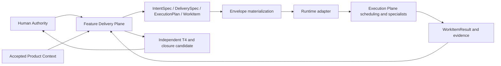

# Architecture

## Context and scope

Users are Feature owners, company AI delivery actors, execution specialists and
reviewers. The goal is repeatable engineering delivery across runtime bindings,
with Product meaning under Human control. First adoption scope: one product,
one governed feature, P1/P2 portability and two independently implemented
bindings. No automatic deployment, new graph database, maintenance engine,
multi-product federation or hot session migration.

FDP owns project controls and engineering contracts. EP owns execution facts and
runtime operational records. Repository systems own actual candidate content;
evidence references bind that content. Accepted knowledge is Human-versioned;
structural/history evidence cannot become semantic authority.

## Components and communication

Start as modules, not mandatory separate services: authority/contract validation,
envelope materialization, adapter port, evidence verification and T4 routing.
Use existing repository/service persistence where compatible. Logical requests
and receipts are transport-neutral; profiles may bind them to methods, CLI or
HTTP. This proposal does not expose a public HTTP API.

Admission is synchronous for integrity/capability rejection; execution and result
collection are asynchronous. `submit`, `inspect`, `cancel`, `collect` port behavior
is defined in EXECUTION-SEMANTICS.md. Notifications are hints: inspect is required
after ambiguous delivery or reconnect. Gates read durable evidence, not ephemeral
progress messages.

## Persistence and consistency

Authoritative controls remain Git-backed and updated together by one FDP writer.
Do not introduce a second writable database copy of project truth. Immutable
engineering/evidence objects use content-addressed bytes; runtime indexes map
execution/routing keys to receipts and candidates only. Adapter-local durable
records must support compare-and-set or a documented exclusive single writer.

Query requirements: exact contract/candidate lookup; complete routing-key search
including closed/cancelled history; predecessor-result resolution; pending
reconciliation; evidence by digest. Index tenant/project+routing key uniquely,
and candidate digest/review role for reviews. A runtime lacking durable lookup
cannot claim duplicate-safe P1 execution. A database technology decision belongs
to the company binding; no new database is required by the domain.

Recovery replays execution facts and verifies immutable objects. Do not replay
external side effects blindly. Git ref changes use expected-old revision checks;
runtime dispatch changes never write active controls.

## Alternatives and ADRs

| Decision | Chosen | Alternative and tradeoff | Revisit when |
|---|---|---|---|
| ADR-01 topology | Modular implementation with adapter ports | Microservices add deployment and consistency cost | Independent owners/scaling justify split |
| ADR-02 workflow | Immutable engineering DAG, flexible reasoning within WorkItem | Agent-generated mutable workflow risks authority drift; fixed scripts lack diagnostic flexibility | New governed branching semantics are needed |
| ADR-03 portability | Strict capabilities; unsupported required behavior rejects | Lowest-common-denominator fallback hides weakened guarantees | Explicitly reviewed alternate profile exists |
| ADR-04 state | Existing plane ownership and adapter-local records | New Factory/Run/Task domain duplicates AUTH-003 lifecycle | Independent identity/ownership/lifecycle is demonstrated |
| ADR-05 skills | Six SF capability/role entrypoints, shared behavioral contract | Copy all local skills creates dependencies and conflicting meanings | Concrete independent reasoning need is approved |

These are proposed decisions. Human adoption of material architecture is required
before implementation selection; authoring this package does not freeze them.
