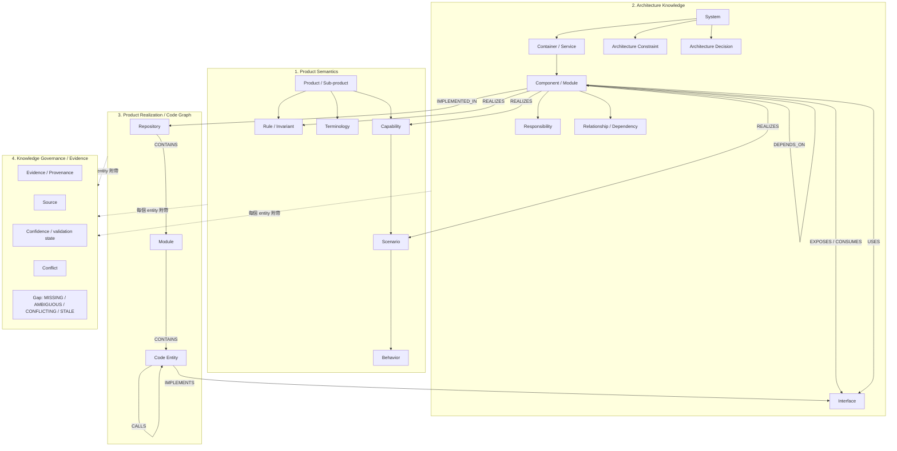

# Product Knowledge（PK）Conceptual Model 正式規格

> 本文件是 Multica swarm 套件「產品知識庫」場景的知識模型正式規格，把 Product Knowledge（PK）收斂為 **4 類知識**，避免把 Architecture、Code Graph、Component 等全部平鋪在同一層。操作手冊（Multica issue/label 落地方式）見 `skills/product-knowledge/SKILL.md`。

## 版本修訂紀錄

| 版本 | 內容 |
|---|---|
| v1 | 四類 PK 知識模型（Product Semantics／Architecture Knowledge／Product Realization／Knowledge Governance）正式化；來源採 13 種文件類型清單。 |
| v2（本版） | 加入 **6 類 Knowledge Sources** 體系（第 7 節）與 **PK Ingestion Pipeline**（第 8 節），原 13 種文件類型清單作廢、降為各 source 類別下的「典型內容」列舉；新增 Source × PK Knowledge 對應矩陣含覆蓋檢查（第 9 節）、Adapter／Analyzer 對應表（第 10 節）、多 source correlation 設計原則（第 11 節）。**Graphify 定位修正**：Graphify 不是 PK Source，而是 Analyzer／Adapter／Tool；Graphify output 是 Observation；Code Graph 才是 governed／synthesized 的 PK realization（v1 把「Graphify observations」列為 Source，作廢）。 |

## 0. 總覽：PK 的四類知識

```
                    PRODUCT KNOWLEDGE
                           │
          ┌────────────────┼────────────────┐
          │                │                │
          ▼                ▼                ▼
 Product Semantics   Architecture      Product Realization
          │                │                │
 Product            System             Component
 Capability         Container          Interface
 Scenario           Component          Repository
 Behavior           Relationship       Module
 Rule               Constraint         Code Graph
 Terminology        Decision           Code Entity
          │                │                │
          └────────────────┼────────────────┘
                           ▼
                Governance / Evidence
                 Source · Evidence
                 Conflict · Gap
```

四類的職責邊界：

| 類別 | 回答的問題 | 主要消費者 |
|---|---|---|
| 1. Product Semantics | 「產品是什麼、怎麼運作」 | T1（需求理解 Baseline 最主要的產品語意來源） |
| 2. Architecture Knowledge | 「目前系統架構長什麼樣」 | T2（不讓每次 Design 都重新從 code 猜） |
| 3. Product Realization | 「Product 語意實際落在哪裡」 | T2 做 ChangeSurface、Architecture Design、Component Design 的 bridge |
| 4. Knowledge Governance / Evidence | 「我為什麼相信這些知識」 | 所有消費者（採信與缺口判斷的依據） |

---

## 1. 第一類：Product Semantics — 產品是什麼、怎麼運作

### 1.1 Entity 階層

```
Product / Sub-product
├─ Capability
│   └─ Scenario
│       └─ Behavior
├─ Rule / Invariant
└─ Terminology
```

| Entity | 定義 |
|---|---|
| Product / Sub-product | 產品或其下的子產品，語意樹的根 |
| Capability | 產品對外提供的能力（使用者可感知的功能面） |
| Scenario | Capability 下的具體使用場景 |
| Behavior | Scenario 中的具體行為（操作 → 預期結果） |
| Rule / Invariant | 跨 Scenario 必須恆成立的規則與不變式 |
| Terminology | 產品術語定義，確保所有知識與產出物用詞一致 |

### 1.2 範例：SPC Chart Management

```
SPC
└─ Chart Management
   ├─ Create Chart
   ├─ Configure Chart
   └─ Maintain Chart
       ↓
   Rules / Behaviors
```

其中 SPC 是 Product，Chart Management 是 Capability，Create / Configure / Maintain Chart 是其下的 Capability 或 Scenario，往下各掛具體 Rules / Behaviors。

### 1.3 定位

這是 T1 理解 Baseline 最主要的產品語意來源。Product Semantics 只描述「產品是什麼」，不描述「程式在哪裡」——後者屬第三類 Product Realization。

---

## 2. 第二類：Architecture Knowledge — 系統怎麼組成

### 2.1 Entity 階層

```
Architecture
├─ System
├─ Container / Service
├─ Component / Module
├─ Responsibility
├─ Relationship / Dependency
├─ Interface
├─ Architecture Constraint
└─ Architecture Decision
```

表示方式以 **C4-compatible structured model** 為主：

```
System Context
    ↓
Container
    ↓
Component
```

| Entity | 定義 |
|---|---|
| System | 系統整體（C4 System Context 層） |
| Container / Service | 可獨立部署／執行的單元（C4 Container 層） |
| Component / Module | Container 內的組成元件（C4 Component 層） |
| Responsibility | 每個 System／Container／Component 的職責（負責什麼、不負責什麼） |
| Relationship / Dependency | 元件間的關係與依賴方向 |
| Interface | 元件對外的介面（API、事件、資料契約） |
| Architecture Constraint | 架構層級必須遵守的約束（效能、相容性、部署拓撲等） |
| Architecture Decision | 已定案的架構決策（含取捨理由） |

### 2.2 Sequence / interaction knowledge 的 conditional 規則

Sequence／interaction knowledge **可以存在 PK，但屬 conditional**：只有在涉及**重要跨 Component interaction** 時才需要建立；單一 Component 內部的互動不進 PK。此類知識掛在 Architecture Knowledge 下，作為 Relationship / Dependency 的補充，不另立 entity 類別。

### 2.3 定位

這一層主要回答「目前系統架構長什麼樣？」，而不是讓 T2 每次 Design 都重新從 code 猜。

---

## 3. 第三類：Product Realization — Product 語意實際落在哪裡

### 3.1 Realization 鏈

這層把前兩層接到 implementation：

```
Capability / Scenario / Rule
          ↓ realized by
Component
          ↓
Interface
          ↓
Repository
          ↓
Module / Code Region
```

### 3.2 Code Graph（first-class knowledge）

Code Graph 是 PK 的 first-class knowledge，不是附屬註記。

**Nodes（7 種）：**

```
Nodes
├─ Product
├─ Capability
├─ Component
├─ Interface
├─ Repository
├─ Module
└─ Code Entity
```

**Relations（9 種）：**

```
Relations
├─ REALIZES
├─ IMPLEMENTED_IN
├─ CONTAINS
├─ CALLS
├─ DEPENDS_ON
├─ IMPLEMENTS
├─ USES
├─ EXPOSES
└─ CONSUMES
```

| Relation | 方向（from → to） | 語意 |
|---|---|---|
| REALIZES | Component → Capability / Scenario / Rule | 元件實現了某個產品語意 |
| IMPLEMENTED_IN | Component / Interface → Repository | 元件／介面落於哪個 Repository |
| CONTAINS | Repository → Module；Module → Code Entity | 結構包含關係 |
| CALLS | Code Entity → Code Entity | 程式層級的呼叫 |
| DEPENDS_ON | Component → Component；Module → Module | 依賴方向 |
| IMPLEMENTS | Code Entity / Module → Interface | 實作某個介面 |
| USES | Component / Code Entity → Interface / Component | 使用某介面或元件 |
| EXPOSES | Component → Interface | 元件對外暴露介面 |
| CONSUMES | Component → Interface | 元件消費他人暴露的介面 |

### 3.3 定位

這是 T2 做 ChangeSurface、Architecture Design、Component Design 時非常重要的 bridge：從需求涉及的 Capability / Scenario / Rule 沿 REALIZES 鏈追到 Component → Interface → Repository → Module / Code Region，即可界定變更影響範圍。

---

## 4. 第四類：Knowledge Governance / Evidence — 我為什麼相信這些知識

### 4.1 Entity 階層

```
Knowledge
├─ Evidence / Provenance
├─ Source
├─ Confidence / validation state
├─ Conflict
└─ Gap
    ├─ MISSING
    ├─ AMBIGUOUS
    ├─ CONFLICTING
    └─ STALE
```

| Entity | 定義 |
|---|---|
| Evidence / Provenance | 知識的證據與出處脈絡（從哪份文件、哪個 commit、哪次會議而來） |
| Source | 知識來源類型（6 類 Knowledge Sources，見第 7 節） |
| Confidence / validation state | 可信度與驗證狀態（已驗證／待驗證／僅單一來源等） |
| Conflict | 兩個以上來源對同一事實主張不一致的紀錄 |
| Gap | 知識缺口，四態：MISSING／AMBIGUOUS／CONFLICTING／STALE（見第 12 節） |

Governance 是**橫切關注**：前三類的每一個 entity 實例都必須能回答「Source 是什麼、Confidence 多高、有無 Conflict、有無 Gap」。

---

## 5. 完整 Relationship Model

### 5.1 四類之間的關係



### 5.2 Semantics → Realization 的 REALIZES 鏈

REALIZES 是連接第一類與第三類的主鏈：

```
Capability / Scenario / Rule（Product Semantics）
    ▲ REALIZES
Component（Architecture Knowledge 的 entity，同時是 Code Graph node）
    │ IMPLEMENTED_IN
Repository
    │ CONTAINS
Module
    │ CONTAINS
Code Entity ──CALLS──▶ Code Entity
    │ IMPLEMENTS
Interface ◀──EXPOSES── Component ──CONSUMES──▶ Interface（他元件）
```

注意：**Component / Interface 同時屬於 Architecture Knowledge 的 entity 與 Code Graph 的 node**——這是刻意設計，Realization 層不重複定義它們，而是透過 REALIZES／IMPLEMENTED_IN 等 relation 把它們編進 Code Graph。

### 5.3 各類 entity 的 cross-reference 規則

| From | To | 規則 |
|---|---|---|
| Capability / Scenario / Rule | Component | 每個已上線的 Capability / Scenario / Rule 應至少有一條入向 REALIZES；沒有 → 記 Gap（MISSING） |
| Component | Capability / Scenario / Rule | 每個 Component 應至少 REALIZES 一個產品語意；無法對應 → 標註並記 Gap（AMBIGUOUS：職責不明） |
| Component | Repository | 每個 Component 必須有 IMPLEMENTED_IN；查無落點 → Gap（MISSING） |
| Interface | Component | 每個 Interface 必須有 EXPOSES 它的 Component；消費方以 CONSUMES 連接 |
| Module / Code Entity | Repository | 一律以 CONTAINS 掛在 Repository 之下 |
| Architecture Decision / Constraint | 受影響的 System / Container / Component | 決策與約束必須連到其作用的架構 entity |
| Terminology | 所有類別 | 任何條目使用產品術語時，以 Terminology 條目為準 |
| 任何 entity | Governance | 每個 entity 實例必填 Source／Confidence，並登記已知 Conflict 與 Gap |

---

## 6. PK ≠ Product Context：邊界與 materialize 流程

### 6.1 重要修正

先前的 Product Context Spec 把 Architecture Context、Component、Interface、Repository、Code Graph 看成彼此平行的資料欄位。**作為 boundary DTO 的欄位可以，但作為 PK conceptual model 不夠準確。**正式模型採本文件的四類；那些欄位只是 view 的切面，不是知識的分類。

### 6.2 邊界定義

- **PK 是全量知識**：四類知識的完整集合，持續累積、持續治理。
- **BaselineProductContext 是 relevant view**：針對單一任務，依 `IntentSpec.baseline` resolve 出來的相關子集，用完即棄（或隨任務存檔），不是知識本體。

### 6.3 Materialize 流程

```
Full Product Knowledge（四類全量）
        ↓
IntentSpec.baseline（本任務涉及的 Product / Capability / 範圍宣告）
        ↓ resolve
Relevant Product Semantics        ← 命中範圍的 Capability / Scenario / Behavior / Rule 子樹
+ Relevant Architecture           ← 沿 REALIZES 反查到的 Component / Interface / Constraint / Decision
+ Relevant Realization / Code Graph ← 沿 REALIZES → IMPLEMENTED_IN → CONTAINS 展開的 Repository / Module / Code Region
+ Evidence / Gaps                 ← 上述條目的 Source / Confidence / Conflict / Gap 一併帶出
        ↓
BaselineProductContext
```

resolve 規則：

1. 從 `IntentSpec.baseline` 宣告的 Semantics 節點出發，向下收整棵子樹（Capability → Scenario → Behavior + 相關 Rule / Terminology）。
2. 對每個 Semantics 節點沿入向 REALIZES 找 Component，再展開其 EXPOSES／CONSUMES／DEPENDS_ON 一階鄰居與適用的 Constraint / Decision。
3. 沿 IMPLEMENTED_IN → CONTAINS 展開 Realization（Repository / Module / Code Region）；需要變更影響分析時再展開 CALLS／USES／DEPENDS_ON。
4. 所有被帶入的條目，其 Governance 欄位（Source / Confidence / Conflict / Gap）一併帶入 view——**Gap 不會因為不在範圍內而被隱藏**，命中範圍的 Gap 必須出現在 BaselineProductContext 的 Evidence / Gaps 節。

---

## 7. 6 類 Knowledge Sources

「**PK 要存什麼**」（四類知識，第 0–4 節）與「**PK 從什麼輸入建立知識**」（本節）是兩個問題，必須分開。MVP1 的 PK input **不以檔案格式分類**，而是定為 **6 類 Knowledge Sources**。v1 的 13 種文件類型清單作廢，降為各 source 類別下的「典型內容」列舉。

### 7.1 總覽

| PK Input Source | 典型內容 | 主要建立的 PK | MVP1 優先度 |
|---|---|---|---|
| **① Product Team Seed** | Capability、Scenario、Rule、Terminology、產品邊界 | Product Semantics | **P0** |
| **② Product Documents** | 新人 training、PRD/spec、manual、user guide | Semantics、Architecture | **P0** |
| **③ Test / Verification Assets** | Test case、AC、regression case、test data/schema | Behavior、Rule、Interface | **P0** |
| **④ Operations Knowledge** | Troubleshooting SOP、RCA、incident、runbook、known issue | Rule、Dependency、Failure Behavior | P1 |
| **⑤ Engineering Assets** | Architecture/Technical Design、API、DB schema、config、Helm | Architecture、Interface、Component、Rule | **P0** |
| **⑥ Delivery + Source Code** | Repo、source code、Code Graph（既存 governed graph 交付物，非輸入）、PR、commit、historical PBI | Product Realization、Code Graph、historical evidence | **P0** |

> **核心設計原則：同一個 PK fact 可以從多個 source 得到，不要預先規定「一種 source = 一種 knowledge」。**
>
> 例如 `Chart Management → Chart Viewer Component`，可能同時從 Architecture Document、source code、historical PR 與 Product Team seed 得到。PK 要做的是 **correlation / evidence / conflict detection**，不是挑一份文件當唯一真相。詳見第 11 節。

### 7.2 ① Product Team Seed（P0）

MVP1 最重要的 bootstrap input。Product Team 透過 Multica Chat / Agent 明確提供：

```text
Product
Sub-product
Capability
Scenario
Key Behavior
Key Rule / Invariant
Terminology
重要 Component / Repo mapping
```

- **典型內容**：Capability taxonomy、產品術語、關鍵 business rule、產品邊界、重要 Component／Repo mapping。
- **主要建立的 PK**：Product Semantics。
- **可抽取 entity**：Product／Sub-product、Capability、Scenario、Behavior、Rule／Invariant、Terminology、Component mapping。
- **為什麼 P0**：Capability taxonomy、產品術語與關鍵 business rule，**source code 通常無法可靠推導**，必須由產品團隊直接給。

### 7.3 ② Product Documents（P0）

這類通常是 free format，非常有價值：

```text
新人 Product Training
Product Specification
PRD / Feature Spec
User Manual
User Guide
Functional Design
FAQ
```

- **典型內容**：新人 Product Training、Product Specification、PRD／Feature Spec、User Manual／User Guide、Functional Design、FAQ（涵蓋 v1 的 Product Training、Spec／Manual 等文件類型）。
- **主要建立的 PK**：Semantics、Architecture。
- **可抽取 entity**：Capability、Scenario、Behavior、Rule、Terminology、部分 Architecture／Component relationship。
- **原文範例**：「新人 Product 訓練文件」很適合作為 MVP1 POC source——它通常包含大量 **Product Semantics**，這正是 code 最難補足的一層。

### 7.4 ③ Test / Verification Assets（P0）

```text
Functional Test Cases
Regression Test Cases
Integration Test Cases
Acceptance Criteria
Test Scenario
Test Data / Schema
```

- **典型內容**：Functional／Regression／Integration Test Cases、Acceptance Criteria、Test Scenario、Test Data／Schema。
- **主要建立的 PK**：Behavior、Rule、Interface。
- **可抽取 entity**：Scenario → expected Behavior → Rule → boundary condition → Interface behavior。
- **原文範例**：Product training 告訴你「Chart Viewer 可以顯示 SPC Chart」，Test Case 可能進一步反向揭露：

  ```text
  When...
  Given...
  Expected...
  Exception...
  Boundary...
  ```

  因此它是建立 **Behavior / Rule knowledge** 很強的 evidence source。

### 7.5 ④ Operations Knowledge（P1）

```text
Troubleshooting SOP
Incident
RCA
Known Issue
Runbook
Production Log / Diagnostic evidence
```

- **典型內容**：Troubleshooting SOP、Incident、RCA、Known Issue、Runbook、Production Log／Diagnostic evidence（涵蓋 v1 的 Troubleshooting SOP、RCA／Runbook）。
- **主要建立的 PK**：Rule、Dependency、Failure Behavior。
- **可抽取 entity**：Failure Behavior、Operational Rule、Hidden Dependency、Recovery Behavior、Known Constraint。
- **優先度說明**：可能不是 MVP1 第一批 ingestion source，但 PK model 一開始就應該容納。

### 7.6 ⑤ Engineering Assets（P0）

補了 **Architecture Context** 之後，這一類重要性明顯提高：

```text
Architecture Document
Technical Design
C4 model / diagram
Sequence Diagram
API / OpenAPI
Event Schema
DB Schema
Configuration
Rule Definition
Helm / Deployment config
```

- **典型內容**：Architecture Document、Technical Design、C4 model／diagram、Sequence Diagram、API／OpenAPI、Event Schema、DB Schema、Configuration、Rule Definition、Helm／Deployment config（涵蓋 v1 的 Architecture／Technical Design、API／Schema、Config／Helm／Rules）。
- **主要建立的 PK**：Architecture、Interface、Component、Rule；API／schema／config 同時可建立 Product Realization。
- **可抽取 entity**：System、Container、Component、Interface、Dependency、Constraint、Decision。
- **原文範例**：這回答了「**T2 不應該每次都從 Code Graph 猜 architecture**」——已有 Architecture／Technical Design 本身就是 PK source。

### 7.7 ⑥ Delivery + Source Code（P0）

分兩種理解，但 ingestion pipeline 仍歸一類。

**Source Code**（涵蓋 v1 的 Source Code）：

```text
Git repositories / Source code / Build definition
Dependency definition / API implementation / Config
```

經 code analysis／Graphify 等工具後：

```text
Source Code
    ↓
Code Analysis
    ↓
Code Graph
    ↓
Component / Module / Interface / Dependency
    ↓
Product Realization Knowledge
```

主要補的是「**產品現在實際怎麼被實作**」。

**Historical Delivery**（涵蓋 v1 的 Azure DevOps history、PR／Commit）：

```text
Azure DevOps Feature / PBI
PR / Commit / Changed Files
Design/Review evidence
Release history
```

可以建立：

```text
Feature
→ Capability / Scenario
→ Changed Components
→ Repositories
→ PR / Commit
```

- **典型內容**：Git repo、source code、Code Graph（既存 governed graph 交付物，非輸入）、PR、commit、historical PBI、release history。
- **主要建立的 PK**：Product Realization、Code Graph、historical evidence。
- **可抽取 entity**：Component、Module、Interface、Dependency、Repository、Code Entity；Feature → Capability → Changed Components 的歷史鏈。
- **重要邊界**：Historical Delivery 對未來 T2 很有價值（「過去改這個 Capability，通常涉及哪些 Components／Repos？」），但它是 **historical evidence**，**不能直接當成這次 ChangeSurface 的答案**。

---

## 8. PK Ingestion Pipeline

### 8.1 完整管線

```text
                         PK INPUT SOURCES
                               │
       ┌───────────┬───────────┼───────────┬────────────┐
       ▼           ▼           ▼           ▼            ▼
 Product Team   Product     Test /      Operations   Engineering
    Seed        Documents   Verification  Knowledge     Assets
       │           │           │           │            │
       └───────────┴───────────┼───────────┴────────────┘
                               │
                        Source Intake
                               │
                               ▼
                          Observation
                               │
                               ▼
              Correlation / Conflict Detection
                       / Synthesis
                               │
                               ▼
                    Product Knowledge
                ┌──────────────┼──────────────┐
                ▼              ▼              ▼
          Semantics       Architecture    Realization
                └──────────────┼──────────────┘
                               ▼
                      Evidence / Governance
```

Source Code + Delivery History 走同一條 pipeline，只是前置一段分析：

```text
Source Code + Delivery History
            ↓
Code Analysis / Historical Analysis
            ↓
Observation
            ↓
同一條 PK pipeline
```

收斂後的 MVP1 管線（五段）：

```text
Source
  ↓
Adapter / Analyzer
  ↓
Observation
  ↓
Synthesis / Correlation / Conflict Detection
  ↓
Product Knowledge
  ↓
Context Resolution
  ↓
BaselineProductContext
```

### 8.2 四層定義（職責與邊界）

| 層 | 內容 | 職責 | 邊界（不負責什麼） |
|---|---|---|---|
| **Source 層** | 6 類 Knowledge Sources（第 7 節） | 提供原始知識材料 | 不產生 PK 條目；不決定知識歸屬哪一類（一種 source 可養多類 knowledge） |
| **Adapter／Observation 層** | Adapter／Analyzer／Tool 及其產出的 Observation | 把 Source 轉成結構化觀察（entity 候選、relation 候選、文件切片） | Observation 是**未治理的原料**，預設「待驗證」，不是 PK 條目，不得直接入庫或引用 |
| **Knowledge 層** | Synthesis／Correlation／Conflict Detection 之後的 Product Knowledge（四類） | 把 Observation 合成為 governed 條目，合併多來源 evidence、偵測衝突、標信心等級 | 不針對單一任務裁剪（那是 Context 層的事） |
| **Context 層** | Context Resolution → BaselineProductContext | 依 `IntentSpec.baseline` 從全量 PK resolve 出 relevant view（第 6 節） | 是 view 不是知識本體；不回寫 PK |

### 8.3 修正案例：Graphify 定位（四層混淆的反例）

**不要把 Graphify 當 PK Source。** 準確的定位是：

```text
Source Code        = Source
Graphify           = Analyzer / Adapter / Tool
Graphify output    = Observation
Code Graph         = Governed / synthesized PK realization
```

這個區分很重要，否則 Source、Tool、Observation、Knowledge 四層會再次混在一起。v1 把「Graphify observations」列為 13 種 Source 之一，正是四層混淆的反例：**Source（Source Code）被換成了 Tool 的輸出（Graphify observations），Observation 被誤當 Knowledge 直接入庫**。修正後：Graphify 產出必須經 Synthesis／人工確認才成為 Code Graph（PK realization）；因此第 10 節把 Graphify 歸在 Adapter／Analyzer 一側，而非 Source 一側。

---

## 9. Source × PK Knowledge 對應矩陣

●＝主要來源（該類知識主要由此建出）；○＝次要來源（補強或交叉驗證）；空白＝一般不作為來源。

| Source（優先度） | Semantics | Architecture | Realization | Governance | 可信度預設值 | 驗證方式 |
|---|---|---|---|---|---|---|
| ① Product Team Seed（P0） | ● | ○ | | ○ | 高（官方文件級） | 產品團隊署名確認；與 Spec 交叉比對 |
| ② Product Documents（P0） | ● | ○ | ○ | ○ | 高～中高（官方文件級／會議共識級，依文件性質） | 版本號與發布日期核對；講師／作者確認 |
| ③ Test / Verification Assets（P0） | ●（Behavior） | | ○（Interface behavior） | ○ | 高 | 實際執行測試；與 Behavior 條目對齊 |
| ④ Operations Knowledge（P1） | ○ | ○ | ○ | ● | 中～中高 | 對照事故紀錄；事故 timeline 與監控數據佐證；SRE 確認 |
| ⑤ Engineering Assets（P0） | ○ | ● | ○ | ○ | 高 | 與 Source Code 落點核對；Architect 審核；contract test |
| ⑥ Delivery + Source Code（P0） | ○（historical） | ○ | ● | ●（Provenance） | 高（須標觀察時間；自動觀察部分為中、待驗證） | commit hash 不可變；直接核對程式；抽樣人工驗證；注意 STALE 風險 |

**覆蓋檢查（四類知識是否都有 P0 可靠來源）：**

| PK 知識類別 | P0 主要來源 | 判定 |
|---|---|---|
| Product Semantics | ① Product Team Seed（P0）、② Product Documents（P0） | ✅ 有雙 P0 來源，可交叉驗證 |
| Architecture Knowledge | ⑤ Engineering Assets（P0）；② Product Documents（P0）次要 | ✅ 有 P0 來源，T2 不必每次從 Code Graph 猜 |
| Product Realization | ⑥ Delivery + Source Code（P0） | ✅ 有 P0 來源；自動觀察部分須人工確認 |
| Knowledge Governance / Evidence | 全類附帶（每類 source 入庫時必填 Governance 區塊） | ✅ 無需獨立來源 |

使用規則：

- **Confidence 預設值只是起點**：同一來源若版本過舊或與其他來源衝突，降級並記 Gap（STALE／CONFLICTING）。
- **單一來源原則降一級採信**：只有「個人分享／未經裁決」級來源支撐的知識，不能單獨支撐需求或設計決策。
- **Analyzer 產出的 Observation 必須人工確認後才升級**：Graphify 類工具自動觀察產出的 Code Graph 邊，預設標「待驗證」（見第 8.3 節）。

---

## 10. Adapter / Analyzer 對應表

每類 Source 進入 pipeline 時需要的 Adapter／Analyzer／Skill，以及在 Multica 套件脈絡下的落地方式（**現況**＝MVP1 由 Knowledge Curator 人工執行；**未來**＝可自動化）：

| Source | 建議 Adapter / Analyzer | 產出的 Observation | Multica 落地 |
|---|---|---|---|
| ① Product Team Seed | Multica Chat／Agent 結構化模板（seed 填寫模板：Product／Capability／Scenario／Rule／Terminology／Component mapping） | 結構化 seed observation | **現況**：Curator 引導產品團隊填模板後人工入庫；**未來**：seed 模板表單化後半自動 |
| ② Product Documents | 文件解析 + 語意抽取（LLM extraction） | entity 候選清單（Capability／Behavior／Rule／Terminology 候選） | **現況**：Curator 細讀文件、人工摘要入庫；**未來**：抽取候選自動產生、Curator 只做確認 |
| ③ Test / Verification Assets | Gherkin／test parser（解析 Feature／Scenario／Given／When／Then） | Scenario → expected Behavior → Rule → Boundary 的觀察鏈 | **現況**：Curator 人工從 test case 反推 Behavior／Rule；**未來**：parser 自動產出 Observation |
| ④ Operations Knowledge | Incident／RCA 文件解析（timeline、root cause、dependency 抽取） | Failure Behavior／Hidden Dependency 觀察 | **P1**：模型先容納，ingestion 排後；落地同 ② |
| ⑤ Engineering Assets | OpenAPI／schema／C4 parser | Architecture entity 觀察（System／Container／Component／Interface／Constraint） | **現況**：Curator 依文件人工建 C4 條目；**未來**：OpenAPI／C4 檔直接 parse |
| ⑥ Source Code | Graphify 類 code analysis | Code Graph 觀察（Component／Module／Interface／Dependency 邊） | **現況**：Graphify 輸出經 Curator synthesis＋人工確認才入庫；**未來**：pipeline 自動跑、抽樣驗證 |
| ⑥ Historical Delivery | Azure DevOps／PR miner（work item ↔ PR ↔ changed files 關聯） | Feature → Capability → Changed Components 的 historical evidence | **現況**：Curator 人工追溯；**未來**：miner 自動建歷史鏈（仍只是 evidence，不直接當 ChangeSurface 答案） |

---

## 11. 多 Source Correlation 設計原則

> **同一個 PK fact 可以從多個 source 得到，不要預先規定「一種 source = 一種 knowledge」。** PK 做的是 correlation / evidence / conflict detection，不是挑一份文件當唯一真相。

### 11.1 Evidence 合併規則

1. **同一 fact 不重複建條目**：新到達的 Observation 經查重後若指向既有條目描述的同一事實，把新來源**併入該條目的 Evidence 列表**（每筆 evidence 記：source 類別、出處、日期、可信度），不另建條目。
2. **多獨立來源一致 → 升級信心**：同一 fact 有兩個以上互相獨立的來源一致主張，Confidence 可升一級（如「會議共識」+ Spec 一致 → 視同官方文件級）。
3. **Evidence 永久保留脈絡**：即使某來源後來 STALE，其 evidence 紀錄保留（標註已過時），供追溯與衝突分析。

### 11.2 Conflict Detection 觸發條件

- **兩個以上來源對同一 fact 主張矛盾** → 觸發 **CONFLICTING** 流程（第 12 節）：兩造條目互記 Conflict 並雙向連結，依可信度採信順序裁決或提請人類裁決；未定案前雙方主張都保留，agent 不得自行二選一當事實引用。
- **只有單一低可信來源**（個人分享級、未驗證的自動觀察）→ 不觸發 Conflict，但**標信心等級**（Confidence 降一級、validation state 標「待驗證」），該知識不能單獨支撐需求或設計決策。
- **來源版本差異**（新舊版文件主張不同）→ 不一定是 Conflict，先判斷是否為時間序上的取代：是 → 走 STALE 淘汰流程；無法判定 → 按 CONFLICTING 處理。

---

## 12. Gap 處理規範

### 12.1 Gap 四態

| 狀態 | 定義 | 範例 |
|---|---|---|
| MISSING | 應存在但完全查無知識 | 某 Capability 查無任何條目；Component 無 IMPLEMENTED_IN 落點 |
| AMBIGUOUS | 有知識但語意不明，無法據此行動 | 條目只說「效期照規則」但規則本身未定義 |
| CONFLICTING | 兩個以上來源主張不一致 | 方案 v2 說不可轉讓，beta 回饋結論說已開放贈與 |
| STALE | 知識曾正確但可能已過時 | 條目引用的 Spec 已有新版；Source Code 已重構但 Realization 未更新 |

### 12.2 發現 Gap 時的處理流程

```
任何消費者（PM / Architect / T2 各角色）在 resolve relevant view 時發現 Gap
        │
        ▼
1. 就地標記：在自己的產出物（PRD / SPEC / BaselineProductContext 的
   Evidence / Gaps 節）註明 Gap 四態、影響範圍、受影響的條目連結
        │
        ▼
2. 開補齊 issue 給 Knowledge Curator：
   - 標題格式：[Gap/<四態>] <一句話描述>
   - 內容：Gap 四態、發現脈絡（哪個任務 resolve 時發現）、
     相關條目連結、建議的補齊來源（6 類 Knowledge Sources 中找誰）
        │
        ▼
3. Curator 處理：
   - MISSING    → 依建議來源入庫新知識，回填條目連結
   - AMBIGUOUS  → 向來源擁有者澄清，更新條目或補充 Terminology
   - CONFLICTING→ 依可信度採信順序裁決，或提請人類裁決；
                  兩造條目互記 Conflict 並雙向連結
   - STALE      → 走淘汰流程：舊條目 cancelled、新條目取代、雙向連結
        │
        ▼
4. 結案回報：在原 Gap issue 評論附處理結果與條目連結；
   發現者更新自己產出物中的 Gap 標記為「已解決（連結）」
```

規範要點：

- **Gap 不得被靜默繞過**：發現 Gap 卻不標記、不開 issue，視同失職（與「未查 ProductKB 就動筆」同級）。
- **CONFLICTING 未定案前，雙方主張都保留**：由人類或來源擁有者裁決，agent 不得自行二選一當事實引用。
- **STALE 不等於錯誤**：在淘汰流程走完前，舊條目仍可引用但必須加註「可能過時（STALE）」。

---

## 13. 與 Multica 落地的對應

| Conceptual model | Multica 落地 |
|---|---|
| 一個知識 entity／條目 | `pk/` Structured PK Store 中的一個 machine-readable entry；對應 ProductKB governance issue 只負責審核／衝突／Gap／lifecycle |
| 四類知識 | 主 label：`pk-semantics`／`pk-architecture`／`pk-realization`／`pk-governance` |
| 來源類別（6 類 Knowledge Sources） | 副 label：`src-team-seed`／`src-product-docs`／`src-test-assets`／`src-operations`／`src-engineering`／`src-code-delivery`；原文件類型（solution／spec／prd 等）保留為條目描述欄位，不再是 label |
| Code Graph relations | authoritative relation 寫入 `pk/code-graph/edges.jsonl`；ProductKB issue comments 僅保留 human-readable governance cross-reference |
| Governance 欄位 | 條目必填區塊：Source／Evidence 列表／Confidence／Gap 狀態／Pipeline 層級標記 + metadata（source、date、credibility） |
| BaselineProductContext | PM／Architect 產出物中的四節：Relevant Semantics + Relevant Architecture + Relevant Realization + Evidence/Gaps |
| Gap 上報 | 開 issue（標題 `[Gap/<四態>] …`）指派給 Swarm Knowledge Curator |

詳細操作（模板、指令、檢索流程）見 `skills/product-knowledge/SKILL.md`；端到端演示見 `examples/product-knowledge-demo.md`。
