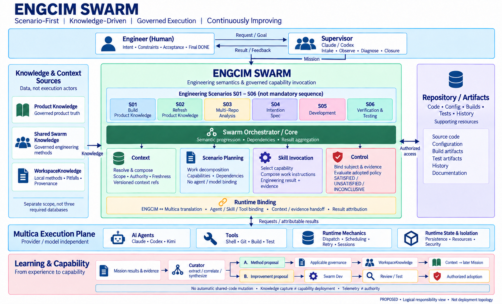
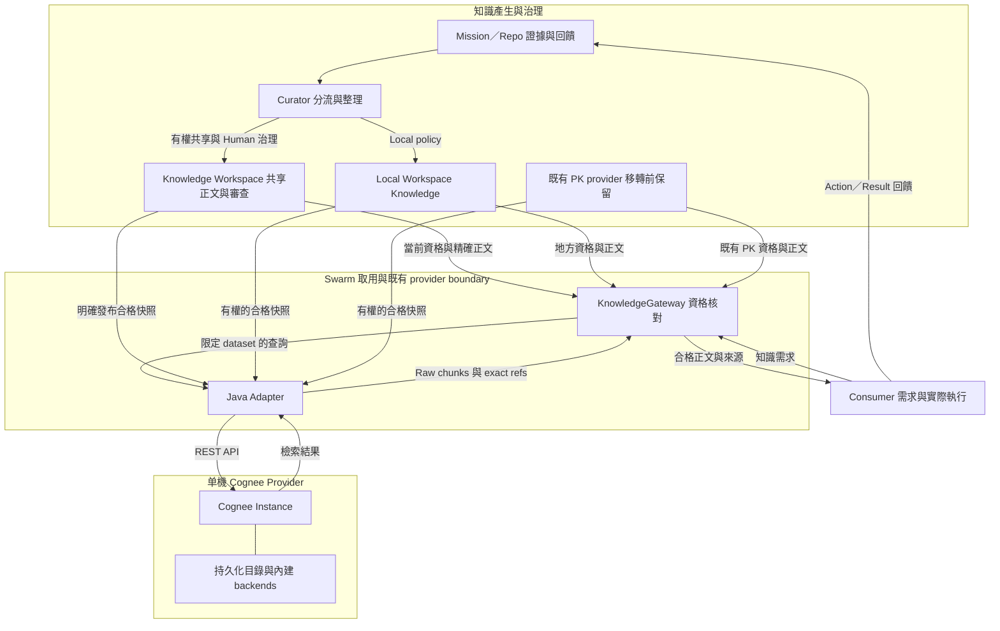
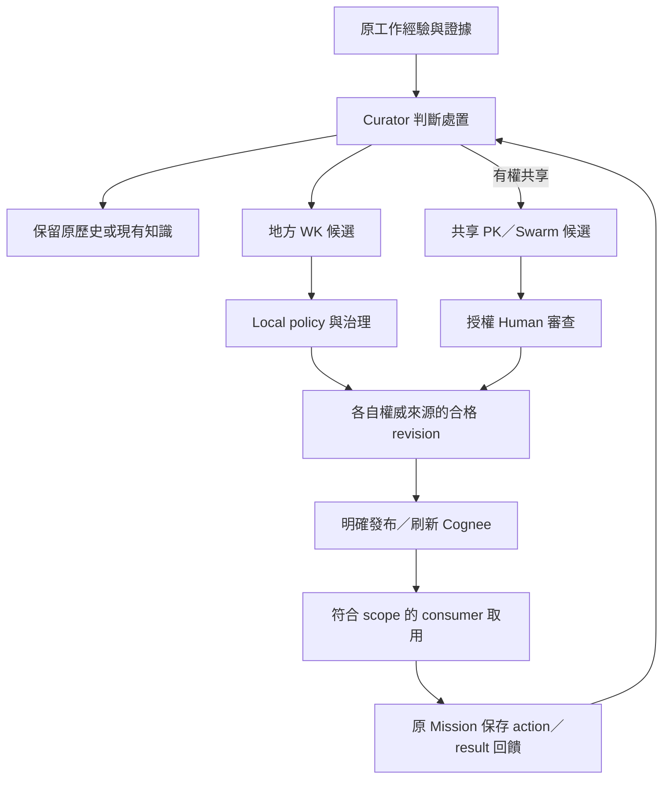

# ENGCIM Knowledge Design v0.8-r3 — Knowledge Workspace Model

> **Repository review source — 2026-09-28 consolidation.** This file is the single maintained design/review source for this knowledge capability line. Status remains **PROPOSED**, not adopted runtime authority. Sections 1–26 retain the imported r3 design except the explicitly dated Cognee provider boundary amendment in §1 and §4; §27 defines SSOT/reference rules, §28 records the dated evidence-chain assessment, and §29 aligns the architecture diagram with module responsibilities and implementation seams. Historical worked-example statuses in §26 are not a current runtime status feed.
>
> Imported from `ENGCIM-KNOWLEDGE-DESIGN-v0.8-r3-KNOWLEDGE-WORKSPACE.md`, SHA-256 `0d071c6cbea40b6ab5df0e896f33fd70f4117eebf8f07f2ce252dd3ecfe29c61`. Downloads copies remain historical, unchanged; future edits belong here. This consolidation changes the design maintenance location, not knowledge approval, source-policy precedence, package adoption, runtime configuration or deployment.
>
> Execution backlog: [RC10 implementation plan](RC10-IMPLEMENTATION-PLAN.md). Runtime contract: [existing Workspace Learning profile](../../../bootstrap/overlays/multica/RC10-WORKSPACE-LEARNING.md). These retain their own responsibilities; this design does not replace them.

**Status:** PROPOSED / READY FOR REVIEW — r3 corrections pending scoped independent review; not runtime-validated  
**Date:** 2026-09-27  
**Review update:** 2026-10-01 — §32 replaces the separate evaluation/isolated-PoC recommendation with the current project’s minimal Cognee integration design: one external instance, embedded backends, persistent directory, and explicit index refresh. §1/§4/§27.4 align the provider boundary and storage responsibilities. Status remains PROPOSED / DOCUMENTATION_ONLY; installation, Java integration and runtime adoption are not claimed.
**Authority base:** ENGCIM Swarm v1.0 r9 FINAL-ALIGNED + Claude Supervisor v0.5.20  
**Candidate alignment:** ENGCIM Swarm v1.0 r10 Candidate r3 + Knowledge Workspace Architecture v0.1  
**Supersedes as review candidate:** v0.8-r2; preserves v0.7 consumer needs and bounded two-mode decision rules. No adopted authority is superseded by this document.  
**Review basis:** ownership, authority, runtime executability, failure-closed eligibility, minimality  
**Important:** This document is not current authority until separately reviewed, validated, and promoted. Authority/candidate references above are inherited design references, not newly verified package alignment. The companion v0.8 review assessed the original v0.8, not this r3.

**Inherited r2 scope:** document-only corrections for concurrent approval, invalid old revisions, consumer/export authorization, bounded Mission exceptions, consumer continuity and existing Product Knowledge authority. No deployment, migration, new service or schema is authorized.

---

# 1. Objective

ENGCIM needs a knowledge architecture that:

1. works without direct tKMS access;
2. can be developed and validated in Multica today;
3. supports one Product spanning multiple engineering Workspaces and repositories;
4. preserves local Workspace learning without forcing Human approval on every local learning event;
5. provides Human-governed cross-Workspace Product and Swarm knowledge;
6. supplies exact, attributable Product Context and Swarm Context to Missions;
7. turns repeated learning into Knowledge or Capability improvement;
8. does not introduce a new ENGCIM-owned Memory Service, workflow engine, or eighth ENGCIM Core component. The 2026-10-01 proposal permits one external Cognee provider process with derived persistent state behind the existing Java boundary (§32); this is an explicit change to the earlier no-knowledge-runtime constraint, not a claim of zero runtime or operational cost.

The growth objective is to improve judgment and subsequent work in concrete scenarios: preserve quality while measurably reducing avoidable Human reminders, rescue and rework. Retrieval, record counts and isolated test passes do not establish this outcome. The bounded acceptance procedure is in §27.6.6.1.

The target loop has independent, governed branches:

```text
Work in context → Experience → Evidence-bounded judgment
                                 ├→ History only
                                 ├→ Local candidate → Applicable local governance
                                 │                    → Eligible local reuse
                                 ├→ Shared candidate → Shared governance
                                 │                     → Eligible shared reuse
                                 └→ Authorized capability improvement
                                                       → Review/test/adoption
                                                       → Consumer behavior
Reuse / behavior → Actual result and counterexamples → Same learning lineage
```

Shared promotion is not a prerequisite for local reuse. An already authorized correction need not wait for knowledge admission. Each branch retains its own authority; knowledge selection does not authorize mutation, publication or deployment.

---

# 2. Core Architecture Decision

The earlier five-domain model:

```text
Product
Workspace
Swarm
Supervisor
Swarm Dev
```

is retained as a map of knowledge needs and consumers, not five peer authorities. v0.7 already separated domain, scope, audience and authority; this revision changes the proposed local/shared operating model, not that distinction.

They represent different dimensions:

```text
Product
= shared Product knowledge authority

Workspace
= local execution / experience scope

Swarm
= shared ENGCIM knowledge authority

Supervisor
= diagnosis / learning-source producer role

Swarm Dev
= capability improvement activity
```

Supervisor still consumes diagnosis/recovery knowledge; Swarm Dev still consumes implementation, evaluation and maintenance experience. Role/activity classification does not remove their retrieval needs:

| Consumer | Knowledge need | Candidate source |
|---|---|---|
| SA/SD, Planner, Developer, Reviewer, QA | Product behavior and realization | Governed Product Context |
| Authorized local roles | Environment and local operating experience | Eligible local WorkspaceKnowledge |
| Engineering roles/Skills | Reusable engineering methods | Eligible Swarm Context |
| Supervisor | Diagnosis, recovery, intake/closure experience | Authorized local knowledge and Swarm Context |
| Swarm Dev | Root causes, design trade-offs and improvement results | Authorized local knowledge, Swarm Context and relevant Product Context |

These are logical consumers, not five stores, services or independent approval authorities.

The proposed candidate architecture is therefore:

```text
                   ENGINEERING WORKSPACES
          ┌────────────────┬────────────────┐
          │                │                │
          ▼                ▼                ▼
      Workspace A      Workspace B      Workspace C
          │                │                │
          ├─ Mission       ├─ Mission       ├─ Mission
          ├─ Evidence      ├─ Evidence      ├─ Evidence
          ├─ Findings      ├─ Findings      ├─ Findings
          └─ Workspace     └─ Workspace     └─ Workspace
             Knowledge        Knowledge        Knowledge
          │                │                │
          └──────── promotion candidates ───┘
                           │
                           ▼
                KNOWLEDGE WORKSPACE PROJECT
                           │
             ┌─────────────┴─────────────┐
             ▼                           ▼
      PRODUCT KNOWLEDGE              SWARM KNOWLEDGE
      PRODUCT/<productRef>                SWARM
             │                           │
          Candidate                    Candidate
             │                           │
             └─────────────┬─────────────┘
                           ▼
                       IN_REVIEW
                           │
                      Human Review
                           │
                          DONE
             ┌─────────────┴─────────────┐
             ▼                           ▼
       Product Context               Swarm Context
             │                           │
             └─────────────┬─────────────┘
                           ▼
                     ENGCIM Mission
                           │
                           ▼
                    Runtime Binding
                           │
                           ▼
                        Multica
```

---

# 3. Knowledge Classes and Authority

## 3.1 WorkspaceKnowledge

**Scope:** one engineering Workspace.

Purpose:

- local reusable experience;
- local environment constraints;
- local setup / recovery guidance;
- recurring local failure patterns;
- local procedural learning;
- local execution caveats.

### Governance

WorkspaceKnowledge remains in the originating Workspace.

```text
WorkspaceKnowledge
→ local capture
→ local update
→ local reuse
```

**Human approval is not required by this architecture.**

Its lifecycle follows the originating Workspace's existing local learning policy. Absence of a central Human gate does not waive that policy's approval or delegation requirements; if applicable local authority is missing, retain a candidate rather than invent approval.

### Boundaries

```text
WorkspaceKnowledge
≠ Product Knowledge

WorkspaceKnowledge
≠ Swarm Knowledge

WorkspaceKnowledge
≠ Runtime State

WorkspaceKnowledge
≠ automatically cross-Workspace reusable
```

WorkspaceKnowledge may later generate a broader promotion candidate, but the original local record remains local.

---

## 3.2 Product Knowledge

**Scope:** one Product across multiple Workspaces/repositories.

Product Knowledge is governed Product truth.

It may include:

- product semantics;
- capabilities;
- Product Behavior Scenarios;
- business rules / invariants;
- architecture;
- components / interfaces;
- Product realization;
- component ↔ repository mapping;
- governed Product historical decisions.

A Product may span:

```text
Product
├─ Workspace DEV
├─ Workspace VALIDATION
├─ Workspace MAINTENANCE
└─ Repositories
   ├─ Repo A
   ├─ Repo B
   ├─ Repo C
   └─ ...
```

No engineering Workspace is automatically the Product authority.

### Governance

Product Knowledge is hosted in the Knowledge Workspace Project under:

```text
PRODUCT/<productRef>
```

Candidate lifecycle:

```text
OPEN / IN_PROGRESS
        ↓
     IN_REVIEW
        ↓
     Human Review
        ├─ changes → IN_PROGRESS
        └─ approve → DONE
```

Human approval is required for `IN_REVIEW → DONE`.

---

## 3.3 Swarm Knowledge

**Scope:** ENGCIM/Swarm across multiple Workspaces.

Examples:

- recurring engineering patterns;
- recurring failure patterns;
- Supervisor diagnosis patterns;
- runtime/platform limitations;
- reusable Swarm operating guidance;
- evidence-backed engineering practices.

Hosted under:

```text
SWARM
```

in the Knowledge Workspace Project.

It uses the same Human-governed lifecycle:

```text
candidate
→ IN_REVIEW
→ Human
→ DONE
```

Swarm Knowledge remains distinct from capability implementation.

```text
Swarm Knowledge          Capability Implementation
---------------          -------------------------
reasoning pattern     →  Skill candidate
deterministic rule    →  Control / code candidate
runtime pattern       →  Core / Runtime Binding candidate
platform limitation   →  Multica/platform issue
```

---

# 4. Knowledge Workspace Project

The Knowledge Workspace Project is the proposed operating surface for cross-Workspace governed knowledge, subject to the authority transition in §4.2; its presence does not establish current deployment or authority.

It is not:

```text
a new ENGCIM component
a Memory Service
a new ENGCIM-owned runtime
a workflow engine
a replacement for WorkspaceKnowledge
```

Initial logical namespaces:

```text
Knowledge Workspace Project
├─ PRODUCT/SPC
├─ PRODUCT/APC
├─ PRODUCT/MES
├─ ...
└─ SWARM
```

A separate physical Workspace per Product is not required initially.

Split only when evidence demonstrates a need for:

- access isolation;
- ownership separation;
- scale;
- performance;
- compliance;
- operational isolation.

---

# 4.1 Shared Knowledge Approval Authority

The Knowledge Workspace Human gate applies only to shared Product/Swarm knowledge.

```text
WorkspaceKnowledge
→ no Knowledge Workspace Human gate

Knowledge Workspace PRODUCT / SWARM knowledge
→ IN_REVIEW
→ authorized Human reviewer
→ DONE
```

`DONE` alone is not sufficient proof of authority.

A shared knowledge revision is Human-approved only when the platform can establish the following acceptance event for that exact revision (not merely the issue's current workflow status):

```text
reviewed revision was accepted by a DONE transition
AND transition actor is an authorized Human reviewer
AND approval binds the exact reviewed content identity
```

The exact content identity MAY be represented by:

- provider issue/body revision;
- immutable snapshot identity;
- or content digest.

Do not invent a new persisted approval object if the issue provider already exposes sufficient transition actor and exact-content revision history.

If exact Human approval provenance cannot be established:

```text
HUMAN_APPROVAL_UNVERIFIED
→ shared knowledge is not eligible for Product/Swarm Context
```

### Reviewer scope

"Human" does not mean any account capable of changing issue state.

Approval must be performed by a Human authorized for the relevant authority scope:

```text
PRODUCT/<productRef>
or
SWARM
```

The concrete reviewer/ACL mechanism is provider-specific and remains outside this architecture, but the authority check is mandatory.

### Accepted-content immutability

After a shared knowledge revision is Human-approved:

```text
approved content
→ immutable as an accepted revision
```

If content changes after approval, the previous approval no longer applies to the changed content.

Required handling:

```text
new content
→ new knowledge revision
→ IN_REVIEW
→ Human review
```

Do not treat a post-DONE body edit as still approved merely because issue status remains DONE.

---

# 4.2 Existing Authority and Authorized Sharing

An existing governed Product Knowledge store remains authoritative until an explicit scope-bound adoption decision selects a different source. For each Product/scope, identify the current authoritative provider and exact governed revision. Choose one of these roles for the Knowledge Workspace:

- candidate intake only: holds proposals, not a second Product truth source;
- read-only projection: preserves source identity/approval, cannot approve divergent truth locally;
- authoritative provider: only after explicit adoption, migration/reconciliation and consumer-binding validation.

The shared Human gate in this design applies to the proposed authoritative-provider profile; it does not retroactively invalidate existing governed knowledge or authorize a second writer. Before adoption, existing Product Context bindings continue to follow their adopted contracts. If no authority transition has been decided, retain the existing store and use the project only as candidate intake.

Knowledge approval and data access are separate decisions. Before promotion transfers local content or evidence to a shared project, verify source sharing/export permission, destination audience and required redaction. Read permission is not export permission. A sanitized derivative has its own content identity and review; do not edit an approved payload while retaining its approval.

At retrieval, verify that the requesting actor/Mission/Workspace may access and use the selected knowledge in that destination. Labels and Product membership do not establish access permission. Use existing provider ACLs/policies; if a shared project cannot enforce a required boundary, separate the protected surface before placing sensitive material there. Unknown required authorization excludes the affected material, not all unrelated work.

# 5. Knowledge Issue Model

One issue represents one independently reviewable shared knowledge unit.

Avoid:

```text
one giant Product Knowledge issue
```

Prefer:

```text
PK-SPC-DNAVIEWER-REALIZATION
PK-SPC-OOC-RULE-001
PK-SPC-CHART-BEHAVIOR-001
```

Minimal structured body:

```yaml
knowledgeRef: string
knowledgeKey: string

domain: PRODUCT | SWARM

productRef: string?          # required for PRODUCT
recordKind: KNOWLEDGE | ANALYSIS
knowledgeType: string
revision: integer

statement: string
scope: string
applicability: string
limitations: [string]

sourceRefs: [string]
evidenceRefs: [string]
conflictRefs: [string]

supersedesRef: string?
```

Platform-native fields remain native:

```text
issueRef
status
author
timestamps
comments
review history
issue/body revision history when available
```

`knowledgeRef` SHOULD reuse the stable provider `issueRef` (or another already-existing stable provider ref). Do not create a second identifier merely to duplicate issue identity.

At the ProductKnowledgeBinding boundary, `sourceRefs[]` / `evidenceRefs[]` are projected as governed provenance. Supporting evidence does not have to be live-accessible on every Context read; see §8.1.

---

# 6. Minimal Labels

Required:

```text
kb:product
or
kb:swarm
```

For Product Knowledge:

```text
product:<productRef>
```

Record class:

```text
record:knowledge
record:analysis
```

Optional source Scenario:

```text
source:S01
source:S02
source:S03
```

Do not create labels for:

```text
revision
knowledgeKey
scope
applicability
evidence count
confidence
workspace
repo
agent
model
provider
```

These belong in the structured body or refs.

---

# 7. S01 / S02 / S03 Knowledge Lifecycle

## 7.1 S01 — Build Product Knowledge

```text
Product seed / source evidence
        ↓
S01 Build Product Knowledge
        ↓
Product Knowledge candidate(s)
        ↓
IN_REVIEW
        ↓
Human Review
        ↓
DONE
```

S01 may create multiple atomic knowledge issues.

S01 MUST NOT mark governed Product Knowledge `DONE`.

---

## 7.2 S02 — Refresh Product Knowledge

S02 creates a new revision.

Example:

```text
knowledgeKey = SPC-DNAVIEWER-REALIZATION

r1 = DONE
r2 = IN_REVIEW
```

While r2 is under review and r1 remains eligible:

```text
Product Context → r1 only while still eligible
```

After Human approves r2:

```text
r2 = DONE
Product Context → r2
```

Accepted revisions are never edited in place.

If material new evidence contradicts r1, or its approval/use authorization is withdrawn, stop using r1 for the affected decision while review is pending. Preserve it as history; do not overwrite Product truth or silently substitute unapproved r2. Only work requiring the excluded context is blocked. Being the current accepted revision is necessary but not sufficient for eligibility.

### Approval-time stale-base guard

Before Human approval of a refresh candidate:

```text
candidate.supersedesRef
MUST equal
currentAcceptedRef(authorityScope, candidate.knowledgeKey)
```

If another revision became accepted after this candidate was created:

```text
STALE_REVIEW_BASE
→ do not approve as DONE
→ return/rebase/re-evaluate candidate
```

The read/check and acceptance transition must not be treated as atomic merely because they are adjacent. Two reviewers can both read r1 and pass the check before either approves.

Use an existing provider conditional operation only if it protects the shared accepted-lineage identity, not just each separate candidate issue. Alternatively, serialize approval for the same authority-scope/key through an existing authorized process covering every acceptance path. Neither mechanism is asserted to exist yet; map and validate it before claiming race prevention.

If neither mechanism is available, explicitly operate in detection-only mode: retain Human decisions, reconcile lineage after writes and before context handoff, and exclude ambiguous branches. This does not guarantee that a race never reaches a consumer and must not pass a prevention claim. A profile requiring race-free acceptance remains blocked until an adequate existing mechanism is identified. No new workflow engine or platform state is implied.

If lineage is ambiguous, do not guess authority.

---

## 7.3 S03 — Analyze Multi-Repo Codebase

S03 is analysis.

```text
Repos / history / architecture
        ↓
S03
        ↓
Analysis / Observation / Realization Finding
        ↓
record:analysis
```

Human may review the analysis and move it to `DONE`.

But:

```text
S03 DONE
≠ Product Knowledge
```

`record:analysis` is never directly eligible for Product Context or Swarm Context as accepted shared knowledge. It may remain explicitly attributed analysis/evidence input under its applicable authority; review completion does not promote it to truth or shared guidance.

If an S03 finding deserves Product Knowledge promotion:

```text
S03 finding
   ↓
Product Knowledge candidate
   ↓
record:knowledge
   ↓
IN_REVIEW
   ↓
Human
   ↓
DONE
```

---

# 8. Product Context Resolution

Product Context consumes only eligible Product Knowledge.

Here K denotes one exact knowledge revision, not a mutable issue as a whole. Revision acceptance is established from its exact authorized approval event/history; current revocation, conflicts, lineage and consumer authorization are evaluated separately at read time. Historical acceptance alone never establishes current eligibility.

For one-issue-per-revision representations, this coarse query may discover candidates:

```text
status = DONE
AND kb:product
AND product:<requestedProduct>
AND record:knowledge
```

For multi-revision issues, discovery must also enumerate resolvable accepted revision snapshots/history even when the current issue is IN_REVIEW for a newer draft. Do not filter those issues out solely by current status. If the provider cannot resolve the old exact content and approval event, mark that revision's provenance UNVERIFIED; do not infer acceptance or create a new history service by default.

Then semantic eligibility:

```text
EligibleProductKnowledge(K, request) =
    AcceptedRevisionVerified(K)
AND HumanApprovalVerified(K)
AND ConsumerAccessAndUseAuthorized(K, request)
AND K.domain == PRODUCT
AND K.productRef == request.productRef
AND K.recordKind == KNOWLEDGE
AND K is current accepted revision within its authority scope
AND approval/use authorization has not been withdrawn
AND scope matches
AND applicability matches
AND no unresolved material conflict
AND required provenance identity is retained
```

Therefore:

```text
Revision accepted (historical DONE event)
= Human accepted this exact shared knowledge revision

Eligible
= verified revision acceptance
+ verified authorized Human approval
+ authorized consumer access/use (separate from approval)
+ exact approved content identity
+ right Product
+ right record class
+ current accepted revision
+ scope/applicability
+ conflict-free
+ sufficient retained provenance
```

`DONE` alone is never sufficient.

### Swarm Context eligibility

Swarm Context uses the same revision-level eligibility predicate above, replacing PRODUCT/productRef matching with domain=SWARM and the applicable SWARM authority scope. It retains recordKind=KNOWLEDGE, exact authorized Human acceptance, current accepted lineage, consumer access/use authorization, absence of withdrawal/material conflicts, scope/applicability and retained provenance. A DONE SWARM ANALYSIS is not eligible merely because it is reviewed, accessible and correctly scoped. No new resolver service is implied.

## 8.1 Approval-time Evidence vs Read-time Availability

Product Context must remain usable when original Product repositories or enterprise systems are temporarily inaccessible.

Therefore:

```text
approval time
→ Human/governance validates supporting evidence/provenance

context read time
→ exact approved knowledge record + approval provenance must be resolvable
```

The resolver MUST NOT require every original `sourceRef` / `evidenceRef` to be live-accessible on every Mission unless the knowledge contract explicitly requires current-source validation.

Allowed:

```text
approved knowledge record
+ exact accepted content identity
+ retained provenance refs/digests
→ Product Context eligible
```

even when an original source system is temporarily unreachable.

Currentness-sensitive knowledge MAY declare a stronger requirement:

```text
requiresCurrentSourceValidation = true
```

Conceptually only; do not add this field until a real knowledge type requires it.

This distinction is required so Knowledge Workspace can support development outside environments that cannot access enterprise source systems.

---

# 9. Revision Authority

Candidates are grouped by:

```text
(authorityScope, knowledgeKey)
# authorityScope = PRODUCT/<productRef> or SWARM
```

A stable issueRef identifies a unit, not necessarily a revision. Approval and supersedesRef must resolve the exact accepted snapshot/body revision/digest, including when one provider issue carries multiple revisions. Reuse provider references; no additional identity service is implied.

Normal accepted lineage:

```text
r1 DONE
 ↓
r2 DONE
 ↓
r3 DONE
```

Current:

```text
r3
```

Refresh in progress:

```text
r1 DONE
 ↓
r2 IN_REVIEW
```

Current accepted lineage remains r1, but Context may use it only while eligible:

```text
r1 eligible → usable
r1 materially contradicted/revoked → exclude affected use, not fallback to unapproved r2
```

Forked accepted lineage:

```text
       r1 DONE
       /     \
 r2a DONE   r2b DONE
```

Result:

```text
REVISION_LINEAGE_CONFLICT
```

Do not choose `max(revision)` across ambiguous branches.

If the affected key is mandatory for the Mission:

```text
Product Context = BLOCKED
```

---

# 10. WorkspaceKnowledge in Mission Context

WorkspaceKnowledge is not read by the Product Context Resolver.

It is composed separately.

```text
Resolved Mission Context
=
Product Context
+ eligible local WorkspaceKnowledge
+ eligible Swarm Context
+ Mission inputs/evidence
```

Attribution remains separate.

```text
Product Context
= Product truth

WorkspaceKnowledge
= local learned experience

Swarm Context
= logical shared-knowledge context slice for ENGCIM work
  (not a new Core component)
```

A local workaround or environment fact does not silently become Product truth.

### Local reuse guardrails

WorkspaceKnowledge does not require Human approval, but local reuse is not unconstrained.

At minimum:

```text
current Mission evidence
> stale/conflicting WorkspaceKnowledge

Product Knowledge authority
> conflicting WorkspaceKnowledge on Product truth

Control / Human authority
> WorkspaceKnowledge guidance
```

Known stale or materially contradicted WorkspaceKnowledge must not be silently injected as current guidance.

The detailed local Workspace learning policy remains Workspace-owned; this document does not create a central approval workflow for it.

---

# 11. Workspace Learning and Promotion

Local learning remains local by default.

```text
Mission
 ↓
Evidence / Finding
 ↓
Mission Learning Source
 ↓
WorkspaceKnowledge
 ↓
local reuse
```

No Knowledge Workspace Human approval is required.

When evidence justifies broader reuse:

```text
WorkspaceKnowledge / evidence
        ↓
Promotion Candidate
        ├─ Product-specific
        │      → Knowledge Workspace / PRODUCT
        │
        ├─ Swarm-general
        │      → Knowledge Workspace / SWARM
        │
        ├─ reusable reasoning
        │      → Skill improvement
        │
        ├─ deterministic rule
        │      → Control / code improvement
        │
        ├─ Core/runtime issue
        │      → owning component improvement
        │
        └─ platform issue
               → Multica/platform issue
```

Promotion must first satisfy source sharing/export and destination access authorization (§4.2), including referenced evidence. Approval of the shared statement alone does not grant those permissions.

Promotion does not move or delete local WorkspaceKnowledge.

It creates a new governed shared candidate.

---

# 12. Supervisor Responsibility

Supervisor may:

```text
inspect Mission
identify material findings
perform evidence-backed diagnosis / 5 Whys when warranted
produce Mission Closure Summary
assemble Mission Learning Source
suggest broader learning / promotion
recommend correction owner / improvement direction
```

Supervisor does not:

```text
publish Product Knowledge
publish Swarm Knowledge
promote Knowledge Workspace issue to DONE
own Product Context
own WorkspaceKnowledge persistence
turn runtime facts into Product truth
```

Supervisor remains a learning-source and diagnosis role, not a shared truth publisher.

---

# 13. Knowledge → Capability

Knowledge is not always the right final representation.

LearningDisposition classifies reusable learning:

```text
one-off/local experience
→ WorkspaceKnowledge / history

Product fact / Product pattern
→ Product Knowledge candidate

Swarm-wide reusable guidance
→ Swarm Knowledge candidate

reusable reasoning
→ Skill improvement

deterministic engineering rule
→ Control / code improvement

Core orchestration pattern
→ Swarm Core improvement

execution translation pattern
→ Runtime Binding improvement

platform issue
→ Multica/platform issue
```

The objective remains:

```text
Experience
→ Knowledge
→ Capability
```

not:

```text
Experience
→ ever-growing knowledge files
```

---

The following sections support evaluation, adoption and future provider decisions. They are **not prerequisites for implementing the first Knowledge Workspace closed loop** unless a validation case explicitly exercises them.

# 14. Supporting Policy — Knowledge Evidence Maturity

Evidence maturity is kept separate from adoption policy.

Suggested logical maturity:

```text
E0 OBSERVED
= evidence/finding exists

E1 SYNTHESIZED
= bounded reusable candidate with scope/limitations

E2 REUSED
= later consumer use is traceable

E3 EFFECT_VALIDATED
= comparable evidence supports measurable effect
```

Maturity does not itself choose an implementation.

E0–E3 是本設計建議的 evidence maturity，不是新增 runtime workflow state，也不是 Agent 的整體分數。先前對話中的 L0–L4 不作第二套標準。E2 僅表示可追溯使用，不表示方法成功；每次使用的 outcome、負面證據及適用性須另保留。E3 必須指出可比較的情境、版本、觀察窗口與效果，不能以單次 PASS 或使用次數取代。成熟度、治理決定、當前 eligibility 及能力採用／部署狀態分開：曾達 E2/E3 的方法也可能因新反證失效。

---

# 15. Supporting Policy — Capability Improvement Selection

When knowledge leads to capability alternatives, use the existing two-mode decision rule.

## Default Capability Improvement

```text
Quality
> Human effort
> Cycle-time
```

## Explicit Time-Critical Mission Exception

```text
Quality
> Cycle-time
> Human effort
```

Constraints such as:

```text
Human authority
safety
security
budget/resource limits
hard deadlines
```

remain feasibility boundaries, not weighted tradeable scores.

Missing evidence is `UNVERIFIED`, not equivalent.

Long-term capability adoption uses the default. A time-critical Mission may reverse only the second and third priorities through an existing Human decision or explicitly delegated policy. Reuse the Mission record to bind scope, urgency, applicable window/deadline, permitted additional Human effort and authority reference; no separate approval service or mandatory new schema is required.

The exception expires at its agreed end or Mission completion. Scope/budget/time extensions follow the existing authority. Expiry of a ranking exception affects later choices, not otherwise authorized in-flight operations; Human hold, operation-authorization withdrawal or expiry follows existing stop/safe-wrap-up rules. A faster Mission achieved with additional Human assistance is not proof that the shared capability default should change.

Quality equivalence needs proportionate evidence, not merely two PASS labels. Compare total relevant Human effort, including build, review, learning governance, maintenance and rework over the same usage window. Separate capability delivery time from downstream Mission cycle-time.

When evidence is UNVERIFIED, keep a still-applicable authorized approach if available; do not retain an approach refuted by material evidence. For a necessary new choice, gather the minimum distinguishing evidence within existing authorization, then escalate unresolved material trade-offs to the existing decision owner. Unknown limits require clarification only when they affect that choice. Do not claim an unsupported winner or stop unrelated authorized work.

This policy selects capability alternatives or an explicitly scoped Mission strategy; it is not part of knowledge identity or storage. Knowledge evidence maturity remains separate from selection and adoption.

---

# 16. Supporting Boundary — tKMS

For this design:

```text
tKMS = OPTIONAL / DEFERRED
tKMS = NOT REQUIRED FOR DEVELOPMENT
tKMS = NOT REQUIRED BY MULTICA
tKMS = NOT REQUIRED FOR S01/S02/S03
tKMS = NOT REQUIRED FOR Product Context
tKMS = NOT REQUIRED FOR Swarm Context
```

Current providers:

```text
WorkspaceKnowledge
→ originating engineering Workspace

Product / Swarm Knowledge
→ Knowledge Workspace Project
```

Future tKMS MAY become:

```text
optional provider
optional synchronization target
optional enterprise discovery surface
```

only when:

1. access exists;
2. a demonstrated requirement cannot be satisfied by the current Knowledge Workspace approach;
3. authority/provenance remains preserved.

No direct `Swarm → tKMS` publication is required or assumed.

---

# 17. Supporting Boundary — Storage and Portability

The logical design is independent of the final physical storage implementation.

Current candidate:

```text
Knowledge Workspace Project
+ issue-backed governed records
```

Possible future providers:

```text
Git-backed knowledge repository
tKMS
other governed repository
```

Do not migrate storage merely because another representation looks cleaner.

Trigger storage migration only when concrete requirements appear, such as:

- versioned portable snapshots;
- cross-provider transfer;
- stronger recovery;
- independent ACL boundaries;
- provider limitations blocking required semantics.

---

# 18. Retrieval Rules

All retrieval must preserve:

```text
authority
verified Human approval for shared knowledge
exact accepted content identity
recordKind = KNOWLEDGE for shared Knowledge Context
current authorization/revocation checked separately from historical acceptance
scope
applicability
revision
freshness/currentness
conflict state
provenance identity
```

Search result is not authority.

```text
found
≠ eligible
```

Vector similarity, keyword ranking, graph traversal, or semantic search may help discover candidates, but must not replace deterministic eligibility checks.

---

# 19. Failure Modes

Fail closed when shared knowledge is required but:

```text
mandatory Product Knowledge missing
Human approval provenance unverified
approved content identity ambiguous
required revision lineage ambiguous
stale refresh base approved incorrectly
material conflict unresolved
required provenance identity missing
wrong Product
wrong record kind
knowledge revision has no verifiable authorized acceptance
scope/applicability mismatch
```

Do not invent Product Context to keep a Mission moving.

---

# 20. Validation Set

## KW-V1 — Local WorkspaceKnowledge

Expected:

```text
WorkspaceKnowledge created/updated/reused locally
without Knowledge Workspace Human approval
```

## KW-V2 — Human Product Knowledge Promotion

```text
S01 candidate
→ IN_REVIEW
→ Human
→ DONE
```

Agent cannot autonomously promote shared knowledge.

## KW-V3 — Accepted-revision-only Product Context

```text
exact accepted Product Knowledge revision → candidate
unapproved IN_REVIEW revision → excluded
same issue: accepted eligible r1 + IN_REVIEW r2 → discover r1, exclude r2
same issue: accepted but now revoked r1 + IN_REVIEW r2 → neither eligible
```

## KW-V4 — S03 Analysis Separation

```text
DONE record:analysis (PRODUCT or SWARM)
→ excluded from the corresponding shared Knowledge Context
```

## KW-V5 — Product Isolation

SPC resolver does not silently consume APC knowledge.

## KW-V6 — Refresh Continuity

```text
r1 DONE
r2 IN_REVIEW
→ Context uses r1 only if still eligible

Human approves r2
→ Context uses r2
```

Also exercise materially contradicted or revoked r1 while r2 remains IN_REVIEW: exclude affected r1 use, retain history, do not use r2 early, and block only required dependent work.

## KW-V7 — Revision Fork

Forked DONE branches:

```text
→ REVISION_LINEAGE_CONFLICT
→ fail closed if mandatory
```

## KW-V8 — Workspace Promotion

Local WorkspaceKnowledge can create a separate Product/Swarm candidate without moving/deleting local knowledge.

## KW-V9 — Product/Swarm Separation

Product Context reads PRODUCT only.

Swarm Context reads eligible SWARM KNOWLEDGE revisions only; approved SWARM ANALYSIS is excluded. Product Context uses the corresponding PRODUCT KNOWLEDGE restriction.

## KW-V10 — tKMS Independence

Knowledge build, review, Product Context, Runtime Binding, and Multica execution work while tKMS is unavailable.

## KW-V11 — Knowledge → Capability

A stable deterministic Swarm learning can be dispositioned into a Control/code improvement rather than remaining only as knowledge.

## KW-V12 — Human Approval Provenance

A `DONE` Product Knowledge issue whose transition actor/content identity cannot be verified:

```text
→ excluded from Product Context
```

## KW-V13 — Concurrent Refresh / Stale Review Base

```text
r1 DONE
candidate r2a IN_REVIEW supersedes r1
candidate r2b approved first → DONE
```

Expected:

```text
r2a.supersedesRef != currentAcceptedRef
→ STALE_REVIEW_BASE
→ r2a cannot become DONE without re-evaluation/rebase
```

Also exercise truly concurrent reviewers: both read r1 before either commits. Verify the selected shared-lineage conditional operation or serialized process prevents both successors becoming usable. In detection-only mode, record that limitation and demonstrate conflict exclusion; do not call it race-prevention PASS.

## KW-V14 — Approved Knowledge with Source Offline

An approved knowledge revision retains exact content identity and provenance refs/digests, but its original enterprise source is temporarily unreachable.

Expected:

```text
Product Context may still use the approved knowledge
unless the knowledge type explicitly requires current-source validation.
```

---

## r2 targeted acceptance checks

These extend relevant existing cases, not a new test platform:

- KW-V5/V8/V9: same-Product unauthorized consumer is excluded; local read permission without export permission cannot promote content/evidence; SWARM obeys the same access boundary.
- KW-V6/V12: approved old content that is now materially contradicted or revoked is excluded for the affected use.
- KW-V13: distinguish sequential stale-base rejection from simultaneous approvals; scope identical keys to their Product/SWARM authority.
- Authority transition: existing PK remains the only authoritative source until explicit adoption; candidate intake/projection must not create dual writers.
- Supporting policy, when exercised: authorized urgency expires; operation hold still applies; insufficient evidence does not become equivalence or an automatic global blocker.

# 21. Architecture Invariants

**KD-01** Runtime State is not Knowledge.

**KD-02** WorkspaceKnowledge remains local to the originating Workspace.

**KD-03** WorkspaceKnowledge does not require the Knowledge Workspace Human approval lifecycle.

**KD-04** Product Knowledge is Product-scoped, not Workspace-scoped.

**KD-05** A Product may span multiple Workspaces and repositories.

**KD-06** Swarm Knowledge is shared ENGCIM knowledge, not Product truth.

**KD-07** The candidate proposes Product and Swarm Knowledge in authority-separated domains; existing Product authority remains unchanged until the explicit §4.2 transition.

**KD-08** Human exclusively promotes Knowledge Workspace Product/Swarm knowledge from `IN_REVIEW` to `DONE`.

**KD-09** Exact revision acceptance through authorized Human DONE is necessary but not sufficient for shared Context eligibility; a mutable issue's current status is not a substitute.

**KD-10** S03 reviewed analysis does not automatically become Product Knowledge.

**KD-11** S02 creates new revisions; accepted revisions are immutable.

**KD-12** Product Context Resolver never reads WorkspaceKnowledge directly.

**KD-13** WorkspaceKnowledge may contribute separately to Authorized Visible Context.

**KD-14** Knowledge is distinct from Capability implementation.

**KD-15** Supervisor produces learning sources and diagnosis, not shared truth.

**KD-16** tKMS is optional/deferred and not a current runtime/development dependency.

**KD-17** Knowledge Workspace Project is an operating/provider surface, not an eighth ENGCIM component.

**KD-18** `DONE` without verifiable authorized Human transition and exact approved content identity is not sufficient for shared Context eligibility.

**KD-19** Shared knowledge approval is bound to exact content; post-approval edits require a new revision/review.

**KD-20** S02 approval checks that `supersedesRef` still equals the current accepted revision; stale-base candidates cannot be silently approved.

**KD-21** Product Context does not require every original source system to be live-accessible at read time when approved knowledge retains sufficient immutable provenance.

**KD-22** WorkspaceKnowledge has no central Human approval gate, but it cannot override current Mission evidence, governed Product truth, Controls, or Human authority.

**KD-23** Swarm Context is a logical shared-knowledge context slice, not an eighth Core component.

**KD-24** Search/discovery does not bypass authority/scope/freshness/provenance checks.

---

# 22. Implementation Sequence

Recommended first implementation:

```text
K0  Identify existing authority and reuse/select an authorized candidate surface (§4.2); bootstrap only if needed
 ↓
K1  Verify issue state/label operations
 ↓
K2  Run bounded S03 multi-repo analysis
 ↓
K3  Human reviews S03 analysis
 ↓
K4  Run S01 for one atomic Product Knowledge unit
 ↓
K5  Human IN_REVIEW → DONE
 ↓
K5a verify Human actor + exact approved content identity
 ↓
K6  Resolve Product Context
 ↓
K7  Run S02 refresh
 ↓
K8  prove eligible old DONE remains usable; contradicted/revoked old content is excluded
 ↓
K9  Human approves under the selected concurrency mechanism; no prevention claim from a pre-check alone
 ↓
K10 prove Context switches to new revision
 ↓
K11 test WorkspaceKnowledge promotion candidate
 ↓
K12 test tKMS-offline path
 ↓
K13 test approved knowledge remains usable when original source is offline
```

Do not start by building a large Product Knowledge corpus.

---

# 23. Target Mental Model

```text
                LOCAL LEARNING                          SHARED KNOWLEDGE

          Engineering Workspace                   Knowledge Workspace Project
          ---------------------                   ---------------------------
          Mission / Evidence
                 │
                 ▼
          WorkspaceKnowledge
          (no Human gate)
                 │
                 │ promotion candidate
                 └─────────────────────┐
                                       ▼
                         ┌──────────────────────────┐
                         │ PRODUCT     │   SWARM    │
                         │ Knowledge   │ Knowledge  │
                         └──────┬──────┴─────┬─────┘
                                │            │
                            IN_REVIEW     IN_REVIEW
                                │            │
                              Human        Human
                                │            │
                               DONE         DONE
                                │            │
                       Product Context   Swarm Context
                                └──────┬─────┘
                                       ▼
                                  ENGCIM Mission
                                       │
                                  local WorkspaceKnowledge
                                       │
                                       ▼
                                Runtime Binding
                                       │
                                       ▼
                                     Multica
```

The resulting design is intentionally simple:

> **Local Workspace learning stays fast and autonomous. Shared Product/Swarm knowledge is authorized-Human-governed and approval-bound to exact content. ENGCIM resolves only eligible shared knowledge into Context. Approved knowledge can remain usable without live enterprise-source access when immutable provenance is retained. tKMS is not required.**


# 24. r2 Revision Record

This is a document-only candidate revision. The original v0.8 review and r1 remain unchanged. Four primary findings and two architecture clarifications are addressed in wording:

| Review concern | r2 location | Remaining proof |
|---|---|---|
| Approval check race | §7.2, KW-V13 | Provider/process concurrency evidence |
| Invalid old revision reuse | §7.2, §8–9, KW-V6 | Contradicted/revoked old-version case |
| Cross-Workspace access/export | §4.2, §8, §11 | Actual ACL, sharing and consumer tests |
| Bounded Mission exception | §15 | Applicable decision/hold behavior |
| Five consumer needs preserved | §2 | Actual consumer context mapping |
| Existing PK authority continuity | §4.2, KD-07, K0 | Explicit adoption only if transition requested |

No runtime test PASS, independent r2 review, provider enforcement, deployment or adoption is claimed. This revision does not authorize executing §22. Keep the first closed loop bounded; no new service, loader, engine or parallel knowledge authority is required by these wording corrections.


# 25. r3 Scoped Revision Record

Only r2 independent-review F1/F2 are addressed. F1: exact revision acceptance/history is separate from current issue state and current eligibility; discovery includes eligible old accepted snapshots while a same-issue draft is IN_REVIEW. F2: Swarm Context inherits full shared eligibility, including KNOWLEDGE-only record class. No new service, schema, provider operation or authority transition is introduced.

QA mapping T11 now has an explicit document oracle: eligible accepted r1 remains discoverable while same-issue r2 is under review; revoked/contradicted r1 is excluded. T12 oracle: eligible SWARM KNOWLEDGE can be selected; DONE SWARM ANALYSIS cannot be selected as shared knowledge. Both remain NOT_RUN. Existing r2 mapping is historical; B4's document ambiguity is addressed here pending scoped review. B1 concurrency mechanism, B2 actual ACL and B3 authority profile remain unresolved implementation prerequisites.

Original r2 and its independent review remain unchanged. A scoped review of F1/F2 does not constitute whole-system validation, adopted authority, runtime PASS or Human DONE.

# 26. 經驗 → 可重用改善方法 → 能力：操作設計與完整演練

**2026-09-28；DESIGN_ONLY / PROPOSED。** 本節依 Human 要求補充 §11–15，不變更既有 schema、已採用治理或 runtime instructions。先前 r3 scoped review 不涵蓋本節。本節完成的是設計演練，不是知識入庫、共享採用、能力部署或 runtime 驗收。

## 26.1 三種產物，不是三套系統

| 產物 | 回答的問題 | 不是什麼 |
| --- | --- | --- |
| Experience / Mission Learning Source | 此次發生什麼、做了什麼、證據與結果為何？ | 原始 log 不是已證明的通用方法；失敗原因推論不是事實 |
| PROCEDURAL WorkspaceKnowledge | 何時適用、如何處理、哪些方法無效、如何判斷有效？ | 不是 Product truth、執行授權或可自動執行的程式 |
| Capability improvement | 如何讓既有角色在適用情境下穩定採用方法，降低逐步提醒？ | 不是多存一份文件、多加一個 Agent，或把每個案例升格為 gate |

共同方法保留五個問題：改善誰的哪個問題；修改哪個已確認位置及 owner；哪些行為不可破壞；最小有效驗證；成功交付／失敗僅修受影響部分。再補「適用／不適用條件、實際結果、證據及限制」，才可脫離原始個案重用。

```text
既有 Mission 結果／失敗證據
  → Supervisor：有界限的 Learning Source
  → Curator：觀察、比對、衝突識別、可重用方法 proposal
  → 既有 workspace policy/owner：決策；Curator 寫入並 readback
  → 下一個適用 Mission：Orchestrator 選取 → 實際角色採用／拒用 → 行動證據
  → 必要時：能力改善 proposal → Swarm Dev owner 實作 → 獨立驗證
  → 新結果回饋原知識版本；保留失敗與限制
```

不強制每筆 learning 都走完全部路徑：一次性資料留 Mission history；有用方法可停在 WorkspaceKnowledge；明確重大缺陷可直接以 evidence 提出能力修正，不必等待跨 Mission 重複失敗。共享知識 promotion 與能力部署是不同決策。

## 26.2 Owner、consumer、觸發與驗收

| 時機／活動 | Owner → consumer | 最小交付與通過条件 |
| --- | --- | --- |
| 材料性失敗、修正完成或可形成結論的階段結束 | Supervisor → Knowledge Curator | 既有 MissionLearningSource；區分事實／推論／建議，綁 Mission、subject revision、closure/evidence refs。未結案時保留階段 finding，不捏造 final closure 或 Human DONE |
| 有可重用內容時提煉 | Curator（既有 extraction/correlation/synthesis skills）→ workspace governance owner | PROCEDURAL proposal；五個問題、適用性、無效方法及限制可理解，正反證據均保留；無證據因果仍標推論 |
| 存放與更新 | 實際 policy 指定的決策 owner → Curator → 後續取用者 | 同 workspace 既有 issue-backed body/index；決策綁版本及 digest、read-after-write 成功。不因 Orchestrator assignment 推定批准權 |
| 後續 Mission 規劃前，或新症狀／重大 scope 變更時 | Orchestrator → Architect/Developer/Reviewer/Verifier 等真正 worker | 一次有界限查詢，傳最小版本綁定 context；role 記錄採用／拒用與理由、實際行動 ref；不要求每個角色遍搜知識庫 |
| 有穩定重用價值或重要缺陷時 | Curator/Supervisor 提出 direction → Swarm Dev 對應 owner | proposal 指出問題、已確認 seam、保護行為、最小案例、回復方式；沒有 owner/授權時 DEFER，不自動修改共享程式 |
| 能力候選交付 | Swarm Dev implementer → 獨立 Reviewer/Verifier → 既有採用 owner | 本地針對性檢查、適用與不適用案例、實際 consumer 整合；部署另依既有授權。不能以自評或離線 PASS 代替 live 行為證據 |
| 消費或改善產生新結果 | 消費角色提供證據 → Curator | 版本更新，保留舊內容與決策；重大反證使受影響知識不再 eligible。失敗不覆蓋成成功、不反覆自動重跑 Mission |

這些是責任，不新增排程器或週期掃描。治理 owner 必須解析成既有 policy/actor；缺少時保留 proposal。Workspace 本地治理不等於共享 Knowledge Workspace 的 Human gate，不能新增每次 local learning 的中央人工批准。既有 RC10 profile 要求 APPROVED/decisionRef 時仍遵守，不用候選設計取消現行要求。

五類 consumer 需求保持可辨識：Product 工程角色消費適用工程方法但不改 Product truth；Workspace 角色消費本地環境/排障經驗；Swarm 執行角色消費工作方法；Supervisor 消費 intake/診斷/closure 經驗；Swarm Dev 消費根因、trade-off、回歸與維護證據。這不是五個資料庫或五個新 authority。Supervisor 透過既有授權 retrieval receipt 消費，不直接寫入 WorkspaceKnowledge。

## 26.3 存放、欄位對應與可移植

沿用 repo 的 `engcim/bootstrap/overlays/multica/RC10-WORKSPACE-LEARNING.md`：issue description 內單一 versioned JSON；metadata 僅作查詢索引。既有 `WorkspaceKnowledgeProposal.schema.json` 不新增字段：

| 方法資訊 | 現有位置 |
| --- | --- |
| 誰的問題、有效方法、owner/consumer、五步處理方式 | `statement` 中有小標題的文字；`knowledgeType=PROCEDURAL` |
| 使用範圍、触發／不適用條件 | `scope`、`applicability` |
| 未證實因果、無效方法、風險與避坑 | `limitations[]`，相關反證連到 `evidenceRefs[]` |
| 來源、版本、衝突 | `sourceRefs[]`、`evidenceRefs[]`、`conflictRefs[]`；record envelope 保持 governance/freshness/lifecycle |

方法內的角色是責任說明，實際授權仍由 envelope/policy 決定；方法正文不能自授權。能力改善提案留既有工程 backlog/issue，由其原生 refs 連回知識與測試，不塞 executable code 到知識記錄。

移植時（另需 export 授權）保留方法文字、record/content identity、decision/provenance、限制與必要證據快照；本機絕對路徑不得成唯一來源。provider ID 可以保留為歷史定位，但新 workspace 重新確認 access、scope、freshness 與治理，不能把舊 APPROVED 原封不動變成新 workspace 授權。來源暫不可用依適用 profile 判斷，不把 §8.1 的 shared PK 規則直接套到較嚴格的 local runtime profile。本次不輸出或匯入任何 knowledge package。

## 26.4 能力改善的落點與選擇

| 問題性質 | 優先落點／owner | 不應做的事 |
| --- | --- | --- |
| 情境判斷、工作方法、報告組織 | 既有 Skill/role procedure；對應 maintainer | 一筆 learning 就創一個 Skill 或塞入所有 Agent 的全域指令 |
| 可客觀檢查的已採用規則 | 既有 validator/code seam；只有涉及治理才由既有 Control owner 處理 | 將每個格式細節升格為 Control、用新 gate 假造授權 |
| 語意 progression／handoff | Core／Orchestrator owner | 在 Skill 複製 scheduler |
| attribution／translation | Runtime Binding owner | 以 runtime completed 推定工程正確 |
| provider 機制缺陷 | Multica owner 的 issue/proposal | ENGCIM 另造 retry／event engine |

選擇依 §15：Quality > Human effort > Cycle-time；時效例外需已有授權。衡量沿用 Phase 2 四項：品質、額外人工介入及原因、首次報告完整性、elapsed time。單次結果只支持有界限行為，不推算可靠度或節省百分比。

## 26.5 完整桌面演練：首次完整結案報告

### A. 經驗與證據（已觀察）

- 來源 workspace：`0b02adb6-a395-46bd-bd92-6fec14dee20e`；Mission [RC10VAL-94](https://multica.ai/engcim-swarm-rc10-s01-s06-validation/issues/01a0e571-3973-736e-81b7-f3f88c0f5be9)。首報 comment `01a0e592-1d62-7b5f-8d44-6a3d39bd9178` revision 1；provider `source_task_id` 為 C5 run `01a0e58f-2a0e-7d02-8af4-4319e06b911c`。
- 首報已含 C1–C5、Product Context 說明、review 與限制，但聲稱 C3 發布後派 C4。母單 C4 dispatch 記錄 `2026-09-28T00:57:33Z`；C3 comment `01a0e584-d66a-7971-a301-4b117e3cb606` createdAt `00:58:03Z`，該敘述不成立。execution start 與 dispatch 是不同事件，不能互換。
- 首報聲稱完成所有 refs 自檢，但 C5 run 只稱「本 run」，children 主要為 issue key＋comment UUID，缺便於直接打開的 child/交付連結。保留其已有定位價值，不把缺少冗餘 child UUID 等同證據不存在。
- 證據索引：repo `validation/rc10/report-config-20260928/README.md`；原始 body/metadata 可依上列 provider refs 唯讀取回。historical procedure digest `54fa249e61d6a1cfaf573744cd4d8b53bc0c89f47ec7b5c9612c630998c785e0` 綁本次觀察，不代表未來版本。
- 事實結論：新增文字 preflight 指令並不足以保證這次正確執行。原因推論：自我敘述沒有可靠反映檢查結果；尚不能推定模型能力、缺少某個 service 或某段 Java 是根因。

### B. Learning Source（設計映射，未提交）

Supervisor 的 source 應引用上述 Mission、首報 subject、finding 與證據，`improvement.reusablePrevention` 表達「先以獨立事件/ref 清單核對草稿，不以報告自己的完成宣告作證」。使用實際來源 contract/adapter；rich Supervisor source 的 diagnosis 欄位不能直接加進 `additionalProperties=false` 的 minimal JSON schema。`closureSummaryRef` 須等真實 Supervisor summary 存在才填；不能拿這段演練虛構 capture receipt。本 Mission in_review 不等於 Human DONE。

### C. 可重用知識候選（PROCEDURAL；未入庫）

**問題／受益者：** Human reviewer 需要可直接審閱和追溯的首次報告，避免逐筆找來源及要求補件。

**適用：** 多角色交付、有事件先後與版本綁定證據的結案報告；不是所有日常回答都必須建立 ledger。

**方法：**
1. 指定改善結果：首次報告可理解、可定位、事實正確；不是增加 UUID 數量。
2. 確認修改位置：本例為實際載入的 Orchestrator report procedure；owner 是其 maintainer，consumer 是 Orchestrator；不假定 Java 模型是 live caller。
3. 保護既有行為：Human DONE、S05-only、獨立 review、exact revision、Product truth 與候選假設區分、首次失敗歷史不可覆寫。
4. 最小驗證：用 RC10VAL-94 原始首報與事件作負例，本地修正 draft 作正例；分別檢查 C3 留言及來源 run 的 parent/Orchestrator 歸屬、C5 留言 body readback 及其 run 與 prepublication run identity、錯時序、缺少結果和 stale review revision；有效 issue key＋完整 comment UUID 不被誤擋，加入可用連結方便人閱讀。
5. 局部交付：離線結果成立後交 maintainer/reviewer；未通過只修報告檢查與草稿，不重跑 coding。任何 live 更新與再次發布另依授權；下一個適用 Mission 的首次發布才能證明 runtime 能力。

**無效方法／避坑：** 只多寫「已檢查」不能證明檢查；把所有 ID 重複列全不等於可讀；報告補件不回填首次成功；發布 comment 可能喚醒 squad，草稿應留本地；不能為格式修正重跑全部工程工作。

**限制：** 原始負例已觀察；本地 draft 與 8/8 regression 只證明固定 fixture 可接受、所列錯誤變體可被拒絕，不證明下一次 Orchestrator 首次發布會成功、語意主張正確或 runtime 已載入此候選。共享與跨 workspace 使用尚未批准。

**WorkspaceKnowledge proposal-shaped 本地草案（未入庫）：** 依現有 `WorkspaceKnowledgeProposal` schema 0.1 表達同一筆候選；這不是完整的 issue-backed record，刻意不補 `learningSource.closureSummaryRef`、governance decision、actor 或 `decisionRef`。proposalRef 是本地草稿標籤，不是 provider record ID。

```json
{
  "proposalRef": "rc10wk-p2-05-first-report-traceability-20260928-draft",
  "workspaceRef": "0b02adb6-a395-46bd-bd92-6fec14dee20e",
  "sourceRefs": [
    "issue:01a0e571-3973-736e-81b7-f3f88c0f5be9",
    "comment:01a0e592-1d62-7b5f-8d44-6a3d39bd9178",
    "comment:01a0e584-d66a-7971-a301-4b117e3cb606",
    "run:01a0e58f-2a0e-7d02-8af4-4319e06b911c",
    "file:validation/rc10/report-config-20260928/first-report-runtime.md#sha256=3352e64a59e716f01eda0befb88c8983e7ac5a42a88b76bdb416dc9f368453c3",
    "file:validation/rc10/report-config-20260928/first-report-runtime-evidence.json#sha256=f3ef7eacdd4aab077288f29e48c794f2464d412aab151daef193600909779d86",
    "file:validation/rc10/report-config-20260928/first-report-corrected-draft.md#sha256=8f00b8f6cfde174408b3b6c3c992d38ac16dad2e138e450bf4428382df282950",
    "file:validation/rc10/report-config-20260928/preflight-regression.test.mjs#sha256=01a65fb1635bf04b97ff10f462a0870987516400e540f2332e6402cef728825f"
  ],
  "knowledgeType": "PROCEDURAL",
  "statement": "For multi-role delivery reports with child issues and asynchronous runs, build an expected-reference ledger from fresh issue, comment, run, attachment, and repository reads before drafting; bind every reported result to its actual issue, author, run, and revision; distinguish created, dispatched, and started timestamps; reconcile required locators against the draft; then read back the complete posted body and compare it with the validated draft before writing the existing final-report marker or moving the parent to in_review. Preserve an incomplete first publication as FAIL and link any correction separately. A local regression may check known attribution/body/chronology defects, but does not certify semantic claims or live runtime behavior.",
  "scope": "WORKSPACE; first complete parent report in the isolated RC10 S05 validation flow only",
  "applicability": "Multi-role delivery with child-result fan-in, separate parent runs, revisions, and source locators; not ordinary chat, simple one-step tasks, or unrelated workspaces",
  "limitations": [
    "One observed first-publication failure and one unposted corrected draft do not establish a general success rate or causal runtime improvement.",
    "Node 22 offline fixture suite passed 8/8 after three added negative cases; external provider resolution, report semantics, and next-Mission consumption remain unverified.",
    "RC10VAL-94 is still in_review and its S05 scope expressly prohibits WorkspaceKnowledge mutation; this local proposal is not a capture authorization.",
    "Current WorkspaceKnowledge record WK-CASE-CLOSURE-REWORK-001 v2 is DEFERRED with policyRef absent; its persisted actor is not authority to approve this distinct proposal.",
    "The actual Orchestrator report maintainer and applicable governance approval actor for this proposal have not been identified."
  ],
  "evidenceRefs": [
    "comment:01a0e592-1d62-7b5f-8d44-6a3d39bd9178",
    "comment:01a0e584-d66a-7971-a301-4b117e3cb606",
    "run:01a0e58f-2a0e-7d02-8af4-4319e06b911c",
    "file:validation/rc10/report-config-20260928/preflight-regression.test.mjs#sha256=01a65fb1635bf04b97ff10f462a0870987516400e540f2332e6402cef728825f"
  ],
  "conflictRefs": []
}
```

### D. 下一次 consumer 演練（尚未執行）

若既有 policy 批准並完成 readback，Orchestrator 在下一次適用 Mission 規劃時取一次 eligible record，傳遞精確 record/version 與限制。報告生成時採用事件/ref 核對方法；Reviewer 對照原始來源，記錄採用的方法及草稿/首報 evidenceRef。非結案任務或不相容 report contract 應拒用並說明，不新增多餘步驟。

Supervisor 消費「如何辨別完成宣告與證據落差」作診斷；Swarm Dev 消費負例與限制，決定要不要把客觀核對放進既有檢查 seam。兩者都不把 knowledge 當成直接 mutation 授權。

### E. 能力改善 proposal 與驗收（不預設完成）

| 項目 | 本例處理 |
| --- | --- |
| Owner / seam | 現有 Orchestrator report maintainer；`engcim/bootstrap/overlays/multica/RC10-ORCHESTRATOR-PARENT-REPORT.md` 對應的真實 consumer；必要客觀檢查先找 existing seam |
| 最小候選 | 讓檢查結果支持發布決策：時間敘述對事件類型、必要 ref 可定位、連結可用、版本/issuer 正確。語意判斷不能假裝僅靠字串比對即可證明 |
| 離線案例 | 原首報錯時序／缺 C5 run 和可點選 issue link FAIL；修正草稿 PASS；C3 comment/run attribution、C5 missing-body、wrong-run-context、run-to-issue mismatch、stale review revision 均有負例；issue key＋完整 comment UUID 的定位不被誤擋。`node --test validation/rc10/report-config-20260928/preflight-regression.test.mjs`：8/8，2026-09-28 |
| 不適用案例 | 一般不涉及工程結案的回答不強迫 ledger；無外部 permalink 時允許精確 scoped locator，不創不可用 URL |
| Runtime 驗收 | 尚未執行。未來須先有明確適用授權及 policy actor，下一個自然發生的 eligible Mission 首報可讀可定位、具新鮮 attribution/chronology，並在 marker/in_review 前確認完整 comment readback；不得修改原始首報把本次 FAIL 改為 PASS |
| 回復 | 若候選造成過度阻擋或錯誤，回復受影響 source/live block 至可用已授權版本，保留其他更新、歷史報告及 failed evidence；不刪 knowledge 歷史 |

### F. 演練結果與不能宣稱的事項

| 層次 | 本次結果 |
| --- | --- |
| 經驗證據 | 已有真實首報及相矛盾的事件紀錄，可作負例 |
| 知識提煉 | 本節已給出符合既有 proposal schema 的 bounded PROCEDURAL 本地草案（E1）；沒有真實 proposal/capture provider ref |
| 治理／存放 | NOT_EXECUTED；RC10VAL-94 仍 in_review 且明文禁止本次 WorkspaceKnowledge mutation；目標方法沒有可確認的 policyRef/approval actor，不填 APPROVED、decisionRef 或 knowledgeRef |
| 後續消費 | NOT_EXECUTED；不能宣稱 E2 REUSED |
| 能力修正／驗收 | 現有本地 regression 的正反 fixture 已通過 8/8；沒有更新或部署 Orchestrator procedure，也未取得新首報 PASS |
| 業務效益 | 預期减少補件與審閱負擔；未量測，不能宣稱 E3 或節省百分比 |

設計自審：重用既有 storage/schema/角色；local policy 與 shared Human gate 分離；知識與能力分離；有明確負例、owner、consumer、版本及回饋路徑；不引入新元件、排程器或自動 mutation。下一步是依既有授權驗證與治理，不再新增一套學習平台。


<a id="rc10wk-p2-04-authorized-work-continuity-v1"></a>

## 26.6 已授權工作持續推進與能力驗收收斂

**候選狀態：PROPOSED；未入庫、未批准、未證明重用。** 本候選只描述目前 RC10 驗證 workspace 的工作方法，不改既有 schema、authority、workspace policy 或 runtime contract。它不授予 PK/WK 寫入、共享 promotion、production、Human DONE 或部署權限。

<!-- RC10WK-P2-04-AUTHORIZED-WORK-METHOD-V1-BEGIN -->
### 方法 v1：已授權工作持續推進與能力驗收收斂

**適用問題：** 已有明確授權和具體驗收目標，但工作被切成許多對話或小步驟，代理反覆停下詢問下一步，或將文件／本地測試誤當成消費者已採用的能力。

**已觀察事實：** 在來源 task 01a0dc67-960f-7100-972d-557464f7c1fd，turn 01a0ea32-5571-7e22-8789-7557508699b2 完成於 2026-09-29 09:53:40 +08:00，下一 turn 01a0ed2d-b555-7830-9623-e4f50a5cb7b7 開始於 20:39:50 +08:00；兩個 turn 間隔 10 小時 46 分 10 秒。此事實只描述 task turn 間隔，不證明外部 runtime 全程停止。母 task 01a0dae4-bfd9-7213-bb47-4b27bba3e4f1 的 Human 訊息 01a0ea38-c43b-7e40-a836-cc16fc8c32c5 已授權 Phase 2 非 production deployment/live test；較早的單一 Mission 限制屬歷史指示，不能覆蓋後續 Phase 2 授權，但也不延伸成 PK/WK 寫入授權。

**必須保留的區分：** RC10VAL-103 首次報告 r1 仍是首次發布失敗；r2 是修正後的報告與證據 preflight 通過，不會回寫 r1 為通過。55% 是管理估算，不是量測的改善基線。對停滯原因的說明目前都是假設，沒有因果時間分解證據。

**操作方法：**
1. 先從當前 scope、已授權動作、現有 Phase 2 計畫及真實驗收缺口開始；區分確認事實、推論與建議，沿用現有 workspace/project/issue/contract seam。
2. 選一個實際未通過或未驗證的 acceptance，記錄最小重現、正反案例、負責 owner、必須保留的行為，以及可讀回的原始證據。優先使用自然發生且仍開啟的工作，不為展示或湊流程另開 Mission。
3. 先在本地重現，再修受影響的最小 seam，執行相關回歸；只有本地不足以驗證真實 consumer 時，才在既有授權範圍內做非 production live test。現有獨立 reviewer 的先前結論只能作為基線，不能冒充新版本方法的採用證據。
4. 保留已授權、未完成且無安全阻礙的工作，不因回合結束或可選的 What’s next 提示重複索取批准。若執行者必須停止，明確記錄停止點、未完成項及恢復入口；不得聲稱有背景執行。不要建立 scheduler/service。
5. 可平行且互不衝突的工作可分開執行；共享文件、manifest、release index 採單一 writer，於里程碑收尾時批次更新並驗證，避免重複小改和過早封版。
6. 每次消費記錄 consumer、method version/digest、適用性、採用或拒用理由、action/result refs、驗收結論及限制。舊結果不能追溯計為新方法的重用；人類直接要求做一次檢查也不等於 live WorkspaceKnowledge retrieval。

**驗收與限制：** 以一次自然適用工作中的可追溯行動證明方法被實際使用；記錄實際行動與結果，並保留首次失敗、修正與獨立驗證的版本界線。沒有有效 consumer 或不符合適用條件時，應記錄拒用原因。60–90 分鐘無證據或同一失敗重複兩次，只是改變診斷方法的提示，不是硬性 gate、SLA 或停止條件。此方法不能據單一案例宣稱可靠度、節省比例、provider capture/readback、共享採用或 Product truth。

**可能原因（尚未證實）：** 把批次完成誤認成任務停止、把修正後報告和首次能力混算、離線測試未連到實際 consumer、文件與 manifest 反覆更新，以及未做因果時間分解。這些只是後續觀察假設，不是既定根因。

**Owner 與 capability 落點：** Human 提供 scope/authority；Supervisor 維持工作連續性並留下停點；Orchestrator 選擇適用 consumer；實際角色執行與回報 action/result refs；現有 Swarm Dev owner 只在有證據時修正受影響 seam；Reviewer/Verifier 維持獨立性。 intake 行為優先檢查既有 local Codex instruction seam；報告行為優先檢查既有 P2-05 report/preflight seam；不得由本方法新增 service、adapter、schedule、schema 或控制 gate。
<!-- RC10WK-P2-04-AUTHORIZED-WORK-METHOD-V1-END -->

### 26.6.1 消費驗證紀錄

| 欄位 | 本次紀錄 |
| --- | --- |
| Consumer / adoption start | RC10VAL-105 的 Swarm Verifier；2026-09-29T13:15:50Z，由 trigger comment 開始（同一時間 run 啟動） |
| 方法版本 / digest | v1 / SHA-256 `5ef913322adcb263bd3bdeb63b5864987267de5f617ba320b8f718ab663c6026`；計算範圍為 BEGIN 下一行至 END 上一行的 UTF-8 原文（不含標記行及其分隔換行） |
| 適用性與理由 | 驗證修正後 r2 report 的 evidence applicability；使用現有 RC105，不新開 Mission |
| 採用行動 / 結果 refs | 採用行動：issue RC10VAL-105 `01a0ed3d-b6b0-73d2-a4b3-e7affd48d518`；trigger comment `01a0ed4e-a87a-7744-a277-6818e17de98b`；Verifier run `01a0ed4e-a886-7967-be11-de46daa8fe65`。結果待 run 完成；先前 Reviewer PASS 僅作基線，不能計為本次重用 |
| 驗收／限制 | 待 verifier 完成後填入；只判斷該 report/evidence case，不推論 code-level S06 或 WorkspaceKnowledge live retrieval |

<!-- RC10WK-P2-04-AUTHORIZED-WORK-METHOD-V1-APPLICATION-END -->

# 27. Single source of truth：單一維護入口、分責任的權威來源

**PROPOSED；文件整合已完成，不代表以下 runtime 路徑已全部實作。**

## 27.1 哪一份才算數

SSOT 不是把證據、知識、程式和執行狀態全部存進一份文件，而是每一種 claim 只有一個可解析、版本明確的依據。五類 consumer 共用此規則，不建立五套 storage。

| 問題 | 唯一依據／存放 | Owner → consumer | 最小引用 |
| --- | --- | --- | --- |
| 能力要如何設計？ | 本文件；Phase 2 plan 只管理落地工作及驗收，不複製方法正文 | 設計維護者 → 實作者／審查者 | repo path + source revision；dirty candidate 加 content digest |
| 上次真的發生什麼？ | 原 Mission issue/comment/run、revision-bound artifact 和保留的 evidence snapshot | 原始產出角色／provider → Supervisor、Curator、Reviewer | workspace、issue、comment revision/run、subject revision；snapshot digest |
| 下次可用什麼方法？ | 既有 WorkspaceKnowledge project 中 issue description 的 versioned record JSON；不是此設計的桌面演練 | Curator 維護；policy 指定 actor 決策 → 授權 consumer | workspace/project + recordKey + recordVersion + proposal digest + decisionRef + provider locator/revision |
| 已固化的能力如何執行？ | 已採用的 canonical Skill／instructions／code exact revision；候選修改仍只是候選 | 對應 Swarm Dev maintainer／採用 owner → runtime role | source path/ref + revision/digest + adoption decision |
| 這次實際用了哪版？ | materialization mapping、effective configuration readback，加實際 run input/output 或 provider 可提供的消費證據 | Runtime Binding／部署 owner → 審查者、Supervisor | agent/runtime/run + source/effective digest（可取得時）+ consumption evidence |
| 現在做完哪一步？ | 既有 implementation report 的有日期 receipts，指回上述原始來源 | 實作 task → Human／獨立審查者 | milestone + evidence refs + limits；report 本身不能替代原始證據 |

Runtime State 不是 learned knowledge。Metadata、搜尋索引、embedding/cache、聊天記憶與報告摘要都只是查找或導覽，不是第二個方法正文。若 cache 存精確副本，必須保留來源版本及失效規則，不單獨編輯。

## 27.2 方法何時成為能力

方法記錄描述「為何、何時適用、怎樣處理、哪些方法無效、驗證及限制」。固化後，實際可執行步驟以已採用 implementation 為準；知識記錄改以引用該 implementation 表達適用方法，不再維護一份會漂移的 executable procedure。

知識中的新建議不能覆蓋現行已採用 Skill／instructions／code。若衝突：
- 在既有 policy 容許的正常路徑繼續；排除不相容方法並記錄原因。
- 需要變更能力則送既有 owner 的 improvement proposal。
- 只有衝突影響必要正確性、授權或安全時，暫停受影響操作；不因可選知識不可用就停止整個 Mission。
- 不按「最新時間」或「標題版本最高」自動選 authority。

固化能力不要求先有成功入庫：已授權缺陷修正可先進行，再把結果回饋方法 lineage。反過來，入庫也不代表需要建立新 Skill 或新 code。

## 27.3 如何讓下一個 Agent 選對方法

**觸發而非強制前置。** 需要必要產品脈絡、陌生情境、重要決策或出現異常時，才按既有責任取用相關知識；已採用且適用的能力可直接執行。當次已取得、仍符合現行policy且前提未實質變動的context可重用，不要求每個步驟或每位Agent重新搜尋。這不是豁免原有mandatory Product Context／Control檢查。目標是改善工作判斷，不是最大化檢索次數。

1. **找對範圍。** Orchestrator 在規劃或出現新症狀時，用 workspace/project、任務情境及 consumer 需求作有界查詢。
2. **判斷能否用。** 遵守實際採用的 Workspace Learning profile：讀正文、版本、決策、freshness、限制和衝突；metadata 命中不算批准。
3. **交给真正執行者。** 傳最小方法内容與 exact record/version/decision refs。Workspace、Product 工程、Swarm、Supervisor、Swarm Dev 按 §26 的各自責任消費；Supervisor 不因此成為 publisher。
4. **用而不是只讀。** Consumer 記錄採用／拒用理由，以及受方法影響的實際 action/result ref。不要求每位 Agent 重搜全部知識。
5. **回饋同一 lineage。** Consumer 將成功、失敗或未知的使用結果留在原工作紀錄並連回 exact 方法版本；Curator 依證據判斷保留方法、修訂方法或保留待驗證假說，不是每次使用都修改方法正文。正文／適用範圍改變才依既有治理產生新版本、重新綁定決策，不能暗改已批准內容。撤銷／stale／不相容記錄不得被 cache 當作當前方法。

下次未找到適用記錄可以是正常結果；不得臆造知識或用不合適的方法湊 reuse 成績。既有 mandatory evidence/authority 要求仍保持。

### 27.3.1 情境、關聯與真正交接

**2026-09-30；整合修訂提案，非runtime adoption。** 每次取用先回答「誰在什麼工作時刻，需要作哪個判斷」。最小情境沿用Mission／WorkItem／授權runtime facts：目標、當前活動、預期／實際或已知事實、受影響對象、相關版本、限制及待判斷問題。環境和repo資訊由既有解析責任提供，不全部轉成Human必填，也不先發明新schema。

| 工作決策點 | 真正consumer | 知識支持的判斷 |
| --- | --- | --- |
| SA／SD | 分析／設計角色 | intention、capability／rule對應哪些component／interface／repo；未知mapping不捏造 |
| 拆工作 | Planner／Orchestrator依現有分工 | 真實依賴、分工與可平行工作；不把歷史改過的repo當本次答案 |
| Coding／Review | Developer／Reviewer | 實作方法、設計契約與曾漏檢的失敗模式 |
| 異常診斷 | 問題owner／適用Supervisor | 候選原因、差異、最小區分檢查；不憑同error直接修復 |
| 結案 | Orchestrator | 報告完整性、事實／revision一致性、限制與Human action |
| Swarm改善 | Swarm Dev | 真正consumer、最小修正seam、影響範圍及回歸 |

**候選發現與方法選擇分開驗。** 先用既有索引／檢索能力找有界候選，再做資格及情境判斷。已知存在且有權取用的適用方法應能被找到；無關但文字相似資料不能擠掉必要context。零結果須區分「此次未找到／查詢可能不合適」「未找到適用方法」「權限或provider錯誤」，不能從一次空查詢推論知識不存在。可以做相稱的查詢調整，但不可無限重試或繞過存取限制；缺可選方法時沿安全原路徑繼續。

**關聯不是事實自動升級。** 情境→經驗、現象→原因、原因／目標→方法、方法→能力、能力→結果各自保留依據。描述關係時區分「候選相關」「有界支持」「已被反證／不適用」，這是claim性質，不是新workflow state或批准權限。至少說明相同處、差異、差異是否破壞前提，以及缺哪個最小檢查。Curator整理與提出關聯；領域／問題owner對專業及因果判斷提供證據；consumer檢查本次條件；必要獨立review沿既有契約，不要求每條edge新增Human批准。

Grafel可提供definition/caller/dependency等結構證據，使用前核對其repo/worktree/ref及相關source；查不到不等於不存在，edge不證明runtime採用或因果。案例與run提供實際行為證據；當前採用的產品／工程契約提供應有行為。不能把這三種依據合併成單一圖譜權威。

**實際入口先於class選擇。** `SwarmMissionGateway`／`MissionExecutionEnvelope`只是目前Java候選seam；需核對live caller是Java、instructions或CLI路徑，避免新增僅測試使用的平行管線。Handoff需明定consumer與決策用途、必要內容或可解析引用、exact版本與限制，以及實際接收／使用證據。只有傳出ID或「已讀」自述不算完整交接。Runtime Binding忠實傳遞及歸因，不替工程角色選方法。

**使用前的相稱重核。** Consumer在實際採用前確認對方法有實質影響的前提；repo/candidate、scope、授權或相關環境改變時，只重核受影響部分，遵現行freshness與撤銷規則，不每步全量重查。交接過不等於永久有效。知識正文是受規則約束的資料，不能用其中的命令、角色宣告或建議提升權限、覆蓋已採用instructions／Control；存入知識不使內容自動成為高優先指令。

Fallback沿§27.6.6.1：無適用方法、provider timeout、存取拒絕與資料完整性錯誤分開回報。可選WK不可用不能掩蓋必要PK／Control缺失；不安全或未授權的受影響操作停止，其他獨立且已授權工作繼續。

上述 Orchestrator 路徑專指 Swarm Mission，不要求所有 consumer 經過它。各入口的具體分工、實體存放與失效處理見 §27.6；沒有實際 retrieval/action receipt 的入口不得因本節有描述就宣稱已接通。

## 27.4 更新、索引與移植

權威正文及治理紀錄沿用既有 issue-backed mapping，不新增 ENGCIM Knowledge Store 或治理資料庫。2026-10-01 修訂允許 §32 的 Cognee 使用內建 backends 保存可重建的文件副本與索引；這些仍是實際持久儲存，不是第二個正文維護入口。正文與 index 不一致時，以當前權威來源與資格檢查決定可用性，排除／修復受影響命中。

更新使用同一 recordKey 的新 content version，保留 decision 綁定舊版本的事實；遇重複 key、部分更新或 uncertain write，先讀回並 reconcile，不聲稱 provider 有未證明的 transaction／exactly-once。

何時沿用同一方法、何時另建或拆分，以及來源 case 與方法身分的區別，見 §27.7；同一症狀或相似標題不足以判定為同一 record。

可移植單位是「record 版本 + 方法內容 + provenance/decision + limitations + 所需 evidence snapshot」，不是裸 Markdown 或本機路徑。來源 provider IDs 保留為 provenance；目的 workspace 使用它自己的 locator、access/scope/governance。來源批准是歷史決策，不能當作目的環境批准。Import/export 仍需實際授權。

本文件的 repo 相對路徑可移植；Downloads 原檔及先前 mapping/review 只作歷史來源。既有 shared-store ACL、並發 approval lineage、shared authority transition 的未決事項沒有因搬檔而解決；未驗證不得宣称已實作。Shared governance 與 local issue-backed profile 不可混用。

## 27.5 Phase 2 驗收，不另造 gate

沿用 P2-04、P2-05、I06–I12 的工作，不新增一個 work package。

| 驗收 | 正例 | 反例／應有行為 | 交付 owner |
| --- | --- | --- | --- |
| 方法身分與治理 | exact record/version/digest 與有效 decision 一致，read-after-write 可核對 | 修改內容後沿用舊 approval，不可當 eligible | Curator + 既有 policy actor |
| 真正 consumer | 授權 consumer 取得方法，說明採用及 action/result | 只貼 knowledgeRef 或只說「已讀」不算 reuse | Orchestrator + 消費角色 |
| 適用性 | 當前 scope、版本和限制適合工作 | stale、衝突、錯 workspace、非結案任務不強套報告方法 | context retrieval owner |
| 能力綁定 | 方法／proposal 可追到實際修改、測試和採用 revision | 本地候選不能聲稱已部署；readback 不能代替行為證據 | Swarm Dev／runtime owner |
| 同 lineage 回饋 | 反證形成有 provenance 的後續版本或既有失效標記 | 不抹除原始失敗，不把補件改算首次成功 | Curator |
| 移植 | 已授權的 isolated local roundtrip 保留內容/provenance，重新檢查目的權限 | 不沿用 foreign approval，不洩漏不允許輸出的證據 | 既有 storage/binding owner |

這些是既有交付的驗收條件，不要求新 receipt schema、新 service 或額外 Mission。Provider 沒有提供的載入資訊標 UNVERIFIED，使用現有可用證據，不發明不可取得的強制證明。若修改 executable framework，遵守 Java 17／Spring Boot 3.4.1 與 JavaOnlySourcePolicyTests；此次僅文檔整合未修改該行為。

## 27.6 經驗→知識→能力輪轉：review 修正版

**2026-09-29；PROPOSED／設計整合，非 runtime adoption。** 本節補足實際取用入口、存放定位、失效處理與驗收，沿用 §§14–15、26–27，不增加 schema、service、role、store 或新的強制 gate。原始經驗可提煉成方法；方法可重用或送能力改善；兩條路都以新的 action/result 回饋同一來源鏈。不是每筆經驗都要成為知識，也不是每筆知識都要變成 code。

### 27.6.0 主流程：經驗、好壞評價、知識與穩定能力

**2026-09-30；PROPOSED。** 本節是既有輪轉的主流程，不是新增 lifecycle、架構元件或 runtime adoption。目標不是讓 Agent 記住更多事件，而是下次在適用情境選對方法、做對事情；值得固化時再形成不需 Human 重貼方法的穩定行為。

```text
真實工作經驗（成功、失敗、恢復與未知）
    ↓ 分開評價結果、方法、成本
做得好的原因／做得不好的原因／仍待驗證的假說
    ↓ 因果檢查、適用邊界、反例
可重用方法候選 → 既有治理 → WorkspaceKnowledge
    ↓ 當次 consumer 選用、調整或拒用
實際 action/result → 方法有效性與限制回饋
    └─ 值得固化 → 既有能力改善 → Skill／instructions／code
                                      ↓ 採用與真正 consumer 驗收
                               穩定能力（肌肉記憶）
                                      ↓ 新結果與反例
                               回到原經驗／方法來源鏈
```

這不是每次工作必經的串行關卡。一次性經驗可留歷史；可用知識不一定需要改 code；已授權的必要修正不必等知識入庫。知識治理不授予工程變更、共享 promotion 或部署權限。

#### 一、先留下經驗，再評價做得好不好

執行 owner 在原 issue/run/artifact 保留目標、受保護約束、當時可取得的資訊、所用方法及版本、動作、結果證據、異常／恢復，以及可觀測的人力介入和返工。原始經驗是事實紀錄，不先寫成成功故事或最佳實務。

| 結果與方法的評價 | 應提煉的內容 | 不可直接推論 |
| --- | --- | --- |
| 結果好，方法有適當證據支持 | 有效步驟、成功條件、可重用範圍；再查替代解釋 | 一次成功就證明因果或普遍有效 |
| 結果好，方法有缺陷 | 幸運成功、人工補救或外部條件掩蓋的弱點 | 最後成功就值得複製原方法 |
| 結果不好，方法在當時資訊下合理 | 未知條件、環境變化、適用邊界及可改善的偵測點 | 結果失敗就代表方法錯誤 |
| 結果不好，方法亦有缺陷 | 發生原因、漏檢原因、最小修正、反例與避坑方法 | 恢復成功就表示根因已排除 |
| 證據不足或好壞混合 | 分開記錄已知、假說與未驗證部分 | 強迫歸類，或把未知寫成 FACT |

評價對象是行為與條件，不是對 Agent／人的人格評分；以當時已採用要求與可取得資訊判斷，避免事後諸葛。結果、方法與成本分開：預設取捨仍是 **Quality > Human effort > Cycle-time**，包含整理知識、審查和返工的人力；沿用 §15 已核准且有界的 Mission 時效例外，不放寬品質硬限制。不具備量測就記可觀測事實／未量測，不製造改善百分比。

好經驗也要問「為何有效、換個條件是否仍有效」；壞經驗則分開問「為何發生、為何未及早發現」。因果可信度和調查停止條件沿用 §27.6.7，不要求每次成功或小故障做完整 RCA。

#### 二、把判斷提煉成能選用的知識

候選方法至少能回答：適用問題與目標、前置條件、怎麼做、為何可能有效及其證據、如何確認結果、何時不要用、fallback、來源版本、反例與未知。沿用既有 record body／applicability／limitations／evidenceRefs，不新增 schema。

有效程序、失敗模式／避坑指南、診斷區分、暫時 workaround、待驗證假說可以並存；必須如實標示證據與限制，不能全部包裝成最佳實務。正常可消費知識仍由既有治理與 eligibility 決定，假說不因被存下就取得執行或決策權威。

| 階段 | Owner 與 consumer | 存放／驗收 |
| --- | --- | --- |
| 經驗與好壞評價 | 執行 owner 留事實；適用 reviewer／診斷責任核對重要判斷 | 原工作紀錄及 exact evidence；未知未被抹去，評價有依據 |
| 方法候選與治理 | 現有 Curator 提煉；實際 policy actor 決定可採用範圍 | 沿 §27.6.1 的候選→正式 issue-backed body；版本、decision、readback 可解析 |
| 當次取用 | 既有 Context／工作入口提供適用內容；真正 consumer 決定採用、調整或拒用 | 原工作紀錄連回 exact 方法版本及 action/result；retrieval 不等於使用，使用不等於有效 |
| 能力固化 | Swarm Dev／現有改善 owner 修改；適用獨立 reviewer 與採用 owner 各守原責任 | 原 backlog、Skill／instructions／code、測試和部署 refs；正常 Mission 不自行改共享實作 |
| 效果與反例回饋 | 執行者留結果；Curator／能力 owner 分別處理知識與實作影響 | 回到同一 lineage；知識更新不自動部署 code，code 修正不抹除歷史失敗 |

Product 工程、Workspace、Swarm、Supervisor、Swarm Dev 是不同 consumer 需求，不是五份知識正文或五個新 store。實際入口沿 §27.6.2；Product truth 仍由 PK 治理，WorkspaceKnowledge 不覆蓋它。正式 knowledge body 是方法正文依據；metadata 僅索引，已固化行為以已採用實作版本為準，知識保留理由、邊界、反例和實作 refs，不平行維護另一份 executable procedure。

#### 三、把值得固化的方法變成肌肉記憶

「肌肉記憶」是自然工作入口會觸發、適用時穩定執行的行為，不是聲稱模型永久記憶、修改模型權重或持續加長 prompt。先重用真正 consumer 的既有落點：

| 方法需要 | 最小固化落點 | 驗收重点 |
| --- | --- | --- |
| 責任、觸發時機、工作習慣、禁止越權 | 既有角色 instructions | 新 session／自然工作中確實遵循；文字 readback 只證明設定 |
| 需情境推理的多步方法 | 既有 Skill | 能選對、調整或拒用方法，不是機械照抄 |
| 可確定判斷的完整性、身份、順序或安全規則 | 現有 code seam；屬治理則由既有 Control owner 承擔 | 正例通過、反例攔截、非適用案例不誤擋，不搬移 authority |
| 防止已知缺陷復發 | 現有 regression suite | 綁修正版本及故障機制；測試是證據，不單獨算 runtime 能力 |

固化要有明確重用價值、穩定適用條件與相稱的維護成本；不設定「使用三次就升級」這種任意門檻。沿用既有 E0–E3 證據成熟度，並把治理、當前 eligibility、實際效果、部署／採用狀態分開，不另建一套 level。

能力驗收須檢查五件事：**自然觸發、選用正確、真實 consumer 使用 exact 版本、結果達標、遇反例能退出／回饋。** 一次人工指定方法的成功，只證明該次試用；離線測試不證明 live 採用；一次自然使用亦不證明跨情境可靠。測試範圍按风险與適用邊界決定，不要求無限案例。

#### 四、用「首次完整結案報告」演練輪轉

1. **經驗：** 首次報告與補正分開保存，核對當時報告、發布順序、exact refs、readback、Human 介入；最後补齊不回溯算首次成功。
2. **評價：** 若最終可讀但靠 Human 反覆補件，結果恢復與方法缺陷並存；若原方法已產出完整且真實首報，保留成功條件，不只收集失敗。
3. **知識：** 提煉「發布前核對實際內容／引用／時序，發布後讀回確認，再寫完成 marker」；適用於既有發布契約，不泛化為每項工程操作的新 gate。缺陷的因果信心、checker 限制與反例沿 §27.6.7 保留。
4. **能力：** 將可確定檢查放既有發布 consumer/code seam，敘事品質留適用 instructions／review；由原 owner 修正，不另建報告服務，不由 Supervisor 接管正常 orchestration。
5. **驗收：** 離線同時檢查缺 refs、錯誤時序、合理正常案例與不適用案例；已授權且需要時，在後續自然 S05 工作驗證首次發布及 readback。未有該次證據就維持 live 未驗證，不為此強制另開 Mission。
6. **回饋：** 後續仍失敗時區分方法錯誤、入口未觸發、版本未採用或條件不適用；更新原方法與受影響能力，不再重貼更多指示當作改善完成。

上述是演練與驗收設計，不宣稱本次已完成 runtime 實作或知識發布。

#### 五、重核、失效與能力退回分開

時間到了需要重核，不代表歷史經驗變假或方法已被反證；新反例也可能只縮小適用範圍。**但現有 profile 的 `validUntil` 仍按既有排除規則執行**，不能用這段設計繞過到期控制。將重核日期與硬性失效分開的 profile 修訂，須另有明確依據、採用決策及相容遷移；本次未修改此語義。

有新反證依 §27.6.4 限制受影響使用、保留歷史、交正確 owner 修正；已固化能力另評估修正／rollback。原知識 E2/E3 不被到期自動抹除，也不因此豁免當前 eligibility。這使輪轉能修正自己，而不是只累加「成功知識」。

#### 六、由誰運作：既有 Agent／Skill／code 的責任配置

**2026-09-30 source inventory 更新；核對基準為 `codex/fdi-rc10-implementation` commit `e5a96512072adbc92e72a051aedb30dea1a1e22c`（下稱 review base），設計配置不等於 runtime 已採用。** 舊盤點固定在 `8fa99b823aff48f6398edc2a3715f1376925137c`，當時未見 consumer API 的敘述不再代表本次 source；歷史 run 的原有版本與限制仍保留。知識體系需要可追責的執行者，但不預設新建固定 Knowledge squad。Agent 承擔工作與判斷，Skill 提供方法，code 執行確定性規則；knowledge record 是資料，不是執行者或部署能力。需要獨立 review 時使用符合契約的另一 eligible agent/run，不因分工建立永久角色或另一份 store。

| 工作／輸出 → consumer | 責任 owner | Agent／Skill 工作 | Code 工作與驗收邊界 |
| --- | --- | --- | --- |
| 原始經驗 → 分析 owner／Curator | 當次執行者；Supervisor 僅提供其觀察與 Learning Source | 留預期／實際、成功條件、失敗與恢復，不替自己編造驗證 | 保存 exact run/subject/evidence refs；原始失敗不能被補正覆蓋 |
| 好壞評價／因果假說 → 方法提煉 | 對應工程 owner；必要時獨立 reviewer | 分開結果、方法、成本；RCA 與成功原因分析 | 可檢查資料完整性，不能把字串比較當因果證明 |
| 有適用邊界的方法 proposal → policy actor | 既有 Knowledge Curator | 重用抽取、關聯、綜合方法；辨識反例與未知 | 來源鏈、版本/digest、路由；不得自產 APPROVED 或改 Product truth |
| 治理決定／capture → retrieval consumer | 既有 policy 指定 actor 決定；Curator 依明確授權落地 | 依 record domain 和 adopted profile 選目的地 | 驗證 decision 與 exact proposal、workspace/project，persist 後讀回；接收 actorRef 不單獨證明 actor 有權 |
| 適用方法 → 真正工作 Agent | 既有 Context／Orchestrator 入口；consumer 對選用負責 | 採用、調整或拒用，保留理由 | scoped retrieval/filtering 與 exact version handoff；拒用合理案例不能被強迫使用 |
| 使用效果／反例 → Curator／能力 owner | 實際 consumer | 對照目標報有效、無效或未評估，區分未觸發與方法無效 | feedback 綁當次 action/result；產生 feedback object 不等於 durable feedback 已保存 |
| 能力改善 → 下次自然工作 | Swarm Dev／原能力 owner | 決定最小 Skill/instructions 改善，保留適用邊界 | 現有 code/test/deployment seam；獨立驗收照原要求，不由正常 Mission 自改共享實作 |

**實際落點與缺口。** 以下路徑相對 repo root，Java 簡稱均位於 `engcim/swarm/src/main/java/com/featuredeliveryintelligence/fdi/orchestration/`。本次核對完整 Git tree 及全部 87 個 tracked Java 檔的 blob identity。Grafel 在目前工具環境未提供，故以 exact source／text references 查 caller；未由索引缺失推論程式不存在。本段為 source audit；歷史 provider snapshot、run delivery 與 independent verdict 的證據範圍另見 §31，未重新查詢最新 live Multica。

| 現有 source／方法 | 已確認內容 | 尚需落地／確認 | 最小驗收 |
| --- | --- | --- | --- |
| RC6 package `agents/knowledge-curator.md`、`skills/pk-correlation-synthesis/SKILL.md` | 既有 Curator 及抽取、關聯、衝突處理方法；原本以 PK 為 domain | 不照搬 PK 的寫入權限、store 或升級門檻；sealed baseline 不代表當次 WK instructions 已載入 | PRODUCT／WORKSPACE scope 分開；不把來源一致或字串不同當成程序因果證明 |
| `engcim/bootstrap/overlays/multica/RC10-WORKSPACE-LEARNING.md` | 有 proposal/governance/capture、Fresh retrieval、Consumer result and feedback；feedback 保存於原 Mission issue/result 並沿 Curator 路徑處理 | 保存的 Orchestrator candidate／S05 部署快照未含 feedback 新段落；其後採用狀態未驗證 | 採用來源與有效設定讀回對齊；新 run 的輸入、輸出及保存的 feedback 可核對 |
| `SwarmKnowledgeGateway.java#observe/correlate/synthesize/route` | 建 observation、proposal、routing；`correlate` 按 subjectRef／不同 statement 建 conflict | 語意提煉、同義去重與候選相關度非這些方法的既有能力 | 有界候選沿既有治理；關聯建議不得自動批准或改 Product truth |
| `SwarmKnowledgeLifecycle.java#buildAndPersist`；`MulticaWorkspaceKnowledgeRepository.java`；`MulticaWorkspaceKnowledgePort.java` | 已有治理、persist/read-after-write 與 capture receipt boundary | 全部 main Java 未見 port 的具名／匿名實作；外部或程序性接線仍需 provider/caller 證據 | exact body/digest/decision 的真實 readback；不能由 interface 存在宣稱 live adapter 完成 |
| `SwarmKnowledgeGateway.java#retrieveForConsumer`；`ConsumerRequest` | 已有每次 provider read、workspace/project、批准、版本/digest、conflict、有效期限、exact repository revision map 等檢查 | main Java 中只見宣告；呼叫點在 retrieval tests。`ConsumerRequest` 無 query／任務前提／語意排序輸入；source/evidence refs 的實際可解析性仍須外部驗證 | 不合格記錄排除、空候選不阻擋可選知識路徑；eligible 集合仍需 consumer 判斷適用方法 |
| `SwarmMissionGateway.java#execute`；`MissionExecutionEnvelope`；`MulticaRuntimeBinding.java#execute` | Mission envelope → Binding → execution receipt；未直接接 retrieval，envelope 無 WK context 欄位 | Java API 無 runtime caller 不代表 Multica 指令路徑完全沒運作；先核對真正工作入口，避免再建第二條 retrieval 路徑 | actual worker input 能解析 exact context；Product、Workspace 與 profile lanes 分開 |
| `SwarmKnowledgeGateway.java#buildConsumerFeedback`；`ConsumerFeedback` | 已有 ADOPTED／REJECTED、理由、版本/digest、action/result、UNASSESSED／EFFECTIVE／INEFFECTIVE 與證據規則 | main Java 中只見宣告；呼叫點在 tests；方法不保存或送達 Curator。沒有 ADAPTED enum | 採用及偏離理由可追溯；處置、效果、durable readback 與 Curator 處理分開驗 |
| `WorkspaceKnowledgeRetrievalTests.java` | 有 fresh-read、空集合、scope mismatch、expiry、digest/revision／decision／conflict／duplicate 排除及 feedback 輸入規則案例 | 本次讀取測試 source，未重跑 Java suite；測試輸入與 provider enforcement／live 使用不同 | 變更 executable framework 時跑受影響測試及 JavaOnlySourcePolicyTests；不能以離線 PASS 宣稱 runtime 閉環 |

上述沿既有 P2-04／相關 slice 管理，不另開平行 backlog。推薦先沿既有 Orchestrator／Curator procedure 對齊版本、驗證 exact handoff → consumer action/result → feedback readback → Curator 處理；需要 Java composition 時再接既有 seam。最小補強與可宣稱狀態見 §31；OSS 候選處理選項見 §32。

### 27.6.1 唯一存放與定位

以下路徑均相對 repo root；runtime IDs 由當次已採用 deployment envelope 解析，不把開發環境 UUID 硬編為公司設定。

| 資料 | 實際位置／唯一依據 | 定位與寫入規則 | 本輪可聲稱的狀態 |
| --- | --- | --- | --- |
| 原始經驗 | 原 Multica workspace/project/issue/comment/run、subject revision；本地必要快照置 `validation/rc10/`，本批為 `validation/rc10/report-config-20260928/` | 原始 locator 加 revision/digest；快照標來源與取得時間，保留原始失敗，敏感資料先處理 | 已有真實 receipts；不是全部事件都必須複製或生成新檔 |
| 本輪本地方法候選 | 本文件 §26.5、§26.6、§30 的既有案例；各方法以 section/anchor + content version/digest 定位 | 本輪設計／案例唯一正文在此，Phase 2 plan 只引用；不把每次事件追加成另一份方法正文。這是有界過渡載體，不是正式 knowledge provider | PROPOSED；沒有 provider receipt 就不是已入庫 |
| 正式 proposal 與 WorkspaceKnowledge | `engcim/bootstrap/overlays/multica/RC10-WORKSPACE-LEARNING.md` 的 issue-backed mapping：部署 envelope 指定的 knowledge project 中，issue description 的單一 fenced JSON | 顯式 workspace ID；讀回並確認 project workspace；`recordKey`、`recordVersion`、proposal digest、decision 與 provider issue/revision 綁定。metadata 只是索引，不是正文。DEFERRED/REJECTED proposal 不能冒充可消費知識 | mapping 已存在；本節方法的實際 capture/readback 未證明。無對應權限時仍留本地候選，不自建同名project |
| 能力改善 | 原有工程 backlog／Phase 2 plan 引用現有 Skill、instructions、Control 或 Java code seam | 改善項→source exact revision/digest→tests→採用／部署→consumer receipt。固化後知識引用實作，不再維護平行 executable procedure | 個別能力分別驗收，不由知識檔案存在推論完成 |
| 使用與效果 | 原工作 issue/comment/run 或既有 implementation report 的有日期 receipt | 方法版本、選用／拒用理由、action/result、outcome、限制；連回方法，不複製全文 | 直接由 Human/trigger 給方法不等於 provider 自動 retrieval |

本地候選正式 capture 後，將此處案例補上 provider locator／content version／digest，保留歷史快照且明示後續方法正文以 provider 紀錄為準，不繼續在兩處各自更新。沒有可解析的 capture receipt 就不得宣稱已完成此交接。共享 Product/Swarm promotion 仍另走既有治理，不由本地方法批准取得共享權限。

### 27.6.2 取用入口、owner 與 fallback

共同輸入是當前工作 scope、問題／目標、相關版本、授權與 consumer 需求；不是讓每位 Agent 搜尋全部歷史。共同輸出是最小適用方法內容加 exact record/version、必要治理與證據 refs，以及排除理由；不新增 Context service。

| 入口／時機 | 現有 source 或 procedure 落點 | Owner → consumer／實際動作 | 沒找到或不可用時／證據邊界 |
| --- | --- | --- | --- |
| Swarm Mission 規劃與 Context handoff 前 | Workspace Learning addendum 的 `Fresh retrieval / Authorized Visible Context`；`engcim/bootstrap/multica/MAPPING.md` 的 Orchestrator materialization | Orchestrator 依已採用 profile 取得 fresh provider body/index，按 workspace/project、scope、revision、freshness、decision 過濾，將最小內容交给 Scenario／實際 worker | 可選方法不可用就排除並沿已授權正常路徑繼續；必要 Product Context／Control evidence 缺失仍按各自規則處理。source/readback 不等於每條 runtime path 已接通 |
| 新異常或相同失敗再次出現 | 同一 Mission 的既有 observation/re-entry／工作紀錄，不新增監控器 | 當次 owner 先比對已用方法版本與症狀是否相符，必要時沿原授權 retrieval 路徑查找反例；將新證據交给適用診斷責任 | 不以關鍵字命中代替適用性；無法確認因果記假說，不因可選知識不可用停止不相依工作 |
| Supervisor intake／診斷／closure review | `engcim/bootstrap/overlays/claude/engcim/contracts/SUPERVISOR-SHIFT-LEFT-DIAGNOSIS-v0.1.md` 與 `SUPERVISOR-MISSION-LEARNING-SOURCE-v0.1.md` | Supervisor 消費其既有授權 context/retrieval receipt，產出證據有界的診斷／Learning Source並轉交owner；不取得Swarm規劃或知識發布權 | 此入口的自動 knowledge retrieval composition 尚未證明；可在授權內使用明確提供的候選，但必須標direct supply，不能算provider reuse |
| Swarm Dev 開工／修正／驗收前 | 當前 checkout `AGENTS.md`、既有 Phase 2 plan 與測試入口；本地候選定位見上表 | Swarm Dev 作單一改善職責，當次 task 按scope查相關方法／既有反例，記採用／拒用與實際動作；task分工不新增固定角色 | 目前可直接讀repo候選；自動WK檢索未證明。候選不覆蓋已採用規則或擴張授權；必要獨立驗證仍執行 |
| Product／Workspace工程工作 | 當次 Scenario 的既有 Context 入口；環境操作使用當次工作入口 | Product工程取適用產品脈絡與工程方法；Workspace工作取本地環境／排障方法。內容按scope交真正執行者 | Product truth 由PK治理，WK不得改寫；同Product不代表自動跨workspace授權，亦不能把WK隔離規則一概取代既有PK存取政策 |

部署 owner 負責讓選定來源進入真正 consumer，保留 source/configuration/runtime evidence 的差別。需要補接線時先確認現有 seam，不從架構名詞推導新 adapter/service。當前入口未接通是 P2-04 的具體缺口，不是要求 Human 每個子步重新批准。

### 27.6.3 選用與成功是兩件事

每次適用工作在既有執行紀錄保留：方法 exact version、當前問題／scope、採用或拒用理由、實際 action/result、結果是否符合預期，以及限制／反例。沿用 §26.3 的 `statement`、`applicability`、`limitations`、`evidenceRefs` 和現有 evidence envelope，不新增欄位schema。

- E2 可以是「已使用但無效」；不能自動提升推薦順位、批准或部署。先判 eligibility，再看情境相近且有用的證據，不以使用次數取代判斷。
- 結果成功也不能直接證明方法造成成功；E3 需可比情境及明確效益證據，保留混雜因素與樣本限制。
- stale／衝突／錯scope方法必須可拒用；不為完成reuse指標強迫採用。當前Mission證據優先，不由歷史方法壓過它。

### 27.6.4 失效、更新與已部署能力

1. **發現反證。** 執行者保存原方法版本、預期／實際、subject revision與證據，判斷是方法不適用、方法錯誤、實作未採用或外部條件變化；原因未證實不寫成定論。
2. **先限制受影響使用。** Consumer 不再以相矛盾方法支持當前決策，沿授權正常路徑或有效替代方法繼續。涉及安全、授權或必要正確性才停受影響操作，不凍結全部Mission。
3. **更新同一紀錄。** Curator 將反例交實際policy actor處理，依既有profile更新`conflictRefs`、`limitations`與lifecycle（CURRENT/STALE/SUPERSEDED），保留舊body/decision。撤回治理決定遵既有policy，不新增自授權狀態。未獲寫入權限則保留候選／受影響範圍，不假稱已撤銷provider紀錄。
4. **重新讀取與排除。** Context依§27.3和既有fresh retrieval重新檢查；cache只是locator/帶版本副本。body/index不一致、未知freshness、未解衝突者不eligible。歷史E2/E3不使它自動恢復有效。
5. **分開處理能力。** 若有已固化Skill/instructions/code，以原improvement/deployment refs交Swarm Dev／實際採用owner判斷影響、修正或rollback。知識失效不會自動改runtime；嚴重風險按現有hold/containment權限處理。必要修正不等知識入庫。
6. **保留並發修改。** rollback 先 fresh readback，核對 target identity、provider revision 及本次 after 內容。只有 target field 仍等於本次 after 內容，才可整欄還原；已變動時只評估撤回可分離的本次差異。讀回比對與後續寫入並不原子。整欄還原或撤回可分離差異，都必須在實際寫入時由既有 provider conditional update 保護所讀 revision，或由涵蓋該 target 全部寫入路徑的既有授權流程序列化。僅保護另一個 issue、僅鎖本次 agent，或只比對欄位值，均不足以保證無覆寫；內容改動後又改回也須由 revision 辨識。條件失敗時重新讀取並評估差異，不無條件重試。缺少可驗證的保護機制時，保留 rollback proposal 與當前差異，交原 owner 協調，停止這次自動覆寫；不停止不相依工作。回應不明時先核對 provider 狀態，不盲目重送。多來源逐一保存結果；部分更新如實記錄，不宣稱跨來源原子性。最小驗收須插入「A 讀回後、A 還原前，B 修改」的並發事件，證明 B 的變更保留，並涵蓋條件失敗與部分來源成功。
7. **再驗收與回饋。** 新方法/能力版本經適用治理、測試、採用及consumer驗證後，才更新當前使用判斷；原失敗保留，新通過不回溯改舊版本結果。

### 27.6.5 工作量與取捨

每個異常至少在原工作紀錄保留可追溯的差異與處置，不代表每次都建立新proposal/issue/文檔。已知同類事件可追加原case證據；新原因、重複方法失效、高風險或有可重用價值時才深入提煉。一般成功只有在辨識到可重用且有證據的方法時才提煉。無需每日／每Mission知識數量配額。

沿用§15：能力改善預設 Quality > Human effort > Cycle-time；明確時效Mission例外只交換後兩者，需現有Human／delegated policy的scope及期限，不弱化硬性約束。Human effort含實作、審查、知識整理、治理、維護與返工；分開衡量能力交付時間與後續Mission cycle-time。指標取現有run/comment／人工介入紀錄，不新增KPI service；不可比較就標NOT_DEMONSTRATED。

### 27.6.6 最小驗收與 P2-04 對應

| 驗收缺口 | 最小證明 | 反例／失敗行為 | 目前界線 |
| --- | --- | --- | --- |
| 存放與讀回 | exact proposal version/digest→實際policy/actor decision→provider issue/revision→fresh body/index讀回一致 | timeout先查同key；重複key／decision舊digest排除，不重複造record | 已有mapping與本地契約，不代表本方法live capture完成；本次不授權PK/WK寫入 |
| 真正取用入口 | 選一條自然適用入口，取得符合scope的exact方法並交consumer，記action/result | 錯workspace、stale、衝突、缺治理拒用；可選知識失敗不阻擋正常工作 | RC105直接trigger供應只證明bounded採用，不算自動provider retrieval |
| 有效性與成熟度 | 分開記E0–E3、outcome、eligibility、能力部署證據 | 採用後失敗仍可E2但不能算有效／E3；不得用單次成功推論普遍效益 | 不導入L0–L4，不新增runtime status |
| 失效傳遞 | 受影響新消費排除舊方法；原知識／能力owner可追到反例與版本，必要更改有readback | 知識標stale但舊能力仍運行時，明示未修復；不得假稱自動rollback | 設計要求，尚無本條完整end-to-end驗證 |
| 能力與知識分流 | 方法／proposal→既有seam的最小變更→針對性測試→採用→實際consumer結果 | 只有文件、配置hash或歷史正例不算新能力行為通過 | 按具體case驗收，不新開slice或強制所有方法固化 |
| RCA 到 shift-left 方法 | 原case證據→原因／假說及漏檢原因→最早可判斷且有權處理的既有seam→方法版本→正反例與consumer結果，詳§27.6.7 | 根因未知不能標已證實；一次修復成功不證明普遍因果；可選方法缺失不阻擋正常工作 | P2-04保留來源、取用與回饋；診斷與能力修正由實際問題owner負責，不新增RCA gate/service |

整合自審：入口、存放、owner、consumer與失效路徑已明定；未證明的自動接線與效果仍顯式保留。此處驗收併入既有P2-04及相關slice，不代表完成實作，不啟動新Mission、部署、正式入庫或共享promotion。

#### 27.6.6.1 自我成長目標的最小驗收：選對、用對、減少補救

**2026-09-30；PROPOSED，文件整合，非 profile/runtime adoption。** 本節收斂 §14–15 與 §27.6 的驗收，不新增成熟度、schema、service 或要求每張 Mission 都執行比較實驗。首次以「完整結案報告」為有界案例；其他情境沿同一方法選適用驗收，不把此案例要求泛化為全部 Scenario 的 gate。

**A. Eligibility 與方法選擇分開。** Context/code 依已採用 policy 排除無權、錯 scope、stale、衝突或錯版本資料；這只回答「可不可以取用」。真正 consumer 與其既有 Skill 再比對當次目標、已知症狀、方法前置條件、反例及限制，回答「是否適合這次工作」。在原工作紀錄保留選用／拒用理由與 exact 方法版本，傳最小必要內容。無適用方法可沿原授權路徑繼續；必要 Product Context 或 Control 要求不因此省略。

最小選法測試：同 workspace/project 兩筆均 eligible、只有一筆適用時能選對；相似症狀但不同原因時先做區分檢查；兩筆皆不適用時可拒用。不得用「傳入所有 eligible records」或單一候選的成功，宣稱選法能力已驗收。不強制新增推薦引擎；workspace/project/revision 過濾不單獨承擔語義選法。review base 已有 `ConsumerRequest`，但它只帶 Mission/workspace/project/repository revisions；query、情境前提與語意選法仍由既有 consumer／Context procedure 負責。

選法不預設唯一正解：多個方法皆適用時，按§15預設 Quality > Human effort > Cycle-time 比較；沒有重大差異就選最簡單且足夠的方法並記理由，不再要求 Human 選。互補方法可在不衝突、不擴權且成本相稱時組合，保留各版本與使用順序；資訊不足時先做最小區分檢查，只有未解差異影響必要安全、授權或重大取捨才交既有決策owner。補驗「多個皆適用」「可互補」「資訊不足」三種情境，接受有證據支持的多種合理選擇，不用固定答案字串評分。

**B. 在看結果前約定案例基線。** 改善 owner 在原 issue／驗收紀錄設定以下內容，適用 reviewer 核對，不另開矩陣系統：

| 比較項 | 記錄方式與判準 |
| --- | --- |
| 情境與比較對象 | baseline/candidate 的工作類型、複雜度、輸入完整性、採用版本、model/provider、環境及可比範圍；明列已知差異，不假裝完全相同 |
| 品質底線 | 沿已採用 AC、硬限制、重要正反例及誤擋案例；不能靠放寬標準、少做 review 或隱藏失敗換人工減少 |
| 必要 Human 工作 | 意圖決定、受保護約束、必要 review／授權與 Human DONE 分開記；不以移除這些責任當效率改善 |
| 可避免 Human 工作 | 因已知缺陷而提醒、追問狀態、補資料／報告、救援及返工；每件有原因、action/ref，無操作紀錄不能推論為零 |
| 總投入 | 改善實作、Curator 整理、治理、review、維護和下游返工均記；一次建置成本與每次使用成本分開，選同一觀察窗口，不把成本轉移當節省 |
| 有意義改善 | 依案例預先定義可觀測門檻與觀察窗口，不套全域百分比；證據不足標 NOT_DEMONSTRATED，不在看結果後改門檻使之通過 |
| 因果限制 | 若同時改模型、輸入、工具或人員支援，記混雜因素；按§27.6.7採相稱比較，不能由前後兩個 PASS 推出方法是唯一原因 |

**C. 完整首報的第一個驗收實例。** 先從原始首次報告與介入紀錄建立實際基線；補正版不替換基線，資料缺少不虛構次數或時間。候選的有界行為目標為：在可比且自然觸發的 S05-only 交付中，不需要 Human 重貼方法或針對已知首報漏項提醒／補件，首次發布已符合已採用的報告契約。若基線沒有可證明的相關介入，只能證明候選行為，不聲稱人工投入下降。

| 驗收段 | Owner／真正 consumer | 最小正例及反例 | 必須留下的證據 |
| --- | --- | --- | --- |
| 找方法、選方法 | 現有 Context 入口＋Orchestrator report consumer | 適用完整首報方法選中；另一合法但不適用的方法拒用 | 工作情境、retrieval來源或direct supply標示、exact版本、選用理由 |
| 首次執行 | Orchestrator；review按既有獨立性要求 | 首報包含要求的結果、Product Context來源與使用情形、真實fan-out/fan-in、C1–C5 refs、corrections、limitations、Human action；未知／未使用如實揭露，不誤擋 | 原始首報、可解析refs、發布readback及事件順序；marker/in_review在適用readback後；不擅自Human DONE，不加入S06/QA |
| 人力與品質比較 | 改善 owner＋適用 reviewer | 已知漏項不再需要提醒／補件，品質底線保持；必要Human review仍保留 | before/after介入原因與次數；時間僅在有紀錄時比較；新誤擋、返工與整理成本同列 |
| 方法固化 | 既有 report maintainer／Swarm Dev、採用owner | 可確定檢查進真實code seam，推理／敘事方法進適用Skill/instructions；正常及不適用案例仍可工作 | exact source/test/adopted版本與自然consumer結果；只有source/readback不等於行為驗收 |
| 反例回饋 | consumer→Curator／policy actor與能力owner | 失敗時辨別選錯、未觸發、未採用、方法無效或環境變化；後續受影響使用不再盲用 | 原issue/run的feedback refs、方法版本、處理owner、處置及readback；未獲知識寫入權則留候選，不能假稱已更新provider |

一次成功只支持本案例能力；「明顯改善」須有上表約定範圍內的可比證據，不能由單次試用推算一般可靠度。此處「自然觸發」指走正常工作入口，由已採用行為完成取用／執行，而非 Human 手貼方法答案；不限定真實業務需求。已獲相應授權的 synthetic fixture 可經同一入口驗證功能與整合，標明 synthetic，不宣稱已證明真實業務效益。沒有可比業務工作時，只有業務效果評估保持 pending trigger，不凍結可做的本地實作與已授權驗證。本文件不新增 Mission／知識寫入授權，也不覆蓋現行驗證範圍；必要測試按既有授權執行，不另加逐步批准。

**D. 接線與回饋必須可驗。** P2-04／相關 slice 需指出既有工作入口何時觸發 retrieval、哪個 consumer 選用、如何 handoff、結果存回哪個原工作紀錄，以及誰處理後續方法／能力修訂。feedback builder 即使回傳物件，也不構成保存證據；review base 已有 `buildConsumerFeedback`，main Java 呼叫點未接通；source overlay 已有原 Mission 保存／Curator 處理規則，其後 runtime 採用及 durable feedback 證據仍未驗證（§31）。comment 已保存也不是 Curator 已處理。以原工作 locator→方法版本→處置／新版本→下次取用的證據串驗收，不強制建立新的持久feedback schema。缺 provider/caller/自然觸發證據的段落維持 UNVERIFIED，不以離線 API 測試或 Human 手貼方法代替。

上述 retrieval 要求只驗知識重用路徑，不要求已固化能力每次重讀知識：

| 路徑 | 必須證明 | 不要求／不能替代 |
| --- | --- | --- |
| 知識重用 | 正常入口→授權檢索→情境選法→exact方法→action/result→回饋 | 手貼方法不等於自動檢索；不強制先改code |
| 能力固化 | 來源方法／經驗→已採用Skill/instructions/code版本→正常入口觸發→action/result→回饋 | 不要求每次retrieval或Curator參與；能力成功不代替P2-04另有要求的provider重用驗收 |

兩路共用可追溯lineage，但不是每項工作都要串行跑兩路。能力已固化時沿正常實作驗收，遇新反例才按影響查回來源方法與owner。

回饋採三種相稱處置：①方法仍適用，保留正文，僅在原工作紀錄追加支持／使用證據；②有證据需改方法或縮小範圍，經既有權限與治理修訂版本；③原因不明，保留假說，按風險限制受影響使用並繼續區分診斷。一次失敗不自動判方法錯，一次成功不自動升版／升級。這裡的「處置／新版本」是可選分支，不是每筆feedback都要新建知識；若更新受批准body中的evidenceRefs，仍算內容變更，必須依原版本與決策綁定規則處理。

**E. 跨情境重用的適用規則（候選設計，待 profile 採用）。** 經驗來源保留 exact repository revision／run／evidence identity；方法適用性另依真正依賴的契約、工具、設定及版本判斷。來源 SHA 不隨 consumer 升版改寫，方法標為 PROCEDURAL 也不自動取得跨版本適用資格。

| 內容／條件 | 候選適用規則 | Consumer 必須核對 |
| --- | --- | --- |
| 產品事實、精確命令或依賴特定實作的步驟 | 預設 exact revision；較廣適用範圍須另有證據及治理 | 當前目標版本與已批准依賴一致；版本不符則排除 |
| 可跨版本的一般方法 | 以已批准且有界的契約／工具／設定條件判定；必要依賴須完整列明，不能只寫「通用」 | 所有條件都有當前證據支持，且無反證；無關 repo commit 可不影響適用性 |
| 同一方法混合一般步驟與版本敏感內容 | 同時滿足各部分依賴；版本敏感部分仍 exact pin | 不因其中一段可重用而放寬整筆方法 |
| 依賴未知、條件缺失或無法驗證 | 排除此次取用，保留原因與後續可補證事項 | 不以標題、相似症狀或空白依賴清單推定相容 |

以上沿用 proposal 的 `applicability`、`limitations` 與 evidence envelope 表達，不新增 schema 或相容性服務。scope、governance、conflict、visibility 與 freshness 檢查仍各自成立；相容不等於批准，也不延長有效期限。

**採用與遷移。** 現有 Workspace Learning profile 的 repository revision matching、`validUntil` 及治理排除仍有效；本段不授權 consumer 直接跳過現行檢查。原 profile／consumer owner 須將上述條件映射到既有入口並完成採用。舊紀錄保留原規則；要擴大 applicability，必須建立依原治理綁定的新內容版本及決策，不能沿用舊批准授權較寬用途。未知依賴不得自動遷移為通用方法。review base 的 Java source 不足以證明這套相容判定已實作，實作證據須另綁 exact source。重核到期不代表歷史知識為假，但現有 `validUntil` 到期仍排除，直到適用治理完成更新。

**最小驗收。** 同一已批准方法在四種情境驗證：①無關 repo commit 改變、必要依賴仍滿足時可取用；②必要契約／工具不再滿足已批准條件，或 exact pin 不符時排除；③依賴未知或有效期已過時排除；④舊版本批准不能授權擴大的 applicability。每例保存方法版本、當前依賴證據與取用／排除理由；①只能在相容規則已採用的 profile 下通過。

**F. 成功經驗也要可學習。** 有重用價值的成功案例，在原工作紀錄保留受方法影響的決定／動作、成功所需條件、結果及Human介入、替代解釋與未知。一次成功只支持其證據範圍，不強制完整RCA或知識升版。這樣才可區分方法有效、巧合成功與人工救回；失敗亦沿同一lineage保留，不只挑好看的結果。

**G. 收斂為六項情境驗收。** 本表是既有驗收的摘要，不是新增六個gate或要求每次Mission填表；P2-04／相關slice按所宣稱能力驗證，成功與失敗均留下。使用完整首報作第一個有界案例，不能外推為所有Product Knowledge／S01–S06皆通過。

| 驗收 | 正例 | 必要反例／限制 |
| --- | --- | --- |
| 找得到 | 已知存在且有權取用的適用方法由正常入口找到 | 相似但無關的候選不壓過適用內容；查詢漏找與provider故障不當成不存在 |
| 判得對 | 根據情境、前提與差異採用／組合合理方法 | 同症狀異因、皆不適用、多個合理方法及資訊不足，均有可接受處置；合法不等於適用 |
| 交得準 | 真正consumer能取得必要內容及exact版本，並連到當次工作 | 傳ID但不可解析、傳錯版本、無權內容或僅有「已讀」不能通過 |
| 用得當 | 實際決策點採用時前提仍成立，留action/result | 交接後實質變更需重核；知識內越權指令不採納；不強迫已固化能力每次檢索 |
| 有效果 | 按B/C預先定義的範圍保持品質、比较可避免Human補救及總成本 | 一次PASS／無介入紀錄不等於普遍效益／零成本；synthetic行為驗證與業務效益分開 |
| 能回饋與修正 | 成功條件、反例、未知連回同一方法與能力owner，必要處置可核對 | 可保留方法不升版；有feedback不等於已處理；方法修訂不等於runtime已更新 |

整合自審：發現、資格、選法、交接、使用與效果分開；producer／判斷owner／consumer責任明確；重用／固化兩路與既有治理一致；不新增Agent群、store、成熟度、強制全量搜尋或Human逐步批准。本輪修訂未改現行profile、Java API或live紀錄。

**交付判定分開報：** 設計整合、本地契約驗證、自然consumer行為、可比效益、反例回饋。前一項完成不自動推進後一項；不以「知識體系完成」合併遮蔽缺口。本節只完成設計整合，未提供新的runtime或效益證據。

### 27.6.7 問題發現 → RCA → shift-left → 方法驗證

**2026-09-29；使用者核准整合的設計／驗收要求，非 runtime adoption 或 live 知識寫入授權。** 不從「碰到問題、試一招成功」直接推導可重用根因解法。記錄經驗不必等完整 RCA；宣稱根因或根因型 shift-left 方法，必須提供與宣稱相稱的因果證據。沿用原 issue/comment/run、現有 proposal 的 statement/applicability/limitations/evidenceRefs，不要求新 schema、獨立 RCA 文件、服務或每次 Mission 的強制關卡。

兩條路徑共用證據，但不互相阻塞：

```text
主動比對issue目標／交付／run／證據 → 確認異常及觀測可信度 → 保存事實與時間線 → RCA／有界診斷
  ├→ 方法候選 → 驗證與適用治理 → WK → 下次選用／動作／結果
  └→ 已授權修復或風險控制 → 最小修正／回歸 → 採用／consumer驗證
                                         ↓
                              回饋同一案例與方法版本
```

緊急或已確認缺陷的修復不必等待知識入庫或完整 RCA；先在既有權限內控制影響並保存證據，再補診斷。相同已知原因可引用既有 RCA 並核對適用性；新原因、重複失效、高風險或擬宣稱通用方法者才加深分析。5 Whys 可輔助追問，不是完成次數要求，也不能取代證據。

**證據導向診斷與改善驗證方法（2026-09-30 review整合；不是新增runtime gate）：**

1. 先確認問題：預期必須有當次契約／授權依據；檢查觀測來源、時間欄位、版本及適用範圍，排除過期證據或錯誤驗收造成的假問題。正常in_review、明確未要求的S06及已授權保留的fixture缺陷不自動算異常。
2. 分開「問題如何發生」與「為何逃過檢查」，提出可由證據辨別的假說與替代解釋。多因素可以共同促成，不強求唯一根因。
3. 用固定輸入、版本與環境做適當對照；可控時只介入一項機制，記修前、修後與健康案例，再按需要測交互作用。修後成功先證明介入效果，不能直接證明唯一因果。
4. 撤回修正重現只適用安全隔離的副本／fixture；不為驗證原因回滾live或破壞dirty工作。不可逆或歷史事件用隔離重播、對照案例和多來源證據，明示限制。
5. 分別下結論：發生原因、漏檢原因、改善效果（消除／降機率／提早偵測／控制影響／暫時緩解）、適用邊界。當證據足以支持有界修正且剩餘不確定性不改變該決策即可前進；安全、授權及必要正確性仍依既有規則，不無限追問或要求零未知。
6. 實際採用另驗：source版本、真正caller、被檢查輸入與執行／發布內容一致，以及結果是否影響後續動作。單次案例、方法入庫或fixture PASS不等於跨案例泛化及runtime能力完成。

本方法的consumer為問題owner、適用Supervisor診斷與Swarm Dev；Curator保存證據有界的方法與反例。它是選擇診斷方式的骨架，不是每張issue都要填完整矩陣的固定流程。沿用既有欄位保存因果可信度與限制，不以此另建方法庫。

**發布漏檢案例的結論校準：** 2026-09-30整合前次唯讀診斷：在`report-preflight.mjs` sha256 `51b7bf1d8d7b4fb1e6d554658d380f915f564b7d7427454a6cdeea9902e73d7d`及既有RC10VAL-103 r2 evidence上，記憶體內單獨刪除parent run UUID、追加與事件證據相反的結論、或刪事件名稱只保留排序時間，重算對應正文digest後均得到空findings；基準亦PASS。這支持該版本的漏檢機制，不證明錯誤報告產生的唯一原因。RC106發布run `01a0ed63-bf0e-7e0a-8dee-5aea6d07cdfe`可見工具seq36草稿、47發布、53/59讀回、67/74 marker，未見調用此checker；不等於沒有人工檢查，也不證明接上仍有缺陷的checker即可避免失敗。『無失敗嘗試』摘要尚缺完整operation evidence對照，保留覆蓋缺口而非已證實因果。修正後、健康／撤回對照及live效果未由這段紀錄證實；本段是既有案例證據摘要，不是正式WK入庫或新方法正文。

**當次協作分配：** 本審查task負責診斷方法、知識整理與獨立審查；Phase 2實作task繼續既有slice的程式／整合／驗收。方法泛化、矩陣整理、知識入庫均不作主線前置；只有直接影響當前驗收的確認缺陷回到既有slice處理。這是同一Swarm Dev責任內的task分配，不是新增固定角色。未交付的修正不得因分工而宣稱完成。

| 最小因果內容 | 原case／方法需保留的資訊 |
| --- | --- |
| 發生什麼 | 預期／實際差異、影響、事件先後與 exact subject/revision/run/evidence；不以補件成功覆蓋首次失敗 |
| 為何發生 | 可為多因素的原因鏈、支持／反駁證據、替代解釋；明示已證實、假說、未知，不強求單一根因 |
| 為何未更早發現 | 原檢查是否存在、實際是否執行、當時可用資訊與權限、漏檢或過晚的原因 |
| 前移到哪裡 | 最早具備必要資訊且有權處理的既有 caller/seam、問題owner及consumer；哪些行為不得破壞 |
| 如何證明 | 原失敗案例、健康案例、不適用／資訊不足反例、實際動作與結果、限制；區分復現測試、live行為與跨案例效果 |

Shift left 是把預防或偵測放到最早能正確行動的位置，不是一律提前阻擋。必須區分「減少原因發生」與「較早偵測／控制影響」；後者有效也不等於已消除根因。證據不足的 workaround 可保留為暫時緩解或診斷假說，能否消費仍依既有治理及風險邊界，不能偽稱已驗證根因解法。因果可信度、E0–E3、方法效果、治理資格與部署狀態彼此獨立。

責任：問題的實際工程／runtime owner 負責 RCA 與修正；適用的 Supervisor 可協調跨邊界診斷並保留 Learning Source，但不代替 Control 裁決或知識發布。Curator 提煉、關聯與整理反例，不替來源補造因果；policy actor 依既有權限決定資格。P2-04 保存與傳遞有來源的判斷、選用及回饋，不以 storage API 冒充 RCA。consumer 核對當前情境、記採用／拒用與動作；Swarm Dev／實際採用owner 負責能力變更與部署驗證。

「首次完整結案報告」作驗收案例時，須先區分以下假說，不能預先認定任何一項為根因：

| 待證實假說 | 必要辨別證據 | 證實後可能的最小落點 |
| --- | --- | --- |
| 指令未載入或發布入口未使用 | 可取得的來源／readback、實際caller與run行為；無provider證據時標未知，不發明阻擋條件 | 既有載入／發布接線 |
| child/context/candidate證據未傳入 | 上游是否產出、handoff內容及consumer當時取得的refs | evidence/context handoff，而非只補模板 |
| 檢查僅驗欄位、不驗內容 | 缺漏／錯revision／不可解析locator案例與檢查器行為 | 既有preflight的精確檢查；可讀性仍需適用review |
| marker先於完整發布讀回 | provider事件與實際程式／操作次序，不靠producer敘述推定 | 既有發布→讀回→marker/review順序 |

P2-04／相關slice最小驗收：一筆有界RCA連到方法與修正位置；保留未知根因時不升格為事實的反例；健康／不適用案例不被過度阻擋；真實consumer的選用、動作與結果可追溯。後續反證需能連回方法版本和受影響已部署能力，依§27.6.4分別限制、修訂及修復。原失敗修復證明、首次報告正確發布、跨案例效果分開判定；synthetic PASS、Human手貼方法或單次成功均不能代替整條live輪轉驗收。

## 27.7 經驗整理、知識累積與取用決策

本節補足 §27.6 的日常運作決策，仍為設計候選。沿用既有 Mission／work evidence、Curator、knowledge record 與治理；不新增記憶服務、固定整理排程、角色、schema 或驗收 gate。目標是讓後續工作取得更適用的方法，而非每次事件都新增一筆知識。

### 27.7.1 何時整理成知識

當次目標、已做動作、未決問題與恢復工作所需事實，保留在原 Mission／工作紀錄；交接或中斷時先確保這些資訊可續接，不以知識入庫作為恢復工作的前置。知識正文只承載可在明確條件下再次使用、獨立審查的方法或判斷。

| 新經驗帶來什麼 | 既有流程中的最小處理 |
| --- | --- |
| 只有當次進度，未改變方法或其適用判斷 | 更新原工作紀錄，不必產生 knowledge proposal |
| 已知方法在另一個可辨識 case 被使用 | 留下 exact 方法版本、條件、動作與結果；由 Curator 判斷是否新增支持、限制或反例 |
| 新方法、重要反例，或已知方法的必要條件改變 | 在既有 Curator 工作中整理候選；保留來源與未知，不等待累積固定次數 |
| 多筆相似紀錄但尚無可重用判斷 | 先關聯來源，保留待辨別問題；不把摘要數量當成知識成熟度 |

整理可隨既有交接、結案或問題處理發生，無須每次事件觸發。來源必須符合所用 profile：local capture 若要求可解析的 closure/evidence，未結案觀察先留在原工作證據，不補造 closure 或繞過來源條件。重要反例涉及當前風險時，依 §27.6.4 立即交給既有 owner 處理，不等知識整理完成。

### 27.7.2 累積在同一方法，或建立另一個方法

知識單位以「可獨立選用與審查的判斷／方法」為界。Curator 在相同 authority/scope 內，對照要解決的決策、必要前提及方法機制來判定身分；相似標題、錯誤訊息或來源 subject 只是 discovery 線索。

| 判定 | 身分與版本處理 |
| --- | --- |
| 相同方法，只增加一次使用結果 | 在原工作／既有 audit trail 關聯 exact 方法版本；不因每次使用自動改正文或升版本 |
| 方法步驟、適用條件、限制或正文 evidence 改變 | 在原 canonical key 建立新版本，重新取得適用的版本綁定 decision；舊版本與舊決策留存 |
| 前提或處理機制不同，需獨立選用 | 建立另一個知識單位並保留來源關聯；不要把相同症狀下互斥的修法拼成通用方法 |
| 重複、合併或拆分 | 由 Curator 提議 canonical lineage 與受影響內容，沿用既有治理／supersession；不刪除歷史或直接合併 approval |
| 尚不能確認是否同一方法 | 保留來源／候選及待辨別問題；不臆造 canonical key，也不發布互相競爭的 current record |

同一 run 衍生的報告、重試摘要與轉貼是同一底層來源，不算多次獨立成功；不同 case 也只支持其實際涵蓋的條件。新增使用紀錄不會自動改寫已批准正文；若要把新證據納入正文，仍走新版本。合併不得擴大 audience、跨越 authority 或把各來源批准加總成共同批准；不同 authority 的知識保持各自治理，只在有權存取時建立關聯。

**現有 mapping 的明確邊界：** local profile 的 `recordKey` 沿用穩定 `proposalRef`；目前 `SwarmKnowledgeGateway` 以 `proposal:<learningSourceRef>:<subjectRef>` 產生 proposalRef，新 source 因此可能得到新 key。這是來源候選身分，不能據此宣稱已有跨 case 的方法去重。整理既有方法時需先解析其 canonical record，透過既有 owner/update 路徑沿用該 key；若現有路徑不能表達來源與方法的關聯，交回 P2-04／profile owner 在原工作內處理，未解決前保留候選。本節不靜默改寫 proposalRef 規則，也不宣稱 Java 已實作此能力。

### 27.7.3 取用時做哪個判斷

資格與當前版本核對沿用 §27.3、§27.6.6.1；合格候選仍須回答以下問題，才構成選用理由。這些是既有 consumer 判斷所需內容，不是新增必填表單或推薦引擎。

1. **要解決同一個決策嗎？** 對照當前目標、預期／實際差異及受影響對象，不只比對症狀字詞。
2. **必要條件成立嗎？** 區分已核實、不成立、未知；必要條件未知時先做最小且有權執行的辨別檢查，不能把未知當成符合。
3. **當前證據支持哪個方法？** 一併看限制與反例；歷史成功不能推翻當前相反證據，E2 使用次數也不是有效性排名。
4. **最小足夠動作是什麼？** 多個方法皆適用時選擇足以處理當前問題且成本合理者；尚無法區分時保留候選與辨別問題，沿用允許的安全工作路徑，不強選一筆。

選用／拒用理由與關鍵條件保留在既有 work/handoff evidence，連到 exact 方法版本及實際動作。已核對且條件未變的 context 可沿用，不要求每一步重新搜尋。新 case 的成功只能增加對已觀察條件的支持；要擴大適用範圍，仍需提出有證據的新版本。

### 27.7.4 回饋應修方法，還是修使用流程

一次失敗先定位中斷在哪裡，並允許多個因素並存；未取得辨別證據時標未知。consumer 留下當時輸入、取得／選用的版本、實際動作與結果，沿既有 owner 路徑處理，不把所有失敗都算成方法無效。

| 可辨別的情形 | 優先處理位置 |
| --- | --- |
| 當時有權且適用的知識未被找到 | 既有 context/retrieval owner 檢查 scope、查詢與索引／正文一致性；不能事後以新批准版本推定當時漏取 |
| 找到但選錯，或忽略必要前提／反例 | consumer 與 Curator 校正選用依據、方法表達或限制 |
| 選對但 handoff 缺失、版本錯置，或沒有實際執行 | 既有 Orchestrator／實際入口／執行 owner 修正交接或執行；不因此自動否定方法 |
| 在確認的適用條件下照方法執行仍無效 | Curator 與問題 owner 對照原證據、替代原因與反例，依 §27.6.4 限制／修訂受影響知識及已固化能力 |
| 有效但代價過高，或出現更簡單且可比較的方法 | 依原品質、Human effort 與 cycle-time 邊界比較，再決定是否修訂；不只依單次耗時替換 |

**設計示例，非 live receipt 或驗收 PASS：** 假設某次 workspace 查詢「找不到資料」，證據確認查錯 scope，則可整理「查詢前核對明確 workspace/project，必要時在已授權 scope 重查」的方法。下一次同樣顯示找不到、但 scope 已核實正確，不能直接套用切換 workspace 的修法；應依當前證據辨別查詢條件、可見性或實際不存在。第一個 case 的摘要被多次轉貼不增加獨立支持；第二個 case 也不直接推翻第一個方法，而是檢查它是否漏寫必要條件。若要把方法擴充為另一套診斷程序，需新版本或獨立方法及相應治理。

本節的設計檢查是：同一方法可累積多個有來源的使用結果；不同前提的方法仍可區分；新反例能定位到方法版本與使用環節。實際實作與 live 效果仍回到既有 P2-04／相關 slice 驗證，不由上述示例代替。

### 27.7.5 三個情境的完整循環推演

以下為 **2026-09-30 設計桌面推演**，以 §27.7.1–4 及既有 local profile 的 feedback 規則核對；所有情境與結果均是假設，不是新增真實 Learning Source、知識批准、測試 PASS 或 live 效果證據。表內方法只有在其 authority、版本與必要條件已核實時才可選用。

| 循環節點 | A：相同方法在另一 case 成功 | B：相同症狀，必要前提不同 | C：選用正確，交接時遺失 |
| --- | --- | --- | --- |
| 當前問題 | 另一份報告待發布，需要核對正文與來源、發布後讀回再記完成 | 查詢再次回傳空結果，但 workspace/project 已確認正確 | Orchestrator 已選擇適用的報告核對方法，worker 輸入卻未含它 |
| 原有知識 | 已治理的報告核對方法，適用條件涵蓋當前報告 | 已治理的「查錯 scope 時，以明確且已授權 scope 重查」方法 | 同 A 的 exact 方法版本；選用記錄存在 |
| 辨別證據 | 當前來源／版本、必要資訊與權限均可核對；有另一個可辨識 run | 查詢實際 scope 與預期一致；空結果原因仍未知 | 可讀的 handoff 與 worker 動作證據確認未傳入、未執行；只有上游選用紀錄不夠 |
| 選用決策 | 沿用該版本，交付 consumer 執行 | 修復動作的「scope 錯誤」前提不成立，拒用切換 scope；核對 scope 的診斷步驟可以有用 | 保留上游選用事實；定位 handoff 缺陷，不推定 worker 已採用 |
| 實際動作與結果（假設） | worker 完成核對、發布、讀回，證據支持本次方法有效 | 在授權範圍辨別查詢條件、可見性及資料是否存在；未辨明前結果仍未知 | 原 run 因漏檢而失敗；入口 owner 修正交接，後續 run 再核對 consumer 是否收到及執行 |
| 回饋與整理 | exact 版本的 ADOPTED；有結果證據才記 EFFECTIVE，附可追溯來源 | 若候選已交給 consumer，記 REJECTED 與前提不符；若 eligibility 階段已排除，保留 exclusion，不造 use-feedback | 方法效果保持 UNASSESSED；原 run 記交接故障，後續修復 run 另留結果，不覆寫首次失敗 |
| 知識身分／版本 | 新使用證據留在原工作紀錄；正文不變便不升版本、不再建同方法 | 原方法可保留；若原文漏寫必要條件，修訂原 key；若確認另一機制與修法，另建候選方法 | 無證據顯示方法內容有誤時不修改知識正文；先修入口／handoff，必要時走既有能力改善路徑 |
| 下一次工作 | 仍核對當前情境；不因這次成功而擴大適用範圍 | 按方法前提區分候選，不由相同錯誤訊息直接選修法 | 重新確認交接與使用；修復後成功不回填為前次方法已有效 |

**推演所得的兩項釐清：**

- **局部適用與整體採用分開。** B 中「先核對 scope」可能適用，但不等於已採用或證實「切換 scope」有效。若 consumer 只執行方法中的部分步驟，沿用現有 action/result 與理由記錄實際部分；不能宣稱整套方法有效。只有該部分確實需要獨立選用與審查時，才由 Curator 考慮拆分，避免每個步驟都變成一筆知識。
- **缺少使用不等於使用無效。** C 中未收到、未執行或缺乏執行證據時，方法效果為 UNASSESSED。沒有 consumer 的實際採用／拒用決策，就保留已有的 retrieval/handoff/故障證據及回饋缺口，不代填 ADOPTED／REJECTED，也不以新增狀態掩蓋缺失。若已明確採用但後續執行中斷，保留其採用事實與中斷證據，仍不由任務失敗直接判定方法 INEFFECTIVE。

**設計判斷：** 三個情境可沿既有來源、方法版本、consumer 動作、結果及 owner 路徑表達，暫無必要新增儲存層或 feedback schema。這只支持設計可表達上述情境；canonical 方法解析、實際交接與回饋持久化是否接通，仍需既有 P2-04／相關 slice 的實作與 live 證據。將本表作為原驗收情境的輸入，不另立驗收 gate。

# 28. 「首次完整結案報告」真實來源鏈核對

**2026-09-28，本地 snapshot 的有界核對；不是 live refresh 或完整 Phase 2 驗收。** 本節更新 §26 桌面演練的證據進度，不回寫原始 Mission。若之後有新 receipts，以其 exact subject/version 更新本節或既有 implementation report。

## 28.1 已確認與仍缺的連結

以下 repo paths 均相對 repository root。

| 環節 | 實際來源／owner → consumer | 本次結論／缺口 |
| --- | --- | --- |
| 經驗 | RC10VAL-94 首報 comment `01a0e592-1d62-7b5f-8d44-6a3d39bd9178` revision 1，run `01a0e58f-2a0e-7d02-8af4-4319e06b911c`；本地 `validation/rc10/report-config-20260928/first-report-runtime.md`、`first-report-runtime-evidence.json` | 原始 FAIL 保存；本次未重新讀 provider。時序、locator/C5 attribution 是本地可重播案例，不能推論所有報告都失敗 |
| 方法提煉 | 本文件 §26.5C；Supervisor source → Curator proposal | 只有設計候選。尚未在此次檢查材料中確認真實 LearningSource、proposalRef/provider version |
| 方法存放 | `engcim/bootstrap/overlays/multica/RC10-WORKSPACE-LEARNING.md`；Curator → knowledge project | 應用既有 mapping。此方法的 exact decision/knowledgeRef/readback 未確認，標 UNVERIFIED，不由未找到推斷全系統沒有 capture |
| 能力候選 | `engcim/bootstrap/overlays/multica/RC10-ORCHESTRATOR-PARENT-REPORT.md`；maintainer → Orchestrator | 本地 source 已修改；sha256 `6e00b002021b9c3e955ae6c86d85690a5ed5757136afc74d9f156be5a54aaddf`。未證明此版本 live 採用 |
| 離線證據 | `validation/rc10/report-config-20260928/preflight-regression.test.mjs`、`first-report-corrected-draft.md` | 本次重跑 6/6 PASS。test sha256 `88c82304dc6f2900a6274510a4f3b8f4e3b800d585e4bc5688bd7614e4660429`。是 fixture test，非通用 validator／已接線 runtime Control |
| 歷史 runtime | 同目錄 `README.md`、`orchestrator-after-preflight.instructions.txt` 與 RC94 receipts | 歷史 source digest `54fa249e61d6a1cfaf573744cd4d8b53bc0c89f47ec7b5c9612c630998c785e0`；effective instructions digest `2ee84c3a1cad03a43f99677d990a918e1e40adcbff61e6011cf4f7f532a0c5a5`。不是本地新 source 的部署證據 |
| 下一次實際消費 | 待既有授權下的 later applicable Mission；Orchestrator → reporting role/reviewer | 未取得該方法 fresh retrieval/version/adoption/action receipt；reuse 與新版首次發布仍 UNVERIFIED |
| 能力／知識回饋 | Swarm Dev 結果 → Curator 同 record lineage | 可先保留負例/限制；不能把離線 PASS 寫成 live 首次成功或量化效益 |

本次未寫 live record、未部署、未派發新 Mission、未恢復追蹤 automation。原始 report digest：
`3352e64a59e716f01eda0befb88c8983e7ac5a42a88b76bdb416dc9f368453c3`。

## 28.2 此次確定能保留的方法與限制

- 發布前驗證目前 parent run/issue/actor；不要要求尚不存在的報告 comment。發布後再核對 comment source_task_id 與完整 body readback。
- 不因一般中文省略號誤判 abbreviated commit；辨識應限定實際 identifier 引用。
- 有效 issue key + full comment UUID 是 locator；可讀連結另行改善，不靠冗餘 raw UUID 堆砌完整性。
- 原首報是負例，修正稿是未發布離線正例；local test 不能宣稱成功防止了下一個 live 錯誤。
- 6/6 只涵蓋這個 bounded fixture。尚不證明任意 Markdown 語意、任意 Mission、provider isolation、真正 automatic preflight invocation 或品質/人工投入改善。

## 28.3 自審與交付邊界

整合檢查結論：設計維護來源已集中；知識與能力不混用；owner/consumer、實際存放、版本、更新、移植及正反驗收已明示。§1–25 的 shared target 並未因本節覆蓋已採用 local profile。§26/本節是新增設計核對，不繼承舊 r3 scoped review 的批准。

最短剩餘路徑：核對既有 policy/actor 與真實 source → Curator exact-version proposal/decision/capture/readback → 下一個已授權且適用 Mission 取用並留下行動證據。能力修正可依既有授權並行；部署和新 Mission 不由此文件自動授權。無適用後續 Mission 時保留 pending trigger，不反覆重跑或新增平行系統。

# 29. 模組架構對齊：圖、責任、實作與驗收

**2026-09-28；PROPOSED / DOCUMENTATION_ONLY。** 依 Human 選擇先修圖、再對齊模組。此圖是邏輯責任總覽，不是部署 topology、實作完成證明或新的 component contract。未改 Java、Skill/runtime instructions、Maven module、provider、已採用權限或 live 狀態。



圖的文字責任與精確來源以本節表格為準；PNG 是展示用衍生物。修改責任時先改本節，再同步圖片，避免圖與文件各自演進。Knowledge 箭頭代表各來源經授權後輸入 Context，不是只准讀 Product Knowledge。Mission input 與授權 runtime facts 也是 Context inputs，未各畫一個資料庫。底部 A lane 顯示本地方法重用；Product/shared promotion 保留各自治理，不由本地方法批准代替。

## 29.1 圖例與重要變更

- **Actor:** Human、外部 Supervisor、現有 Orchestrator／Curator／工程角色、Swarm Dev。Actor 不等於一個 service。
- **Data/resource:** Product Knowledge、共享 Swarm Knowledge、WorkspaceKnowledge、Repository/artifacts。三個知識 scope 不要求三個 database。
- **Logical responsibilities:** Context、Planning、Skill Invocation、Control、Orchestrator/Core、Runtime Binding；允許同一既有模組承載不同責任，但不得混淆 authority。
- **External execution:** Multica 負責 dispatch、scheduling、retry/re-entry、durable runtime state、sessions/isolation；模型為設定選項。
- **Cross-cutting flow:** Learning & Capability、observability/provenance 不是新增元件。Telemetry 不產生 Control verdict、Product truth 或 Human DONE。

| 原圖易誤讀處 | 對齊後 |
| --- | --- |
| Supervisor Plan 與 Planning 重複 | Supervisor Intake / Observe / Diagnose / Closure；工程分解由 Scenario Planning |
| Orchestrator Decision／Mission state 無邊界 | Semantic progression / Dependencies / Aggregation；其 Mission relationships 不取代 provider durable runtime state，不自作 Control verdict |
| Skill Runtime / Runtime Binding / Multica 都像執行器 | Skill Invocation 決定能力及工作指引；Binding concrete materialization；Multica execution mechanics |
| Knowledge Base 看似只有共享 PK/Swarm | 明列 WorkspaceKnowledge local scope 與 provenance；不等於 Product truth |
| Knowledge update 接 capability improvement，像自動改程式 | A 方法治理→存放→Context→後續消費；B proposal→Swarm Dev→review/test→authorized adoption，兩路可獨立進行 |
| S01–S06 像固定流水線 | Scenario catalog，不強迫每個 Mission 依序跑完，更不自動讓 S05 進 S06 |

## 29.2 與既有七項 component contract 的對照

檢視來源：`engcim/bootstrap/overlays/claude/engcim/contracts/ENGCIM-SWARM-V1-COMPONENT-CONTRACT.md`。檔案標示 **Canonical Architecture Boundary — Draft for Freeze**；這個標題不證明它已被 runtime 採用。§2 的 PK Runtime Form 本來就是 structured knowledge / knowledge base，不要求 PK service。因此以資料卡呈現 PK 可以保留其 product-truth ownership；不要把展示方式改變誤稱為正式刪除一個契約 component。

| 既有責任名稱 | 本圖呈現 | 保留／待決事項 |
| --- | --- | --- |
| Product Knowledge | Product Knowledge 資料卡；Curator/Product owner 是處理／治理 actor | 保留 product truth 與治理；不新增或刪除 PK service |
| Product Context | Context 的 Product truth lane | Context 圖框還含 Workspace/Mission/runtime context composition；這不授權把本地 learning 塞進 PK |
| Scenario | Scenario catalog + Scenario Planning 的語意需求 | Planning 是協作責任，不新增第八 canonical component；具體 ownership 要依 adopted planning/core contract |
| Skill | Skill Invocation + 既有 Skill capability package | 邏輯選用與 runtime materialization 分開；不必新增 SkillInvocation class |
| Control | Control | Policy/subject/evidence→治理結果；與 domain VerificationResult 分開 |
| Swarm Core | Orchestrator/Core + planning/progression 協調 | 不含 Multica generic mechanics；Orchestrator Agent 不等於所有 Core code |
| Runtime Binding | Runtime Binding | 具體 binding、translation、attribution；不取代 Scenario semantics 或 Control |
| Supervisor / Multica | 外部 band | 維持 Swarm 外部責任，不改 tKMS policy 或 Human authority |

**Authority handling:** 若後續要求正式改 component enum／contract taxonomy，另列 DECISION_REQUIRED，先解析 adopted source/revision 與影響 consumer。此次只建立對照，不更新 canonical enum、契約或授權。舊 contract 中指向 WorkspaceKnowledge 的診斷改善線也不得解讀為所有 code correction 必須先入庫；已授權缺陷修正可並行。涉及實際 policy 衝突時，只記錄及提交受影響差異，不以圖覆蓋 policy。

## 29.3 Owner、介面與既有實作位置

以下是 review-time source mapping，不是 live wiring 宣告。Grafel 對 `SwarmMissionGateway` 查無結果，因此回查 actual files；查無索引不代表沒有實作。路徑 alias 僅為縮短表格，均相對 repo root：

- **J:** `engcim/swarm/src/main/java/com/featuredeliveryintelligence/fdi/orchestration/`
- **B:** `engcim/swarm/baselines/rc6/runtime/package/engcim-swarm-package-RC6/`（sealed，僅讀／重用）
- **O:** `engcim/bootstrap/overlays/multica/`
- **C:** `engcim/bootstrap/overlays/claude/engcim/contracts/`
- **V:** `validation/rc10/report-config-20260928/`

| 責任／維護 owner | Caller → Input → Output → consumer | 實際 source／role／Skill seam | 不可越界／目前證據限制 |
| --- | --- | --- | --- |
| Supervisor／Supervisor maintainer | Human→intent/scope/AC→qualified Mission；結果→closure/learning source→Human/Swarm | C `SUPERVISOR-EXECUTION-IDENTITY-RULES-v0.1.md`；J `ClaudeSupervisorGateway.java#submit/close`；實際 CLI package mapping 在 bootstrap | Java submit/close 存在，但不是完整 diagnose/readiness 或 live CLI caller 證明；不可替代工程 planning、Control 或知識 publisher |
| Scenario／Scenario maintainer | qualified Mission + applicable context→Scenario requirements/composition→Planning/Core | B `skills/scenario-playbooks/SKILL.md`；O `RC10-S05-S06-ROLE-GUIDANCE.md`；Orchestrator/Architect/Reviewer | 宣告與指引已存在；本次未新驗 live S01–S06，不建立固定 universal lifecycle |
| Context／context responsibility owner；Orchestrator 組合、Curator 提供知識 | Mission + Scenario requirements + PK/WK + authorized facts→versioned authorized context→Planner/engineering roles | O `RC10-WORKSPACE-LEARNING.md` fresh retrieval；B `skills/product-knowledge/SKILL.md`；J `SwarmKnowledgeGateway.java#retrieveForConsumer` 是資格過濾 seam | PK 與 WK 保留不同 lane；Java eligibility 檢查不能證明完整 source/evidence resolution、情境選法或 worker 實際用了資料 |
| Planning／Scenario/Core maintainer；Orchestrator 組合、Architect 設計輸入 | reviewed design/context/constraints→capability-level WorkItems/dependencies/integration intent→Core/Binding | B `skills/swarm-orchestration/SKILL.md`、`skills/scenario-playbooks/SKILL.md`；O role guidance 的 C3 | 不指定 provider/model/具體 Agent；現有責任仍可能集中在 Skill，不能憑圖聲稱已 extract 為 planner module |
| Core／Swarm Core maintainer；Orchestrator role | approved work + applicable ControlResult + child facts→eligible progression/aggregation→Binding/Human-readable report | B `agents/orchestrator.md`、orchestration Skill；J `SwarmMissionGateway.java#execute`；O `RC10-ORCHESTRATOR-PARENT-REPORT.md` | actual Java execute 僅 Mission envelope→Binding→WorkItemResult；不足以證明完整 DAG/planning/control coordination。Report source 的存在不代表已部署 |
| Skill Invocation／Skill maintainer；選定 engineering role | capability requirements + authorized context→work instructions / engineering result+evidence→Binding/Core/reviewer | B capability Skills（如 code-review-method、verification-protocol、pk-correlation-synthesis）；O role guidance / task context handoff | 不新增 runtime；不以 Skill 自評充當獨立 review/Control。具體 assigned skill、instruction materialization 在 Binding/既有 bootstrap |
| Control／policy/Control owner | Scenario/plan governance requirements + subject/revision/evidence→ControlResult→Core 的 progression/authorization decision | C component contract Control 定義；O role guidance；B `skills/execution-guard/SKILL.md`；J `ControlResult.java` | result type/procedure 不是 deterministic evaluator 接線證明；真實 resolver/evaluator caller 在本次仍 UNVERIFIED，先定位，不先新增 ControlService |
| Runtime Binding／integration maintainer | Core semantic work + authorized bindings/context→provider request；provider receipt→attributed WorkItemResult→Core | J `MulticaRuntimeBinding.java#execute`、`MissionExecutionEnvelope.java`；`engcim/bootstrap/multica/MAPPING.md` + actual provider receipts | Java 現有檢查 bindingRef/executionRevision；不宣稱因此有全部 resource selection、attempt、dispatch-state 或 live wiring；不判斷工程正確 |
| Multica／external platform owner | Binding request→execution/state/logs→Binding | External provider；V 中 issue/run/comment snapshots 為歷史例證 | 不複製排程/retry/state；本次沒有查 live 狀態、改平台或跑 Mission |
| Knowledge processing/storage／Curator + actual policy actor | Supervisor source/evidence→proposal→decision→versioned record→Context/五類 consumer | O Workspace Learning；B `agents/knowledge-curator.md`、pk-correlation-synthesis；J `SwarmKnowledgeLifecycle.java#buildAndPersist`、`SwarmKnowledgeGateway.java#route/observe/correlate/synthesize`、`MulticaWorkspaceKnowledgeRepository.java#save/findByWorkspace` | Java model/port 與 issue-backed procedure 分開驗；source existence 不算此方法 live capture；拒絕 PK/WK 混寫及 self-approval |
| Capability improvement／對應 Swarm Dev maintainer、reviewer、採用 owner | routed proposal+evidence→bounded source change/tests→authorized adopted revision→原 consumer | J Gateway `route`；O report procedure + V bounded regression 作目前案例；既有 engineering backlog | routing result 不代表任務已受理、實作或部署；不強迫每個方法變成 code；provider 缺陷 route external owner |

**Integration contract:** WorkItemResult、VerificationResult、ControlResult 保持獨立。語意 fan-in 是「必要交付是否足夠／當前」，provider fan-in 是「執行事件如何收集／喚醒」；兩者不能混為新 scheduler。資料框不擁有 runtime actor 授權。

## 29.4 最短互動與錯誤路徑

Mission 主路徑：

`Human → Supervisor intake → Core selects Scenario → Context + Scenario Planning → applicable Control binding/evaluation → Core eligibility → Runtime Binding → Multica → attributed result/evidence → Core aggregation/report → Supervisor closure check → Human`

這是相關責任的最短說明，不是每個 gate 僅執行一次或全部 strictly serial。Control 在適用 pre-mutation／review／completion 邊界被評估；Context 與 planning 可依新證據重新求解。Skill Invocation 由 Scenario/Core 按 capability requirements 觸發，具體執行仍經 Binding→Multica。

有界錯誤處理：missing critical input 按 policy 在 owning responsibility 澄清／阻擋；可管理 uncertainty 保留標記；provider unknown 不宣稱 dispatched；revision 改變只重新判定受影響 evidence。Supervisor 處理材料性異常，不成正常路徑每一步的 orchestrator。

Learning A：`Mission evidence → Supervisor bounded source → Curator method proposal → actual local governance → record/readback → fresh Context retrieval → later consumer action`。

Learning B：`evidence/method → improvement proposal → existing Swarm Dev owner → minimum change → review/test → authorized adoption → actual consumer evidence → Curator feedback`。兩路不是互相必等的串行 pipeline；Product/shared proposal 另走既有治理。方法無適用後續 Mission 時保持 pending trigger，不為 demo 自動新建 Mission。

## 29.5 Phase 2 對應與最小驗收

不建立「先重構所有模組才能做 Phase 2」的前置門檻。維持既有 packages，先實際消費路徑，再針對 confirmed gap 最小修改。

| Phase 2 | 改善落點／business impact | 最小正例 | 最小反例／保護行為 |
| --- | --- | --- | --- |
| P2-01 | Supervisor intake、Context；減少重複問已知欄位與無關掃描 | 完整合法 intent 到真實 submission receipt；保留 AC/scope | material ambiguity 定點澄清；不派未授權工程工作 |
| P2-02 | Scenario/Planning/Core/Binding；交付責任清楚、減少人工追單 | reviewed C1/C2→C3 repo decomposition→attributed children→所需交付 fan-in；multi-repo 僅在已授權 case | pending child 不報完成；不同 repo/revision 不混入；不複製 provider retry |
| P2-03 | Context/Skill/Control/Core；提早發現問題、只重驗受影響部分 | finding→owning responsibility→新 revision→fresh applicable verification | 不因非critical缺資料全面阻塞；self-test 不等於 independent verification；S06 另需授權 |
| P2-04 | Curator/Context/consumer/Swarm Dev；下一次選對方法，不只記住事件 | §27 exact record/version/decision→consumer adoption/action→結果回饋；改善 proposal 對應真實 owner/change | wrong workspace/stale/conflict 排除；不得自動改共享 code 或把 WK 升格 Product truth |
| P2-05 | Core report role + Binding attribution；Human 首次即可讀懂與追溯 | 真實時序、PK/context實際使用、C1–C5、review、限制、Human action；publish readback→marker | original FAIL 保留；prepublication 不要求未存在 comment；offline PASS 不代替 live first report |
| P2-06 | 既有 telemetry、provider receipts；以真實資料判斷效益 | 品質、額外Human介入、首報完整性、elapsed time 四項有來源或明確不可得 | 不以 log 推 Control PASS；不虛構節省百分比，不新增 KPI 平台 |

交付最小附註：每個 slice 應列本表責任名、actual owner、source/Skill/Agent、Input/Output/Caller/Consumer、採用版本、適用 integration evidence；沒有程式變更需求時明記 REUSE/NO_CODE_CHANGE。真正 consumer 未確立用 UNVERIFIED 前置查證，不能據此自動生成新 class/service。

## 29.6 圖文自審與限制

- 原圖「Knowledge→Orchestrator」已改為 Knowledge→Context；Mission 從 Supervisor 進 Swarm。
- 四個責任卡不是 serial pipeline；Runtime Binding 是工程執行的轉譯 boundary，Multica 是外部 mechanics。
- 圖內 Learning A 簡写治理後 record；Curator persist/readback 與後續 adoption/action 詳見 §§26–28，不因圖省略而免驗。
- 不依圖更名 sealed RC6 Skill、改 live Agent 或 contract；本節不是完整 code review、架構 freeze 或 S01–S06 PASS。
- Existing contract terminology 與展示 module 名有明確對照；formal taxonomy 改動需另外決策。
- 本次文件修改未執行 Java suite；未修改 executable framework，沒有新增 Java/runtime 驗收主張。

圖片以內建 imagegen 依使用者原圖非破壞式修改；最終 v2 明確顯示三類知識來源進 Context，並從 Supervisor 送 Mission；其 prompt 留在 [圖像生成紀錄](assets/ENGCIM-SWARM-MODULE-ALIGNMENT-v2.prompt.md)。不新增其他架構規格作競爭 authority。

## 30. Swarm Dev 實作與協作經驗：2026-09-29 本地候選

**PROPOSED / 未入庫。** 本節由協調與審查 task 記錄自身失誤及本批實際觀察，延續 §26.6 方法候選，不新增知識庫、角色或治理權限。Swarm Dev 是單一改善職責；本次兩個 task 的分工不是永久架構。Consumer 為後續同類開發 task；本節維護者负责證據與限制，Curator／實際 policy actor 才能處理正式入庫。單次有效處置不等於已證明長期效率提升。

| 問題與責任 | 本批證據／處置 | 下次適用方法與最早改善位置 | 驗收與限制 |
| --- | --- | --- | --- |
| 我反覆以「已安排／不需再選」結束回合，沒有完成獨立審查；把發訊息當成持續執行 | §26.6 的 turn 間隔與本 task 連續狀態回覆。後來直接讀取 RC105 run/comment，並親自重跑 report preflight 與 Node 14/14 | 協調 task 在回覆前區分已送出指令、executor 正在執行、實際驗收完成；能在當前回合完成的查核就完成。停止時明示停止，不承諾不存在的背景工作 | 可確認本次查核已做；尚不能宣稱持續執行習慣已在 fresh session 固化。正常下一步不得再等選項批准 |
| 我將「不要為方法展示另開 Mission」說得過廣，實作 task 誤解為所有新驗收單都禁止 | 實作 task 曾以沒有現存 Mission 為停止理由；澄清後 RC106 實際執行必要 synthetic duplicate-event 驗收 | Intake／執行規劃先按最新 Human scope 區分無目的重複單與必要驗收／重測，不把建議升格成新禁令。具體 PK/WK、production 等排除仍有效 | RC106 是澄清後可執行的案例，不證明所有授權衝突已解決；遇真實衝突只停受影響操作 |
| 我把本次 task 分工描述成固定雙 Swarm Dev 角色，並把知識文書又交回實作 task | Human 指出拆分多餘後，Documents checkout 的 AGENTS 改為單一 Swarm Dev responsibility；實作 task 回到工程工作 | 分析／設計／實作／驗證／交付屬同一職責；按本次工作分配 owner。必要獨立 review 用另一 eligible agent/run，不新增永久角色、store 或重複報告 | 本地文字已改；其他入口同步及新 session 行為另驗，不由文案推論 runtime 已採用 |
| 測試通過、修正版報告通過，被反覆用作總進度敘述，缺少可重算驗收分母 | RC103 r1 FAIL、r2 VERIFIED；RC105 comment `01a0ed54-3796-73da-97c1-af947fda6691` 與 run `01a0ed4e-a886-7967-be11-de46daa8fe65`。先前 55% 是管理粗估 | 報告按具體 acceptance 的 PASS/FAIL/UNVERIFIED 與 exact subject revision 記增量；補件不回溯改首次成功；測試數、文件數和 active 狀態不當作完成度 | RC105 支持 report-only unchanged-evidence applicability，不支持 code-level S06、首次首報或整個 P2-03 完成 |
| 環境判斷反覆誤稱只有 JDK23；我已知正確入口卻未及早讓檢查可重用 | 本次直接執行 `/opt/homebrew/opt/openjdk@17/libexec/openjdk.jdk/Contents/Home/bin/java -version` 得 17.0.20.1；明確 JAVA_HOME/PATH 重跑兩項 targeted tests exit 0 | 測試入口先驗選定 java/Maven 實際版本，再執行；不以預設 java 或單一 discovery 列表推論未安裝。已確認路徑可重用但每次核對存在與版本 | 此路徑只適用本機，不硬編公司環境；保留原 JDK23 歷史結果，不冒充17，不為探索失敗安裝另一套JDK |
| 操作者漏帶 workspace ID，CLI 使用其他預設 workspace | 實作 task 回報初次唯讀查詢 not-found；後續明確指定 validation workspace 後讀到 RC106；無寫入 | 在 CLI 呼叫入口顯式指定 Mission workspace，核對回傳 issue/project/workspace。not-found 先查作用域，不推定資料不存在 | 原錯誤由實作 task 提供，本節未獨立重現；不因此修改全域預設或 runtime Skill |
| 普通 run 呼叫 squad-leader 專用 activity API 被拒 | RC106 run `01a0ed60-1ea5-7945-ac31-3392fd0bb0bc` 的拒絕；來源已最小補強於 Workspace Learning addendum。leader 正例是先前 RC94，不是修改後新測試 | 呼叫前檢查 provider 的當前 task binding，不由 agent 名稱／membership 推定；無 binding 時保留既有 comment/metadata，不能冒稱 activity timeline record | 候選來源修正已讀回；post-change runtime 採用仍未證明，不能以歷史正例宣稱修復完成 |
| 報告用敘事推定事件先後，修正後仍重犯 | RC106 child event `01a0ed63-beff-7421-b7aa-84dc79356155` 13:38:52Z，child run completed 13:39:04Z；首報卻寫完成「其後」才送event | P2-05 真正發布前依 typed provider timestamps 組成／核對 chronology；缺資料標未知，不按預期流程補故事 | 保留原報告為負例；P2-02 完成後重送無重複效果是另一個獨立成立的驗收，不混為全面PASS或全面FAIL |

### 30.1 可重用的本地驗證方法

以下於 Phase 2 worktree 實際執行成功。它們只驗證現有本地範圍，不證明 runtime 已載入或首次發布成功：

```sh
node validation/rc10/report-config-20260928/report-preflight.mjs validation/rc10/report-config-20260928/RC10VAL-103-report-r2-live-evidence.json
node --test validation/rc10/report-config-20260928/preflight-regression.test.mjs
JAVA_HOME=/opt/homebrew/opt/openjdk@17/libexec/openjdk.jdk/Contents/Home PATH=/opt/homebrew/opt/openjdk@17/bin:$PATH MAVEN_OPTS=-Xmx1024m ./mvnw -q -pl engcim/swarm -Dtest=CompanyImportManifestTests,JavaOnlySourcePolicyTests -DargLine=-Xmx768m -DforkCount=1 test
```

重跑前確認檔案／版本沒有變動；變動後結果須綁新版本。這份紀錄不是 executable procedure 的第二份權威來源；若方法固化到正式工具或 instructions，後續引用該採用版本而不維護平行命令實作。

### 30.2 後續消費與回饋

下一次自然適用工作引用本節 exact revision/digest，記採用／拒用理由、實際 action/result 與新反例，回饋同一 lineage。RC105 的候選方法透過 trigger 直接提供且有 bounded 採用回覆，不是從 live WorkspaceKnowledge 自動檢索；其步驟4–5不適用，因此未驗證「長時間持續推進」核心改善。不得為湊重用成績另建 Mission。未入庫不阻擋已授權工程修正，未有治理不得寫 APPROVED。

---

## 31. Source／部署對齊與最小閉環補強

**2026-09-30；PROPOSED / DOCUMENTATION_ONLY。** 本節完成 source 與保存部署證據的差異盤點，並提出既有 P2-04 的最小落地／驗收順序；沒有更新 live role instructions、安裝 provider、修改 Java 或建立新的驗收 gate。本次 Human 選擇涵蓋方案整理、source inventory 更新與 Cognee 評估；實際部署及 provider 操作仍依當次已授權範圍執行。

### 31.1 固定來源、事實與證據限制

本次 source base 為 `e5a96512072adbc92e72a051aedb30dea1a1e22c`。Source、configured deployment snapshot、run delivery、independent verdict 與方法效果分別判定：

| 證據 | 已確認／保存紀錄 | 可以支持／仍不能支持 |
| --- | --- | --- |
| 全部 87 個 tracked Java source/test；§27.6 inventory | caller 與 API 的存在依 exact Git blob 核對；retrieval／feedback 呼叫點只在 tests | 可支持本次 source 狀態；不能排除外部 caller，也不能證明 provider enforcement。未重跑 Java suite |
| `engcim/bootstrap/overlays/multica/RC10-WORKSPACE-LEARNING.md` | 已含 Fresh retrieval 及 Consumer result and feedback | 是 source procedure；不是已部署或每次自然觸發的證據 |
| `validation/rc10/candidate-runtime/orchestrator-candidate.md`；`s05-profile-deployment-20260926T1821Z/agent-orchestrator-after.instructions.txt` | 有 exact worker handoff 要求，未含新增 feedback 段落 | 可確認保存快照與 source 差異；最新 live instructions 未重新讀取，不能推論目前仍未採用 |
| `s01-learning-20260927/provider-readback/authorized-visible-context-rc10val47-v2.json` | RC10VAL-46 v1／provider revision 6；proposal digest 為 `68c5b950fe39fb811cbd5e67caebab42f7f22b9eaa1959f7e30bf86549f2ac0a`；相符的 provider body snapshot 已獨立重算 | 保存的 exact context 可核對；不是今日 provider 的最新版本、批准或可用性 |
| `RC10-INTEGRATION-TEST-REPORT.md` 的 current checkpoint | 記錄 W3 RC10VAL-50 讀取 AVC 並作 read-only 分類；Reviewer PASS、Verifier 6/7，保留 envelope 限制 | 是報告中的有界歷史取用證據；本次未重新下載完整 W3 run，因果效果及完整 negative coverage 未建立 |
| `s05-reuse-freshness-review/c1-r3-01a0dffe-d72e-7502-85e6-19214a598943.md`；`c2-r3-01a0e003-d00f-7a97-9711-d96e610e85c6.md` | Architect 記 exact selection/read，Reviewer 另行核對；作者明記沒有 learned knowledge 改變 r3 決策 | 支持該次核對與如實記 no-new-influence；不證明方法改善設計／程式或縮短時間 |
| 上述 source／歷史 evidence | 未見同一次方法使用連到契約相符的 durable feedback、Curator 處理及後續治理處置的完整串接 | 閉環仍為 UNVERIFIED；未找到完整證據不等於所有 runtime 從未做過 |

表內省略前綴的 evidence paths 均相對 `validation/rc10/candidate-runtime/`。保存的 RC10VAL-46 v1 `validUntil=2026-09-27T23:59:59+08:00` 已到期；不能在後續 Mission 直接沿用此快照。先 fresh-read 當時有效版本；若沒有可用記錄，排除並走 optional-context fallback。重新批准／延展仍沿原治理，不為演示改舊時間或 approval。

**結論：** 存在程序性取用證據；尚無完整自然使用／效果／回饋處理閉環。Source 新規則與保存的部署版本不一致，是接線查證起點，並非已證實所有失敗的根因。

### 31.2 最小補強順序與 owner

優先使用現有程序路徑。以下是既有工作的分步驗收，不是新 role、service、公共 schema 或平行 backlog：

| 順序／owner | 最小工作 | 交付及限制 |
| --- | --- | --- |
| 1／既有 bootstrap・部署 owner | fresh-read 目標 workspace、role、effective instructions；按既有 mapping 比對 Workspace Learning source，辨識 feedback 段落是否已採用 | 保存來源與有效設定 identity、差異及 scope。已有新段落就不重複部署；需要變更時按現有授權做 scoped materialization，保留其他 profile／role bytes，讀回並保留原版本 rollback locator |
| 2／Orchestrator → 實際 worker | 在既有 Mission context handoff 前做 fresh scoped retrieval，資格與情境選法分開；帶 exact key/version/digest/provider revision/decision、方法內容與限制 | 只傳 eligible context；ID 必須可解析。空集合保留排除理由；不再由 Supervisor 手貼候選當作自然 retrieval 證據 |
| 3／worker → 原 Mission result | 有 selected record 時記 ADOPTED 或 REJECTED、理由；ADOPTED 帶 action/result。效果預設 UNASSESSED，有獨立相稱證據才評 EFFECTIVE／INEFFECTIVE | 在既有 issue/comment/result 保存並讀回。偏離原方法仍記 ADOPTED＋偏離理由，不能冒稱有 ADAPTED enum 或把變體效果算成原方法效果 |
| 4／Orchestrator・Curator・實際 policy actor | 將有界 feedback 沿既有 MissionLearningSource 路徑交給 Curator；記 retain／proposal revision／pending evidence 的處置 | comment 保存、Curator 接收、處理與批准分別留下 refs。retain 不強制升版；更改 approved body／適用範圍需新版本與 decision，不自動更新正式知識 |
| 5／對應 engineering owner | 僅在實際 caller 需要 Java composition 時，接既有 Gateway／Repository／Binding seam | 先證明現在執行在哪條路徑；不因 API 存在就新建 handler/service，不在 procedure 與 Java 同時新增一套獨立 retrieval／治理 |

版本比對完成只可宣稱設定對齊；單次 worker 使用只可宣稱該次取用。方法效果需對照預期、實際結果、適用前提與反例；任何新部署不得由設定 digest 一步推論效果。Provider 不提供的 effective-loaded-byte 證據保持 UNVERIFIED，不自行創造無法取得的阻擋條件。

### 31.3 最小驗收矩陣

| 案例／層級 | 必須觀察 | 結果判定 |
| --- | --- | --- |
| 自然正例／live | 已授權的下一次適用工作：fresh record → exact worker input → ADOPTED理由 → action/result → durable feedback readback → Curator處置 | 同一 lineage 可連回；先前人工要求補件或 hand-supplied 方法不算新自然觸發。無適用工作時保留 pending trigger，不為湊成績另開 Mission |
| 選法／bounded | 同 scope 的兩筆 eligible 方法，只有一筆符合任務前提；consumer 選對並說明理由 | eligibility 全部通過不等於兩筆皆適用；無法辨別時拒用／保留未知 |
| 合格但拒用／bounded | selected record 的 REJECTED 理由保存；outcome=UNASSESSED | 拒用可正確完成取用判斷；不能虛構 action 或有效性 |
| 過期／錯 scope／revision／digest／decision／conflict／duplicate／contract | 每個獨立反例驗對應排除原因；provider-observed 與 synthetic input 分開標示 | 不得讓 malformed JSON 的總拒絕代替各 predicate 驗證；沿既有 tests，按變更補必要缺口 |
| Optional provider 不可用／bounded | 可選知識無法取得或沒有合格方法，保留原因並沿已授權工作繼續 | 不覆蓋必要 PK／Control evidence 的原要求，不暗用舊快照 |
| 不明效果或反例／bounded/live | feedback 指向使用時版本與實際 action/result，Curator區分選錯／交接／執行／方法問題 | 原因未知保持未知；一次失敗不自動撤回、一次成功不自動升版；固化能力問題另交實際採用 owner |

交付分開報 `source-aligned`、`configured`、`worker-consumed`、`feedback-persisted`、`curator-processed`、`effect-assessed` 的觀察狀態；這些為報告用語，不新增 workflow enum／gate。只要其中一段缺證據，就不能合併宣稱完整閉環。此次只完成設計與 source audit，矩陣尚未新增 live PASS。

## 32. 現有 project 的最小 Cognee 接入設計

**2026-10-01；PROPOSED / DOCUMENTATION_ONLY / NOT_RUNTIME_ADOPTED。** 使用者已確認 Cognee 可帶進公司，並選定直接在目前 ENGCIM Swarm PoC 使用一個 instance、內建 backends 與持久化目錄。依此修訂設計，不另開隔離 PoC，不以 §31 閉環完成作為設計或安裝的前置；實際使用與回饋仍須獨立驗證。Company installation、模型存取與 Java caller 接線尚無本文件驗證 receipts。

### 32.1 範圍與最小架構

| 部分 | 本輪責任 |
| --- | --- |
| Knowledge Workspace | 統一人的閱讀、編輯與審查入口，沿既有 issue-backed mapping 保存正文、候選、版本、来源與決策；保留 §4.2 的權威移轉條件 |
| Cognee | 單一外部 provider；接收合格且有權傳送的知識快照，管理文件副本、chunks、Graph、embedding 與搜尋 |
| KnowledgeGateway／既有治理 | 保留 scope、access/use、exact version/digest、approval、expiry、conflict 與 applicability 檢查；Cognee 不授予使用資格 |
| Java adapter | 在既有 provider boundary 呼叫 REST，解析來源映射、timeout、錯誤與 fallback；不新增 Core component 或公共 Knowledge Store service |
| Mission／repo | 原始工作、consumer feedback 與程式證據保留原處；知識引用其 exact locators／revisions，必要時保存有權的最小快照 |

第一版只接 PK／WK 的 raw-chunk 搜尋、來源回讀及既有 consumer handoff；Graph 可建置及檢視，但不以 Graph traversal/completion 組合 worker context。Curator 自動提煉、去重、生成更新建議、memify/improve、自動改寫核准正文與 conversational session memory 均不在這一版；保留既有 Curator 的人工／agent 工作。Grafel 延續 code structure 證據責任；不加入 Graphiti 或第二個 memory engine。

沿 §4 使用一個 Knowledge Workspace Project 的邏輯 namespaces，不先按 Product 建新實體 Workspace 或 Cognee instance。地方 WK 的本地 authority、sharing/export permission 與 governance 保持原契約；集中檢索不代表自動共享、promotion 或一律加 Human gate。不得將所有本地資料無差別搬進 shared project。

#### 32.1.1 架構圖與實作狀態

**ENGCIM Swarm Knowledge Architecture — PROPOSED。** 箭頭是設計資料流，不證明 provider、adapter、真實 consumer caller 或持久化已接通。Knowledge Workspace 是共享知識的明確操作與維護入口；地方 WK 留原 scope，既有 PK provider 在 §4.2 移轉前保留權威。三者各自按 scope 提供正文與決策，不因圖上並列就成為同一 Product 的多個可寫權威。下圖分組表示責任及部署邊界，不是新的 Core component inventory；Consumer 是實際工程角色／工作入口，Java adapter 是既有 provider boundary 下的實作責任。



| 邊界 | 設計 |
| --- | --- |
| Knowledge Workspace | 共享 PK／Swarm knowledge 的可讀正文、revision、來源、審查及決策；在 §4.2 的明確權威移轉後接管相應 PK scope |
| Local Workspace Knowledge | 地方 WK 保留原執行 Workspace、scope 及 local governance；共享 promotion 另核對授權與治理 |
| 既有 PK provider | 尚未移轉範圍維持原 provider 的權威；已移轉範圍退出正文寫入，不與 Knowledge Workspace 平行維護 |
| Cognee 儲存 | 主機 `./storage` → 容器 `/cognee-storage`；使用 pinned build 的內建 SQLite、LanceDB、Ladybug/Kuzu-compatible Graph，不使用 PostgreSQL |
| 首輪取用 | Raw chunks → exact identity 交集 → 回讀正文 → Consumer applicability；Graph 可建置／檢視，不直接組合 worker context |
| 最小操作 | 查詢前 actor/dataset allowlist 授權；同 dataset 串行刷新；本地 mapping 核對後原子替換；過濾不足最多一次有界補查 |
| 回饋與恢復 | 原 Mission 保存 action/result；Curator 可保留、修訂或產候選；Cognee failure 沿既有 fallback，衍生資料可由合格快照重建 |

#### 32.1.2 知識分流與回饋

Curator 先依內容性質、authority 與分享權限分流，不把所有 Mission 經驗集中到 shared project。圖中每一條通往合格 revision 的路徑沿該 scope 原有 policy，不能把 local WK 的 decision 當 shared approval。



每次取用只保存相稱的採用／拒用理由、exact method revision 與實際 action/result；不強制產新候選或升版。Curator 可保留知識、保留未知／反例、修訂適用範圍，或提出新的 PK／WK proposal；能力改善仍交原 owner，不由搜尋引擎改共享實作。

### 32.2 儲存與部署基準

| 資料／配置 | 決定 |
| --- | --- |
| 權威正文、候選、revision、decision | 現有 Knowledge Workspace／local issue-backed profile；現有 Product PK provider 在 §4.2 的明確移轉前仍是唯一權威 |
| Cognee 文件副本、metadata、Graph、embeddings | 使用該 pinned build 的內建 SQLite、LanceDB、Ladybug/Kuzu-compatible graph；記錄實際 provider/package versions，不以網站 default 敘述代替配置證據 |
| 持久化 | 主機專用 `./storage` 掛至 `/cognee-storage`；`DATA_ROOT_DIRECTORY=/cognee-storage/data`、`SYSTEM_ROOT_DIRECTORY=/cognee-storage/system` |
| Source build | 同仁已 clone 1.6.2 source；記錄實際 commit SHA、package version、build image ID/digest 與模型設定，不只依 branch/tag 名稱 |
| 拓撲 | 一個單機 Cognee API instance；不啟用 PostgreSQL/Neo4j profiles、外部 DB、HA 或多節點 |
| 存取 | 開啟認證與 backend access control，驗證內建 backend handlers 相容；初次 installation smoke 限 localhost |
| 模型 | 使用公司核准且明確設定的 extraction/LLM 與 embedding providers；安裝可用不代表模型或外部資料傳送已驗證 |

權威正文只有一個可維護來源。Cognee 保存的副本及衍生資料須帶 exact source identity，可刪除、重建，不在 Cognee 獨立編輯成另一份正式知識。不修改 Cognee internal tables，不新增 ENGCIM relational schema、Knowledge Store、管理 UI 或模型服務來填補尚未證明的缺口。

本部署是目前單機 PoC 基準，不宣稱 production HA、並發容量或可用性保證。保留一個 persistent root 便於操作，不要求全部資料只有一種 DB；模型 caches／下載資產若不在此 root，须另記其位置與重新取得方式，不能假稱全部環境已被目錄備份覆蓋。

### 32.3 發布與來源映射

採明確的「發布／刷新索引」操作，沿既有 owner／工作入口執行，不另加定時排程、同步 daemon、message broker 或 event bus。

1. 從權威 provider 讀 exact revision、正文及當前治理依據；核對當次 access/use/export permission。索引只包含符合該檢索用途的合格快照，不混入待審候選或未准共享的地方資料。
2. 按相同的實際資料存取範圍分組 dataset，建立 Product／Workspace/project／domain 與 dataset UUID 的明確映射；同一 dataset 不混入僅部分 consumer 可讀的正文。查詢前由 adapter 核對當前 actor 與獲准 dataset allowlist，不採 client 任意傳入的 ID，不依 service account 的全庫可讀權限擴大 actor 權限；禁止省略 dataset 或全庫搜尋。名稱／label 不構成權限，Cognee ACL 与 Swarm actor authorization 均需成立。
3. Ingest snapshot，執行 processing，讀回核對來源映射與狀態。完整核對前不發布新 mapping。副作用 timeout／uncertain write 先查 provider state，不能盲目重送。
4. 記錄刷新成功／失敗及受影響 exact revisions；失敗的 mapping 不交 consumer，保留既有讀取路徑。

最小衍生 manifest 保存既有 workspace/project、recordKey/version、proposalDigest 或正文 digest、knowledgeRef/providerRevision ↔ Cognee dataset/data/chunk locators。沿既有持久紀錄或 provider metadata 保存並讀回；若必須用本地 manifest，放 persistent root，視為可重建的衍生資料，不是新權威 DB 或公共 schema。無法可靠對應來源時排除命中，不由模型猜 ID。

**單機刷新與 mapping 發布：** 每個 dataset 的刷新／清理串行執行，鎖涵蓋 source fresh-read、processing、核對與 mapping 發布；同 dataset 的後續操作須等前次完成或明確失敗，不另引入 queue service。發布前重新確認受影響 source identity／資格，已被更新或失效的 snapshot 不得成為新可用 mapping。若使用本地 manifest，於同一 filesystem 寫暫存檔並完整核對後原子替換 active 檔，保留上一份已核對 mapping；讀者只讀完整 active mapping。這只保證 manifest 不呈現半份檔案，不宣稱 Cognee 三個 backends 有跨 store transaction。失敗、重啟或 uncertain write 時以 source/provider readback reconcile；上一份 mapping 也要通過当前資格與 locator 核對，失效或 provider 內容已變則排除／fallback。第一版限制發布寫入由同一 adapter instance 管理，人工操作不得繞過串行刷新。

同一 logical record 的新 revision 不覆蓋已批准版本；新內容須依各自 policy 審查，舊版是否仍可用由當前資格決定，不按「最新」自動替換。刷新操作不是新 approval gate，也不授予資料分享權限。

### 32.4 搜尋、回讀與失效

沿既有入口取得任務需求與明確 scope，第一版限定來源可解析的 retrieval-only raw chunks（如 CHUNKS）。查詢前核對 actor access/use、scope、dataset 與當前 eligible 集合；查詢後再把命中與 exact identities 取交集，不以 Cognee ranking 或 dataset membership 代替 record eligibility。

**最小讀取流程：** 需求／actor/scope → authoritative fresh-read／eligible 集合 → scoped raw-chunk 檢索 → exact identity 交集 → 回讀並核對 authoritative 正文 → handoff → consumer 判斷本次 applicability → action/result 或拒用理由保存。

| 步驟 | 輸出／約束 |
| --- | --- |
| 查詢前資格檢查 | 核對 actor 有權搜尋每個 allowlisted dataset 及當前合格 record/version/digest/decision；service account 權限不代替 actor 權限，無合格記錄時不以搜尋擴大權限 |
| Raw retrieval | 最小必要 query；每個 chunk 必須對應可解析來源，不能用 completion/context string 混合多來源後補猜身份 |
| 命中交集 | 排除 wrong scope、待審、撤回、到期、版本/digest 不符及 conflicts；舊索引可命中但不能被交付 |
| 正文回讀 | 核對同一 revision/digest 與決策，返回正文、限制與 exact refs；資格有實質變動時重核受影響項目 |
| Consumer 使用 | 讀到正文後確認當次前提，採用、調整或拒用；不在未讀正文前宣稱完成 applicability 判斷 |
| 回饋 | 保存原工作證據；後續整理不自動產新知識 |

**過濾後不足的有界補查：** 舊版／撤回 chunks 可能占用 top-k。若已有有權且合格的候選而首次過濾後不足，在同一 actor、dataset allowlist 與相同 raw retrieval mode 下，該次 logical query 最多再作一次增大 top-k 的補查；起始值、增大量及最大值沿 adapter 設定且須有限，合併命中後按 exact identity 去重並重核資格。仍不足、超過時限或發生 provider error 時回既有查找／回讀，不遞迴補查、不無上限查全部、不跨 scope 擴大。無合格記錄或授權不成立時不補查。結果只表示此次候選覆蓋程度，不據此宣稱知識不存在。

**撤回資訊與 Graph 混合風險：**同一 dataset 若尚含失效文件，Graph 關聯、summaries 或 completion 可能混入其內容；post-filter 某個輸出 ID 不能證明全部 context 來源合格。這是需驗證的設計風險，並非本次實測的缺陷。第一版不將這類混合 context 交 worker；raw chunk 亦須確認其 source binding。Graph 關聯取用只在可完整驗證證據來源與資格範圍後另行啟用，不把圖建置 PASS 當授權。

| 情況 | 處理 |
| --- | --- |
| 命中可核對且仍合格 | 返回權威正文及來源、版本、限制；搜尋分數不代表批准或有效性 |
| 待審新版、撤回、到期、scope mismatch、digest/revision 不符或 unresolved conflict | 即使舊索引仍命中也排除；不因清理尚未完成而延長使用資格 |
| 刷新未完成或無可解析來源 | 記錄原因，使用既有 provider 查找／讀取；不將不完整命中當知識不存在 |
| timeout／模型／provider 不可用 | 有界失敗與既有 fallback；不得掩蓋 required PK／Control 缺失 |
| 撤回後清理 | 核准／使用資格撤回先由 Gateway 排除，再串行清理衍生資料，保留正式歷史；若是資料存取權限縮小，須重新核對 dataset audience，無法證明 actor 仍可讀整個 dataset 時在 query 前排除該 dataset，完成 ACL／資料分組調整後才恢復，不能只靠返回後過濾 |

使用前只重核對當次方法有實質影響的變動，不要求每位 agent／每步全量重搜。Cognee raw hits 不直接授予 worker 工具執行或正文寫入能力。

現有 ConsumerRequest 沒有 semantic query 欄位；retrieveForConsumer／feedback builder 的存在不代表真實 caller 接通。先識別已採用 Java／instructions／CLI caller，沿現有 seam 接線，不建立只有測試會用的平行管線。若 private adapter 足夠，不改公共 contract；確需改 contract 時另列相容影響。

### 32.5 持久化、重建與驗收

Workspace／原 provider 備份保護權威正文、版本及治理歷史；Cognee 衍生狀態可由當前合格快照重建。Cognee 目錄冷備份先停止寫入並備份 persistent root及manifest，再以相同 build/config 還原驗證；Graph export/COGX 不是已證明包含全部原文、ACL、決策及模型資產的系統備份。

第一版驗收收斂為四組，沿既有 P2-04／相關 slice，不新增獨立 backlog 或 gate：

| 組別 | 必須可觀測的證據 |
| --- | --- |
| 單機儲存 | package/commit/image/backend identity、health/auth；完成 add/process/search 後移除並重建容器，不重新 ingest，原 dataset、raw body、Graph 及 retrieval 仍可讀 |
| 來源與版本 | 所有 handoff 能回讀 exact authoritative version/digest/decision；r2 待審時不覆蓋合格 r1；清空衍生索引後可由來源重建 |
| 資格與隔離 | 未核准 shared knowledge、wrong scope、撤回/expiry、錯 revision/digest 與 conflict 均不得進 consumer context；至少兩個不同權限 dataset 驗 cross-scope exclusion及 service account 可讀而 actor 不可讀的查詢前排除；同 dataset 保留撤回文件時，raw hits 被排除且其正文不進 handoff，混合 Graph context 未被啟用 |
| 故障與真正使用 | 同 dataset 重疊刷新串行完成且不發布半份／過期 mapping；刷新部分失敗、重啟、provider timeout／不可用能 readback reconcile 或 fallback；舊命中占滿 top-k 時最多一次有界補查且不擴權；consumer 實際 action/result、feedback 保存與 Curator 處理按 §31 分別驗證 |

搜尋品質沿原小樣本 smoke 基準：6 個有標註知識的 query，top-3 至少 5 個找回；2 個無適用方法的 query 可返回空／拒用。這不是 production recall。成本記錄 ingest/query time、資源與人工介入；有 storage 或 retrieval PASS 不代表方法有效、閉環完成或 production readiness。

Workspace 能否回讀 immutable revision 與 exact approval provenance 仍待 provider evidence。優先用既有歷史；不足時只補必要 snapshot binding，另明列最小缺口，不先新增通用 storage subsystem。不能建立可靠來源映射或隔離時，停止受影響 Cognee handoff，保留既有流程。

### 32.6 修訂狀態與查證來源

本修訂取代舊 §32「先完成閉環再決定是否另做隔離 PoC」的建議。§31 的既有閉環工作與本 project Cognee 接入可並行；兩者的結果分開報告。§1 的外部 provider 例外是明確架構提案，不改 Core 元件數，也不宣稱外部 process/state 零成本。

官方基準：
- [Cognee 1.6.2 source](https://github.com/topoteretes/cognee/tree/ba3631f2ed363a6ea50d649c34c56885af6b36fe)：Apache-2.0，Python 3.10–3.14；實際 company checkout/image 身分另驗。
- [Minimal Docker Compose](https://github.com/topoteretes/cognee/blob/ba3631f2ed363a6ea50d649c34c56885af6b36fe/docs/minimal-docker-compose.md)／[Dockerfile](https://github.com/topoteretes/cognee/blob/ba3631f2ed363a6ea50d649c34c56885af6b36fe/Dockerfile)：內建 backends、persistent root與 uid 1000 權限。
- [Architecture](https://docs.cognee.ai/core-concepts/architecture)、[Permissions](https://docs.cognee.ai/setup-configuration/permissions)、[Search](https://docs.cognee.ai/guides/search-basics)：儲存責任、認證／dataset handlers、scoped raw retrieval。
- [S3 storage](https://docs.cognee.ai/guides/s3-storage)、[COGX](https://docs.cognee.ai/core-concepts/further-concepts/cogx)：證明 provider 有檔案與可移植 Graph 能力，本輪不因此部署 S3/MinIO 或把 Graph export當完整備份。

**本輪交付：** 僅整合設計修訂；未修改 Java、overlay／live instructions、正式 knowledge records，未安裝 Cognee、執行公司驗證或遷移 PK。狀態保持 PROPOSED / DOCUMENTATION_ONLY，後續 installation、接線、資格及自然閉環各自提供 receipts。

---

# 33. Swarm v1.1 minimal alignment — Engineering History and S05 effectiveness

**2026-10-02; PROPOSED / DESIGN ALIGNMENT ONLY.** This section aligns this design SSOT with the Swarm v1.1 next-release scope accepted in `RC10-IMPLEMENTATION-PLAN.md`. It does not replace §§1–32, add a knowledge component/store/workflow, change Product/Workspace/Swarm authority, or redefine P2-04a–04c / SW2.6 / SW2.8 acceptance. Existing blockers and UNVERIFIED states remain unchanged.

## 33.1 PR-first Engineering History source semantics

The existing `PA-Historical-Delivery` capability may extend its historical source handling using provider-neutral, change-first semantics:

```text
Pull Request
  ├─ repository / resulting revision
  ├─ commits / changed content
  ├─ review evidence
  ├─ build / test evidence
  └─ linked intent
       ├─ GitHub: Issue
       └─ Azure DevOps: PBI → Feature
```

Start from the actual completed change and trace toward provider-native linked intent. Preserve explicit source links before structural or semantic inference. Historical material supplies attributable precedent, rationale, constraints, risks or verification history; it is not current Product truth or current implementation truth. Current applicability is checked against the existing Product authority and current engineering evidence.

For GitHub replay/generalization validation, follow the existing approved PA-05 temporal-cutoff boundary: pin the case cutoff and withhold the target solution PR's post-cutoff changed content, reviews, test/check results and other post-cutoff evidence from SA/SD reasoning. Reveal withheld artifacts only after the run as reference/evaluation evidence. Azure DevOps PR → PBI → Feature remains an internal company qualification target.

No `EngineeringChangeEpisode`, `ChangePattern`, `DesignPrecedent` or equivalent first-class knowledge contract is introduced by this alignment.

## 33.2 S05 reasoning inputs remain distinct

The existing Context/reuse design is retained. For Swarm v1.1 effectiveness qualification, distinguish the provenance/authority of the inputs consumed by S05:

```text
Product Context
+ Current Mission Artifacts
+ Current Engineering Evidence
+ Applicable Reusable Knowledge
        ↓
S05 System Analysis
        ↓
S05 System Design
        ↓
Engineering Outcome
```

- **Product Context** remains governed Product Knowledge selected under the existing Product authority.
- **Current Mission Artifacts** are current-Mission inputs/outputs and do not automatically become reusable knowledge.
- **Current Engineering Evidence** is attributable current code, API/schema, dependency, test or runtime evidence; it may be used directly without first becoming a persisted knowledge record.
- **Applicable Reusable Knowledge** is eligible Product/Workspace/Swarm knowledge under the existing authority, freshness, revision, conflict and applicability rules.

This distinction is an evaluation/provenance boundary, not a new `EngineeringContext` component. Existing Context composition may carry more than one of these inputs; the implementation must retain enough attribution to determine what materially influenced an SA/SD conclusion.

## 33.3 Effectiveness interpretation

Existing evidence maturity remains unchanged:

```text
E2 REUSED
= later consumer use is traceable

E3 EFFECT_VALIDATED
= comparable evidence supports measurable effect
```

For Swarm v1.1, retrieval/readback or an `ADOPTED` marker can support E2 but does not by itself establish engineering effectiveness. Reuse the existing P2-04 actual-use/feedback path and SW2.0/SW2.8 comparison evidence to determine whether applicable knowledge materially improves SA/SD completeness, correctness, evidence support, constraint/risk coverage or removal of unsupported assumptions without a critical regression.

Acceleration remains a separate conclusion under the existing Phase 2 measures. Insufficient comparable evidence remains `NOT_DEMONSTRATED` / `INCONCLUSIVE`; do not infer speed from retrieval, adoption, fewer calls or a single successful result.

Swarm v1.1 completion additionally requires the PR-linked Engineering History delta to be exercised under the temporal-cutoff rule above or explicitly dispositioned as deferred / NOT_SUPPORTED with missing evidence, owner, next trigger and accepted scope disposition. This does not create SW2.9 or alter the bounded Phase 2 completion state.

No first-class `KnowledgeNeed` / `KnowledgeResolver`, new Knowledge Service/Router/Builder, knowledge-specific persistence layer, new Planner/Architect component, or cross-PR mining architecture is authorized by this section.

